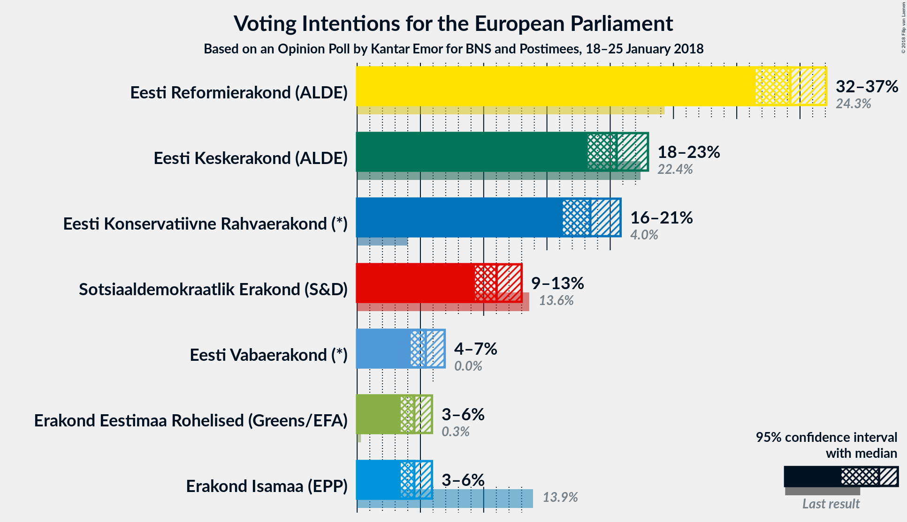

# Opinion Poll by Kantar Emor for BNS and Postimees, 18–25 January 2018

<a href="#voting-intentions">Voting Intentions</a> | <a href="#seats">Seats</a> | <a href="#coalitions">Coalitions</a> | <a href="#technical-information">Technical Information</a>

## Voting Intentions

### Confidence Intervals

| Party | Last Result | Poll Result | 80% Confidence Interval | 90% Confidence Interval | 95% Confidence Interval | 99% Confidence Interval |
|:-----:|:-----------:|:-----------:|:-----------------------:|:-----------------------:|:-----------------------:|:-----------------------:|
| Eesti Reformierakond (ALDE) | 24.3% | 34.2% | 32.4–36.1% |31.9–36.6% |31.5–37.1% |30.7–38.0% |
| Eesti Keskerakond (ALDE) | 22.4% | 20.5% | 19.0–22.1% |18.6–22.6% |18.2–23.0% |17.5–23.8% |
| Eesti Konservatiivne Rahvaerakond (*) | 4.0% | 18.4% | 17.0–20.0% |16.6–20.4% |16.2–20.8% |15.6–21.6% |
| Sotsiaaldemokraatlik Erakond (S&D) | 13.6% | 11.0% | 9.9–12.3% |9.6–12.7% |9.3–13.0% |8.8–13.7% |
| Eesti Vabaerakond (*) | 0.0% | 5.4% | 4.6–6.4% |4.4–6.7% |4.2–6.9% |3.9–7.4% |
| Erakond Isamaa (EPP) | 13.9% | 4.5% | N/A |N/A |N/A |N/A |
| Erakond Eestimaa Rohelised (Greens/EFA) | 0.3% | 4.5% | 3.8–5.4% |3.6–5.7% |3.4–5.9% |3.1–6.4% |

*Note:* The poll result column reflects the actual value used in the calculations. Published results may vary slightly, and in addition be rounded to fewer digits.

## Seats

### Confidence Intervals

| Party | Last Result | Median | 80% Confidence Interval | 90% Confidence Interval | 95% Confidence Interval | 99% Confidence Interval |
|:-----:|:-----------:|:------:|:-----------------------:|:-----------------------:|:-----------------------:|:-----------------------:|
| <a href="#eesti-reformierakond-(alde)">Eesti Reformierakond (ALDE)</a> | 2 | 3 | 3 |3 |3 |3–4 |
| <a href="#eesti-keskerakond-(alde)">Eesti Keskerakond (ALDE)</a> | 1 | 2 | 1–2 |1–2 |1–2 |1–2 |
| <a href="#eesti-konservatiivne-rahvaerakond-(*)">Eesti Konservatiivne Rahvaerakond (*)</a> | 0 | 1 | 1–2 |1–2 |1–2 |1–2 |
| <a href="#sotsiaaldemokraatlik-erakond-(s&d)">Sotsiaaldemokraatlik Erakond (S&D)</a> | 1 | 1 | 1 |0–1 |0–1 |0–1 |
| <a href="#eesti-vabaerakond-(*)">Eesti Vabaerakond (*)</a> | 0 | 0 | 0 |0 |0 |0 |
| <a href="#erakond-isamaa-(epp)">Erakond Isamaa (EPP)</a> | 1 | N/A | N/A |N/A |N/A |N/A |
| <a href="#erakond-eestimaa-rohelised-(greens/efa)">Erakond Eestimaa Rohelised (Greens/EFA)</a> | 0 | 0 | 0 |0 |0 |0 |

