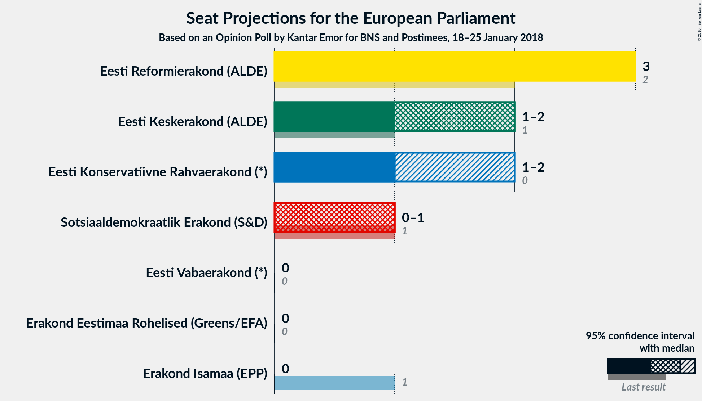
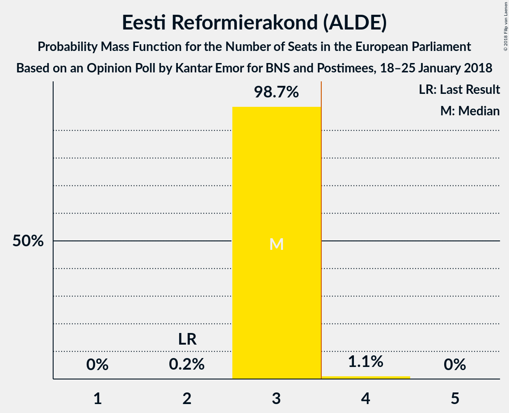
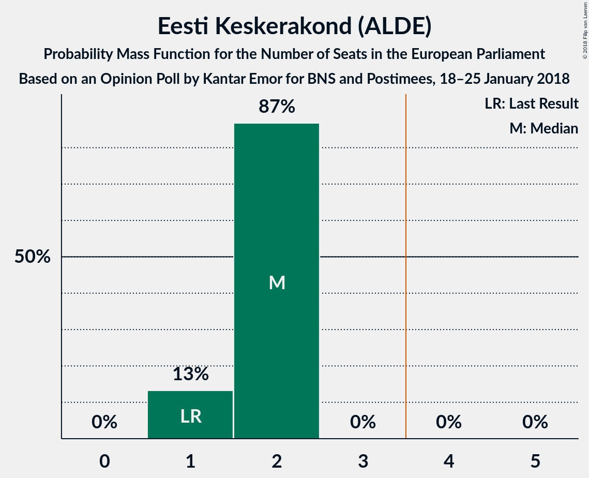
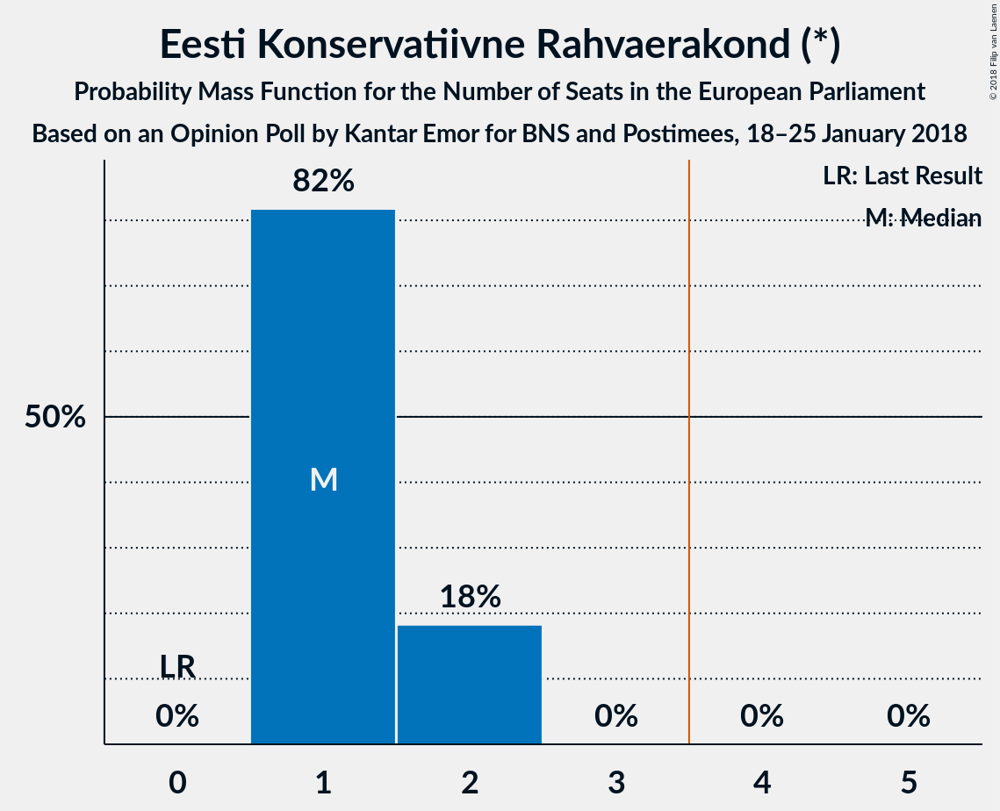
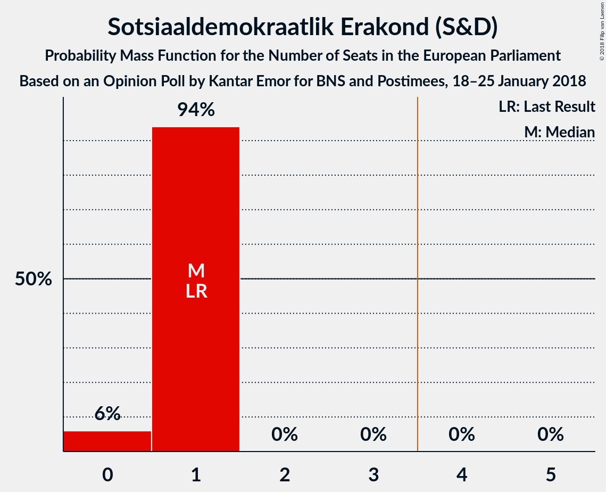
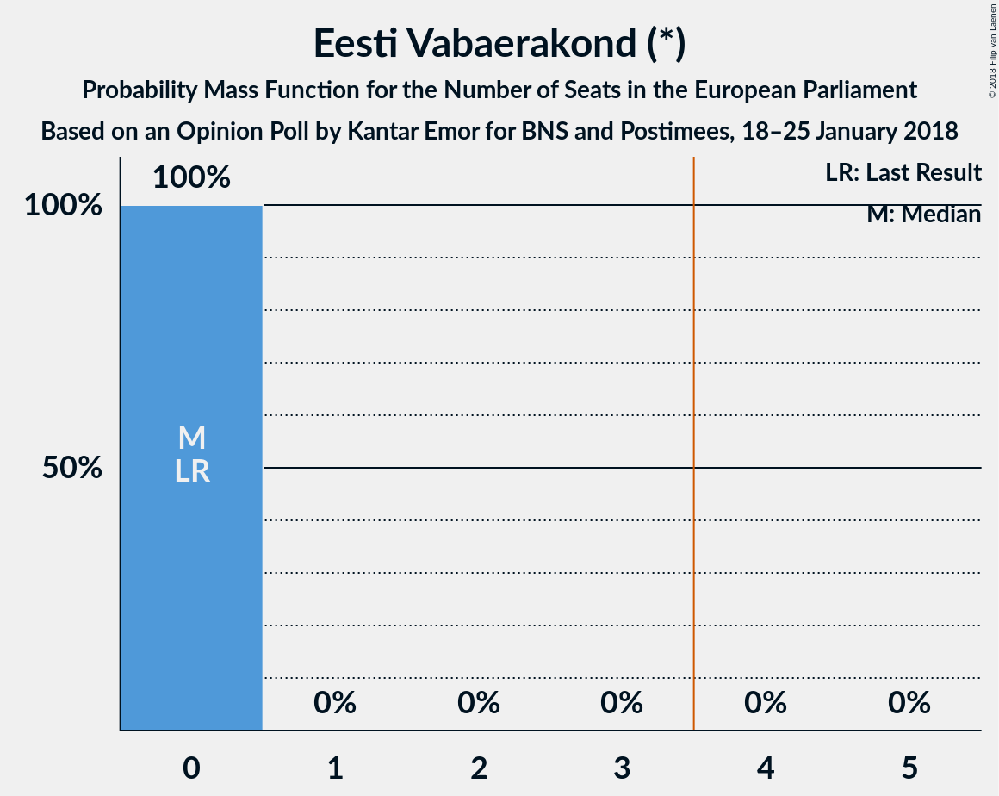
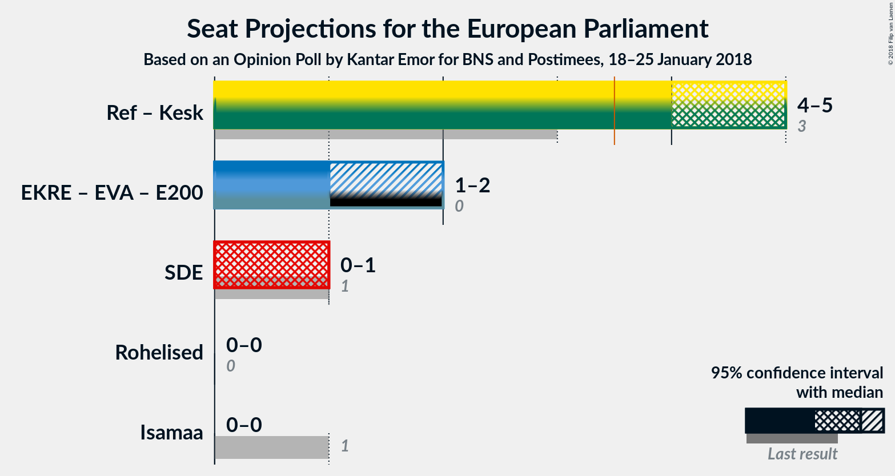

# Opinion Poll by Kantar Emor for BNS and Postimees, 18–25 January 2018

<a href="#voting-intentions">Voting Intentions</a> | <a href="#seats">Seats</a> | <a href="#coalitions">Coalitions</a> | <a href="#technical-information">Technical Information</a>

## Voting Intentions

### Confidence Intervals

| Party | Last Result | Poll Result | 80% Confidence Interval | 90% Confidence Interval | 95% Confidence Interval | 99% Confidence Interval |
|:-----:|:-----------:|:-----------:|:-----------------------:|:-----------------------:|:-----------------------:|:-----------------------:|
| Eesti Reformierakond (ALDE) | 24.3% | 34.2% | 32.4–36.1% |31.9–36.6% |31.5–37.1% |30.7–38.0% |
| Eesti Keskerakond (ALDE) | 22.4% | 20.5% | 19.0–22.1% |18.6–22.6% |18.2–23.0% |17.5–23.8% |
| Eesti Konservatiivne Rahvaerakond (*) | 4.0% | 18.4% | 17.0–20.0% |16.6–20.4% |16.2–20.8% |15.6–21.6% |
| Sotsiaaldemokraatlik Erakond (S&D) | 13.6% | 11.0% | 9.9–12.3% |9.6–12.7% |9.3–13.0% |8.8–13.7% |
| Eesti Vabaerakond (*) | 0.0% | 5.4% | 4.6–6.4% |4.4–6.7% |4.2–6.9% |3.9–7.4% |
| Isamaa ja Res Publica Liit (EPP) | 13.9% | 4.5% | 3.8–5.4% |3.6–5.7% |3.4–5.9% |3.1–6.4% |
| Erakond Eestimaa Rohelised (Greens/EFA) | 0.3% | 4.5% | 3.8–5.4% |3.6–5.7% |3.4–5.9% |3.1–6.4% |

*Note:* The poll result column reflects the actual value used in the calculations. Published results may vary slightly, and in addition be rounded to fewer digits.

## Seats

### Confidence Intervals

| Party | Last Result | Median | 80% Confidence Interval | 90% Confidence Interval | 95% Confidence Interval | 99% Confidence Interval |
|:-----:|:-----------:|:------:|:-----------------------:|:-----------------------:|:-----------------------:|:-----------------------:|
| <a href="#eesti-reformierakond-(alde)">Eesti Reformierakond (ALDE)</a> | 2 | 3 | 3 |3 |3 |3–4 |
| <a href="#eesti-keskerakond-(alde)">Eesti Keskerakond (ALDE)</a> | 1 | 2 | 1–2 |1–2 |1–2 |1–2 |
| <a href="#eesti-konservatiivne-rahvaerakond-(*)">Eesti Konservatiivne Rahvaerakond (*)</a> | 0 | 1 | 1–2 |1–2 |1–2 |1–2 |
| <a href="#sotsiaaldemokraatlik-erakond-(s&d)">Sotsiaaldemokraatlik Erakond (S&D)</a> | 1 | 1 | 1 |0–1 |0–1 |0–1 |
| <a href="#eesti-vabaerakond-(*)">Eesti Vabaerakond (*)</a> | 0 | 0 | 0 |0 |0 |0 |
| <a href="#isamaa-ja-res-publica-liit-(epp)">Isamaa ja Res Publica Liit (EPP)</a> | 1 | 0 | 0 |0 |0 |0 |
| <a href="#erakond-eestimaa-rohelised-(greens/efa)">Erakond Eestimaa Rohelised (Greens/EFA)</a> | 0 | 0 | 0 |0 |0 |0 |

### Eesti Reformierakond (ALDE)

*For a full overview of the results for this party, see the [Eesti Reformierakond (ALDE)](party-eestireformierakondalde.html) page.*

| Number of Seats | Probability | Accumulated | Special Marks |
|:---------------:|:-----------:|:-----------:|:-------------:|
| 2 | 0.2% | 100% | Last Result |
| 3 | 98.7% | 99.8% | Median |
| 4 | 1.1% | 1.1% | Majority |
| 5 | 0% | 0% |  |

### Eesti Keskerakond (ALDE)

*For a full overview of the results for this party, see the [Eesti Keskerakond (ALDE)](party-eestikeskerakondalde.html) page.*

| Number of Seats | Probability | Accumulated | Special Marks |
|:---------------:|:-----------:|:-----------:|:-------------:|
| 1 | 13% | 100% | Last Result |
| 2 | 87% | 87% | Median |
| 3 | 0% | 0% |  |

### Eesti Konservatiivne Rahvaerakond (*)

*For a full overview of the results for this party, see the [Eesti Konservatiivne Rahvaerakond (*)](party-eestikonservatiivnerahvaerakond.html) page.*

| Number of Seats | Probability | Accumulated | Special Marks |
|:---------------:|:-----------:|:-----------:|:-------------:|
| 0 | 0% | 100% | Last Result |
| 1 | 82% | 100% | Median |
| 2 | 18% | 18% |  |
| 3 | 0% | 0% |  |

### Sotsiaaldemokraatlik Erakond (S&D)

*For a full overview of the results for this party, see the [Sotsiaaldemokraatlik Erakond (S&D)](party-sotsiaaldemokraatlikerakondsd.html) page.*

| Number of Seats | Probability | Accumulated | Special Marks |
|:---------------:|:-----------:|:-----------:|:-------------:|
| 0 | 6% | 100% |  |
| 1 | 94% | 94% | Last Result, Median |
| 2 | 0% | 0% |  |

### Eesti Vabaerakond (*)

*For a full overview of the results for this party, see the [Eesti Vabaerakond (*)](party-eestivabaerakond.html) page.*

| Number of Seats | Probability | Accumulated | Special Marks |
|:---------------:|:-----------:|:-----------:|:-------------:|
| 0 | 100% | 100% | Last Result, Median |

### Isamaa ja Res Publica Liit (EPP)

*For a full overview of the results for this party, see the [Isamaa ja Res Publica Liit (EPP)](party-isamaajarespublicaliitepp.html) page.*

| Number of Seats | Probability | Accumulated | Special Marks |
|:---------------:|:-----------:|:-----------:|:-------------:|
| 0 | 100% | 100% | Median |
| 1 | 0% | 0% | Last Result |

### Erakond Eestimaa Rohelised (Greens/EFA)

*For a full overview of the results for this party, see the [Erakond Eestimaa Rohelised (Greens/EFA)](party-erakondeestimaarohelisedgreensefa.html) page.*

| Number of Seats | Probability | Accumulated | Special Marks |
|:---------------:|:-----------:|:-----------:|:-------------:|
| 0 | 100% | 100% | Last Result, Median |

## Coalitions

### Confidence Intervals

| Coalition | Last Result | Median | Majority? | 80% Confidence Interval | 90% Confidence Interval | 95% Confidence Interval | 99% Confidence Interval |
|:---------:|:-----------:|:------:|:---------:|:-----------------------:|:-----------------------:|:-----------------------:|:-----------------------:|
| Eesti Reformierakond (ALDE) – Eesti Keskerakond (ALDE) | 3 | 5 | 100% | 4–5 | 4–5 | 4–5 | 4–5 |
| Eesti Konservatiivne Rahvaerakond (*) – Eesti Vabaerakond (*) | 0 | 1 | 0% | 1–2 | 1–2 | 1–2 | 1–2 |
| Sotsiaaldemokraatlik Erakond (S&D) | 1 | 1 | 0% | 1 | 0–1 | 0–1 | 0–1 |
| Erakond Eestimaa Rohelised (Greens/EFA) | 0 | 0 | 0% | 0 | 0 | 0 | 0 |
| Isamaa ja Res Publica Liit (EPP) | 1 | 0 | 0% | 0 | 0 | 0 | 0 |

### Eesti Reformierakond (ALDE) – Eesti Keskerakond (ALDE)

| Number of Seats | Probability | Accumulated | Special Marks |
|:---------------:|:-----------:|:-----------:|:-------------:|
| 3 | 0% | 100% | Last Result |
| 4 | 13% | 100% | Majority |
| 5 | 87% | 87% | Median |
| 6 | 0.4% | 0.4% |  |
| 7 | 0% | 0% |  |

### Eesti Konservatiivne Rahvaerakond (*) – Eesti Vabaerakond (*)

| Number of Seats | Probability | Accumulated | Special Marks |
|:---------------:|:-----------:|:-----------:|:-------------:|
| 0 | 0% | 100% | Last Result |
| 1 | 82% | 100% | Median |
| 2 | 18% | 18% |  |
| 3 | 0% | 0% |  |

### Sotsiaaldemokraatlik Erakond (S&D)

| Number of Seats | Probability | Accumulated | Special Marks |
|:---------------:|:-----------:|:-----------:|:-------------:|
| 0 | 6% | 100% |  |
| 1 | 94% | 94% | Last Result, Median |
| 2 | 0% | 0% |  |

### Erakond Eestimaa Rohelised (Greens/EFA)

| Number of Seats | Probability | Accumulated | Special Marks |
|:---------------:|:-----------:|:-----------:|:-------------:|
| 0 | 100% | 100% | Last Result, Median |

### Isamaa ja Res Publica Liit (EPP)

| Number of Seats | Probability | Accumulated | Special Marks |
|:---------------:|:-----------:|:-----------:|:-------------:|
| 0 | 100% | 100% | Median |
| 1 | 0% | 0% | Last Result |

## Technical Information

### Opinion Poll

+ **Polling firm:** Kantar Emor
+ **Commissioner(s):** BNS and Postimees
+ **Fieldwork period:** 18–25 January 2018

### Calculations

+ **Sample size:** 1107
+ **Simulations done:** 1,048,576
+ **Error estimate:** 1.25%

