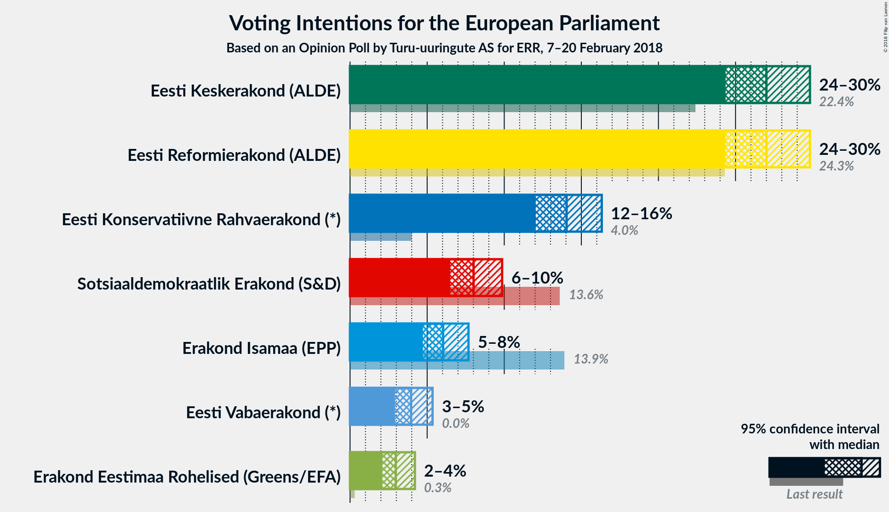
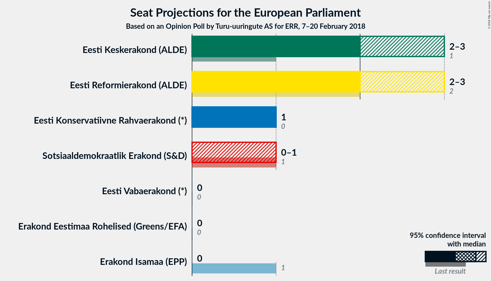

# Opinion Poll by Turu-uuringute AS for ERR, 7–20 February 2018

<a href="#voting-intentions">Voting Intentions</a> | <a href="#seats">Seats</a> | <a href="#coalitions">Coalitions</a> | <a href="#technical-information">Technical Information</a>

## Voting Intentions

### Confidence Intervals

| Party | Last Result | Poll Result | 80% Confidence Interval | 90% Confidence Interval | 95% Confidence Interval | 99% Confidence Interval |
|:-----:|:-----------:|:-----------:|:-----------------------:|:-----------------------:|:-----------------------:|:-----------------------:|
| Eesti Reformierakond (ALDE) | 24.3% | 27.0% | 25.3–28.9% |24.8–29.4% |24.4–29.8% |23.5–30.7% |
| Eesti Keskerakond (ALDE) | 22.4% | 27.0% | 25.3–28.9% |24.8–29.4% |24.4–29.8% |23.5–30.7% |
| Eesti Konservatiivne Rahvaerakond (*) | 4.0% | 14.0% | 12.7–15.5% |12.4–16.0% |12.0–16.3% |11.4–17.1% |
| Sotsiaaldemokraatlik Erakond (S&D) | 13.6% | 8.0% | 7.0–9.2% |6.7–9.6% |6.5–9.9% |6.0–10.5% |
| Erakond Isamaa (EPP) | 13.9% | 6.0% | N/A |N/A |N/A |N/A |
| Eesti Vabaerakond (*) | 0.0% | 4.0% | 3.3–4.9% |3.1–5.1% |2.9–5.3% |2.6–5.8% |
| Erakond Eestimaa Rohelised (Greens/EFA) | 0.3% | 3.0% | 2.4–3.8% |2.2–4.0% |2.1–4.2% |1.8–4.6% |

*Note:* The poll result column reflects the actual value used in the calculations. Published results may vary slightly, and in addition be rounded to fewer digits.

## Seats

### Confidence Intervals

| Party | Last Result | Median | 80% Confidence Interval | 90% Confidence Interval | 95% Confidence Interval | 99% Confidence Interval |
|:-----:|:-----------:|:------:|:-----------------------:|:-----------------------:|:-----------------------:|:-----------------------:|
| <a href="#eesti-reformierakond-(alde)">Eesti Reformierakond (ALDE)</a> | 2 | 2 | 2–3 |2–3 |2–3 |2–3 |
| <a href="#eesti-keskerakond-(alde)">Eesti Keskerakond (ALDE)</a> | 1 | 2 | 2–3 |2–3 |2–3 |2–3 |
| <a href="#eesti-konservatiivne-rahvaerakond-(*)">Eesti Konservatiivne Rahvaerakond (*)</a> | 0 | 1 | 1 |1 |1 |1 |
| <a href="#sotsiaaldemokraatlik-erakond-(s&d)">Sotsiaaldemokraatlik Erakond (S&D)</a> | 1 | 0 | 0–1 |0–1 |0–1 |0–1 |
| <a href="#erakond-isamaa-(epp)">Erakond Isamaa (EPP)</a> | 1 | N/A | N/A |N/A |N/A |N/A |
| <a href="#eesti-vabaerakond-(*)">Eesti Vabaerakond (*)</a> | 0 | 0 | 0 |0 |0 |0 |
| <a href="#erakond-eestimaa-rohelised-(greens/efa)">Erakond Eestimaa Rohelised (Greens/EFA)</a> | 0 | 0 | 0 |0 |0 |0 |

