# Opinion Poll by Kantar Emor for BNS and Postimees, 1–25 February 2018

<a href="#voting-intentions">Voting Intentions</a> | <a href="#seats">Seats</a> | <a href="#coalitions">Coalitions</a> | <a href="#technical-information">Technical Information</a>

## Voting Intentions

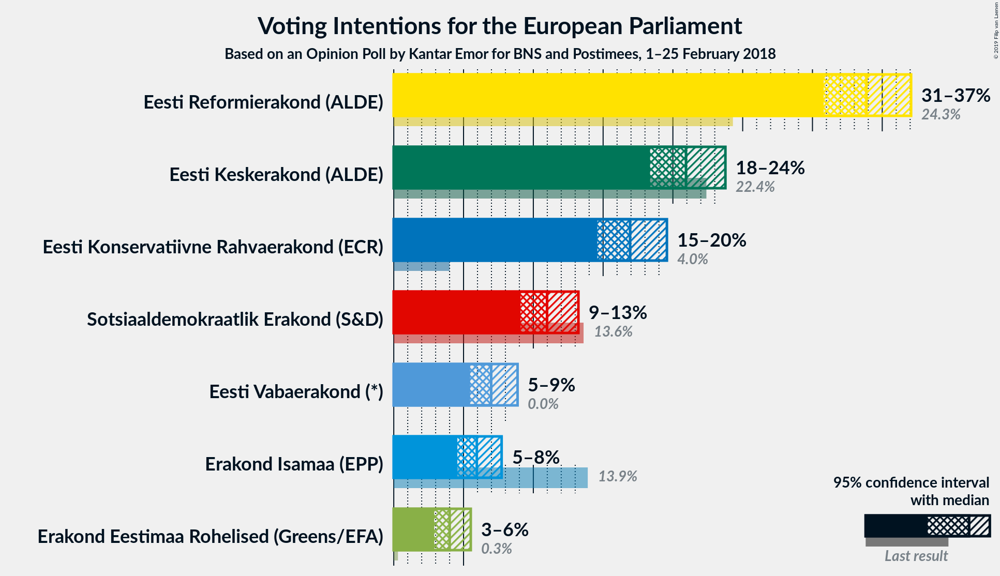

### Confidence Intervals

| Party | Last Result | Poll Result | 80% Confidence Interval | 90% Confidence Interval | 95% Confidence Interval | 99% Confidence Interval |
|:-----:|:-----------:|:-----------:|:-----------------------:|:-----------------------:|:-----------------------:|:-----------------------:|
| Eesti Reformierakond (ALDE) | 24.3% | 33.9% | 31.9–36.0% |31.3–36.6% |30.8–37.1% |29.9–38.1% |
| Eesti Keskerakond (ALDE) | 22.4% | 20.9% | 19.3–22.8% |18.8–23.3% |18.4–23.8% |17.6–24.7% |
| Eesti Konservatiivne Rahvaerakond (ECR) | 4.0% | 16.9% | 15.4–18.7% |15.0–19.1% |14.6–19.6% |13.9–20.4% |
| Sotsiaaldemokraatlik Erakond (S&D) | 13.6% | 11.0% | 9.7–12.5% |9.4–12.9% |9.1–13.2% |8.5–14.0% |
| Eesti Vabaerakond (*) | 0.0% | 7.0% | 6.0–8.2% |5.7–8.6% |5.5–8.9% |5.0–9.5% |
| Erakond Isamaa (EPP) | 13.9% | 5.9% | 5.0–7.1% |4.8–7.4% |4.6–7.7% |4.2–8.3% |
| Erakond Eestimaa Rohelised (Greens/EFA) | 0.3% | 4.0% | 3.3–5.0% |3.1–5.3% |2.9–5.5% |2.6–6.0% |

*Note:* The poll result column reflects the actual value used in the calculations. Published results may vary slightly, and in addition be rounded to fewer digits.

## Seats

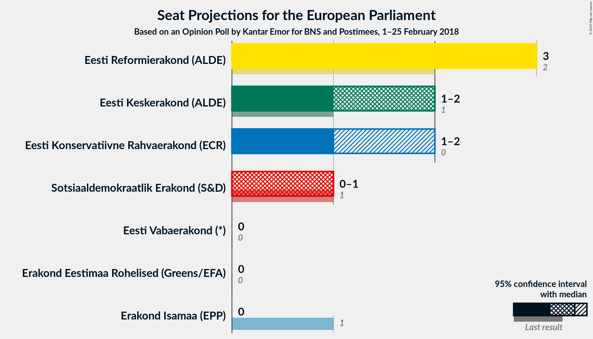

### Confidence Intervals

| Party | Last Result | Median | 80% Confidence Interval | 90% Confidence Interval | 95% Confidence Interval | 99% Confidence Interval |
|:-----:|:-----------:|:------:|:-----------------------:|:-----------------------:|:-----------------------:|:-----------------------:|
| <a href="#eesti-reformierakond-(alde)">Eesti Reformierakond (ALDE)</a> | 2 | 3 | 3 |3 |3 |2–4 |
| <a href="#eesti-keskerakond-(alde)">Eesti Keskerakond (ALDE)</a> | 1 | 2 | 2 |2 |2 |2 |
| <a href="#eesti-konservatiivne-rahvaerakond-(ecr)">Eesti Konservatiivne Rahvaerakond (ECR)</a> | 0 | 1 | 1 |1 |1 |1–2 |
| <a href="#sotsiaaldemokraatlik-erakond-(s&d)">Sotsiaaldemokraatlik Erakond (S&D)</a> | 1 | 1 | 1 |1 |1 |0–1 |
| <a href="#eesti-vabaerakond-(*)">Eesti Vabaerakond (*)</a> | 0 | 0 | 0 |0 |0 |0 |
| <a href="#erakond-isamaa-(epp)">Erakond Isamaa (EPP)</a> | 1 | 0 | 0 |0 |0 |0 |
| <a href="#erakond-eestimaa-rohelised-(greens/efa)">Erakond Eestimaa Rohelised (Greens/EFA)</a> | 0 | 0 | 0 |0 |0 |0 |

### Eesti Reformierakond (ALDE)

*For a full overview of the results for this party, see the [Eesti Reformierakond (ALDE)](party-eestireformierakondalde.html) page.*

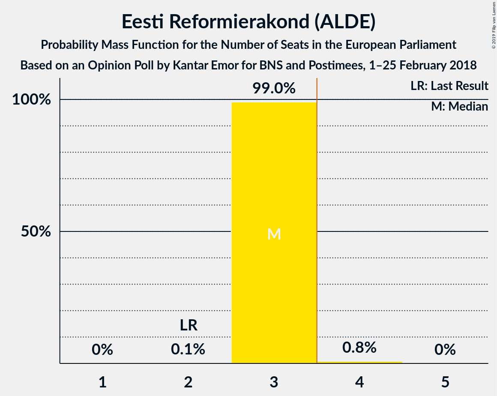

| Number of Seats | Probability | Accumulated | Special Marks |
|:---------------:|:-----------:|:-----------:|:-------------:|
| 2 | 0.5% | 100% | Last Result |
| 3 | 98.9% | 99.5% | Median |
| 4 | 0.6% | 0.6% | Majority |
| 5 | 0% | 0% |  |

### Eesti Keskerakond (ALDE)

*For a full overview of the results for this party, see the [Eesti Keskerakond (ALDE)](party-eestikeskerakondalde.html) page.*

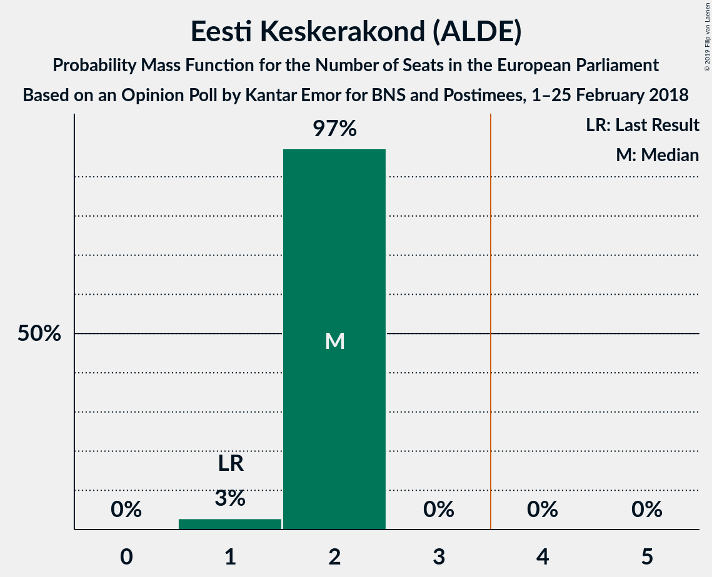

| Number of Seats | Probability | Accumulated | Special Marks |
|:---------------:|:-----------:|:-----------:|:-------------:|
| 1 | 0.1% | 100% | Last Result |
| 2 | 99.9% | 99.9% | Median |
| 3 | 0% | 0% |  |

### Eesti Konservatiivne Rahvaerakond (ECR)

*For a full overview of the results for this party, see the [Eesti Konservatiivne Rahvaerakond (ECR)](party-eestikonservatiivnerahvaerakondecr.html) page.*

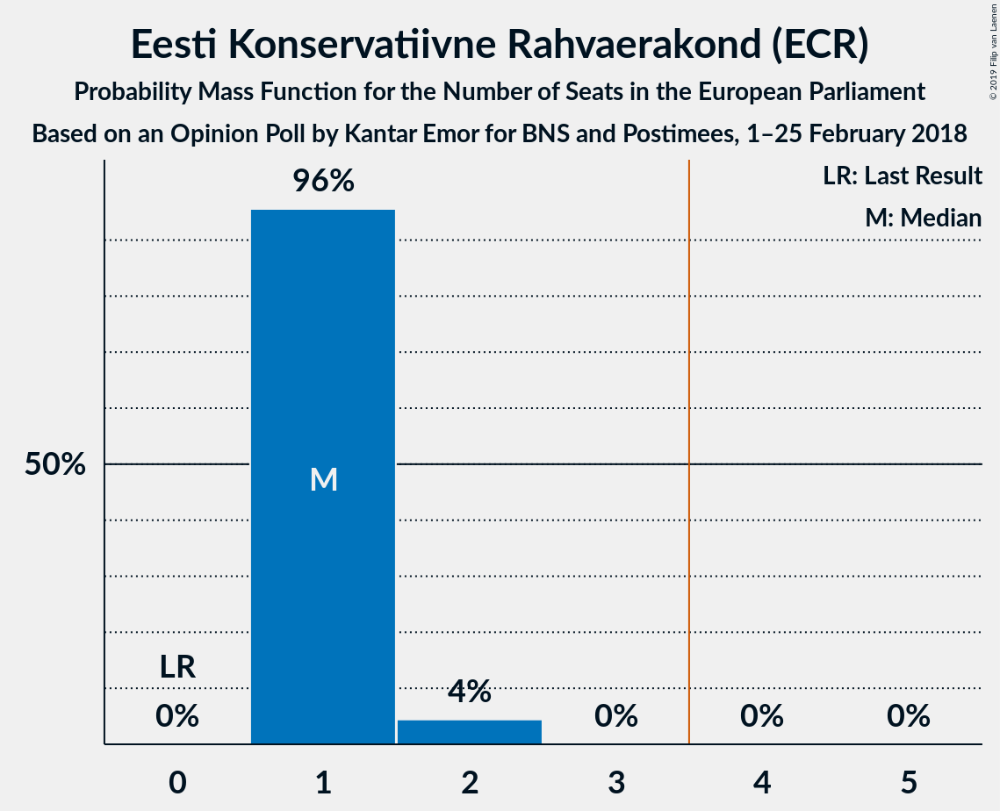

| Number of Seats | Probability | Accumulated | Special Marks |
|:---------------:|:-----------:|:-----------:|:-------------:|
| 0 | 0% | 100% | Last Result |
| 1 | 99.5% | 100% | Median |
| 2 | 0.5% | 0.5% |  |
| 3 | 0% | 0% |  |

### Sotsiaaldemokraatlik Erakond (S&D)

*For a full overview of the results for this party, see the [Sotsiaaldemokraatlik Erakond (S&D)](party-sotsiaaldemokraatlikerakondsd.html) page.*

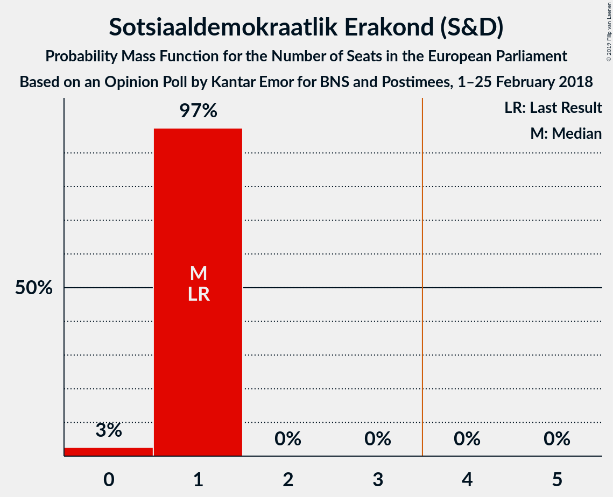

| Number of Seats | Probability | Accumulated | Special Marks |
|:---------------:|:-----------:|:-----------:|:-------------:|
| 0 | 0.5% | 100% |  |
| 1 | 99.5% | 99.5% | Last Result, Median |
| 2 | 0% | 0% |  |

### Eesti Vabaerakond (*)

*For a full overview of the results for this party, see the [Eesti Vabaerakond (*)](party-eestivabaerakond.html) page.*

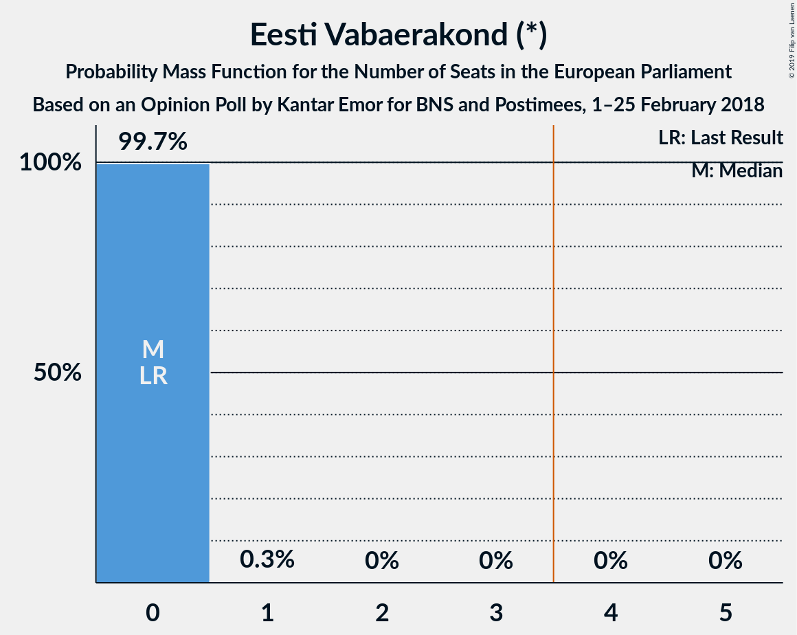

| Number of Seats | Probability | Accumulated | Special Marks |
|:---------------:|:-----------:|:-----------:|:-------------:|
| 0 | 100% | 100% | Last Result, Median |

### Erakond Isamaa (EPP)

*For a full overview of the results for this party, see the [Erakond Isamaa (EPP)](party-erakondisamaaepp.html) page.*

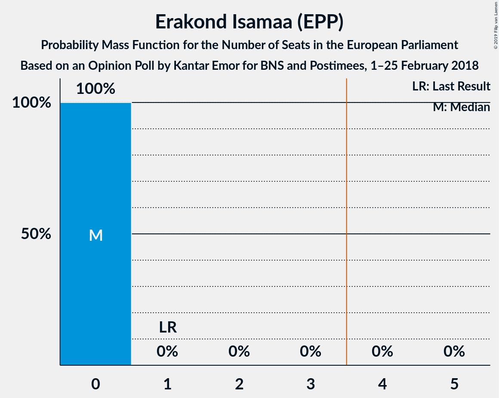

| Number of Seats | Probability | Accumulated | Special Marks |
|:---------------:|:-----------:|:-----------:|:-------------:|
| 0 | 100% | 100% | Median |
| 1 | 0% | 0% | Last Result |

### Erakond Eestimaa Rohelised (Greens/EFA)

*For a full overview of the results for this party, see the [Erakond Eestimaa Rohelised (Greens/EFA)](party-erakondeestimaarohelisedgreensefa.html) page.*

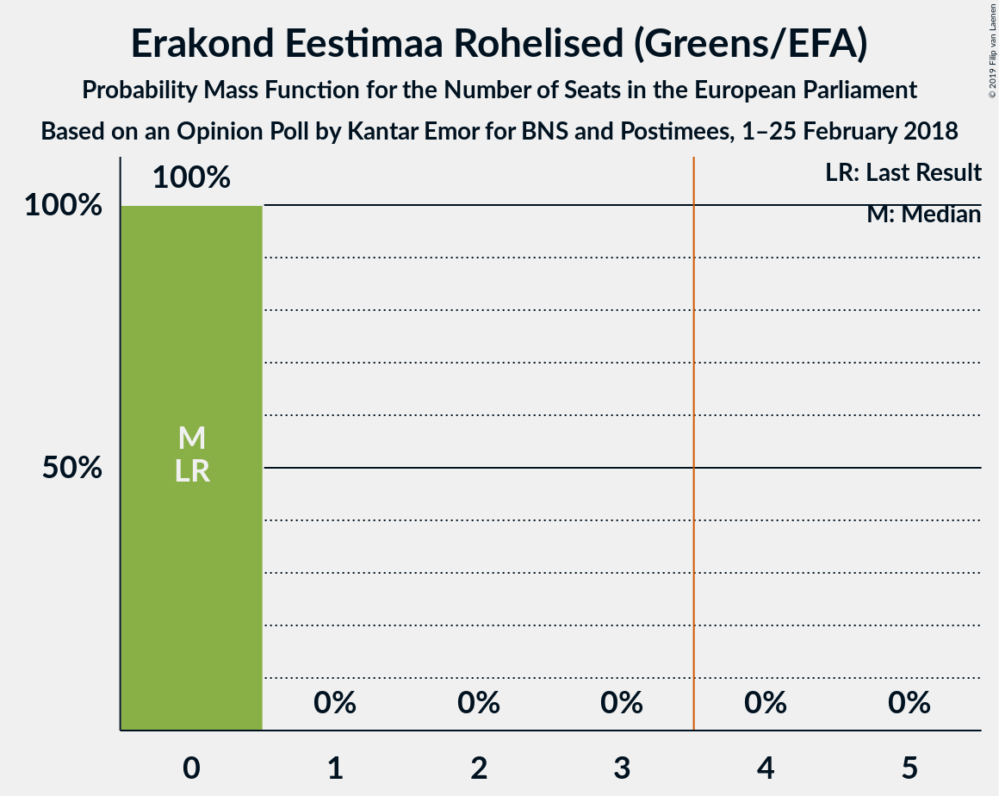

| Number of Seats | Probability | Accumulated | Special Marks |
|:---------------:|:-----------:|:-----------:|:-------------:|
| 0 | 100% | 100% | Last Result, Median |

## Coalitions

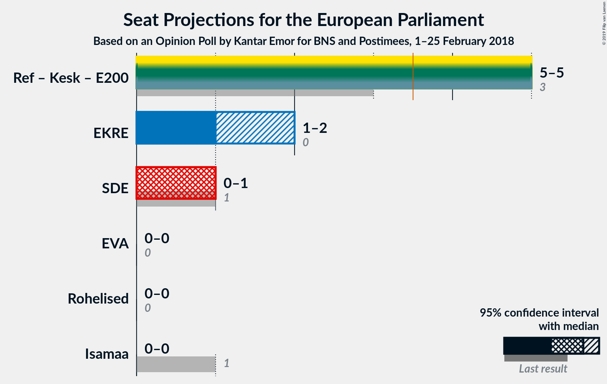

### Confidence Intervals

| Coalition | Last Result | Median | Majority? | 80% Confidence Interval | 90% Confidence Interval | 95% Confidence Interval | 99% Confidence Interval |
|:---------:|:-----------:|:------:|:---------:|:-----------------------:|:-----------------------:|:-----------------------:|:-----------------------:|
| Eesti Konservatiivne Rahvaerakond (ECR) | 0 | 1 | 0% | 1 | 1 | 1 | 1–2 |
| Sotsiaaldemokraatlik Erakond (S&D) | 1 | 1 | 0% | 1 | 1 | 1 | 0–1 |
| Eesti Vabaerakond (*) | 0 | 0 | 0% | 0 | 0 | 0 | 0 |
| Erakond Eestimaa Rohelised (Greens/EFA) | 0 | 0 | 0% | 0 | 0 | 0 | 0 |
| Erakond Isamaa (EPP) | 1 | 0 | 0% | 0 | 0 | 0 | 0 |

### Eesti Konservatiivne Rahvaerakond (ECR)

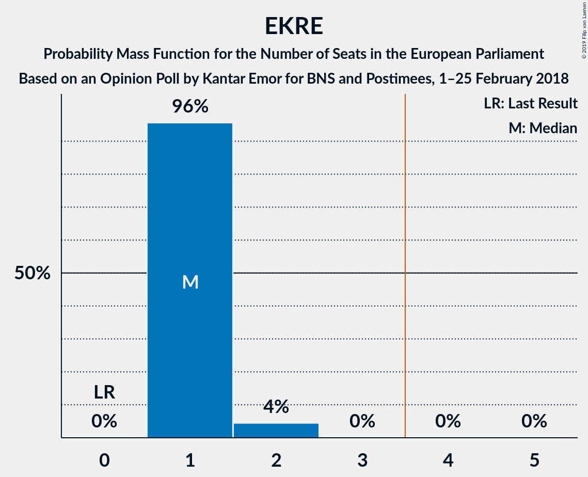

| Number of Seats | Probability | Accumulated | Special Marks |
|:---------------:|:-----------:|:-----------:|:-------------:|
| 0 | 0% | 100% | Last Result |
| 1 | 99.5% | 100% | Median |
| 2 | 0.5% | 0.5% |  |
| 3 | 0% | 0% |  |

### Sotsiaaldemokraatlik Erakond (S&D)

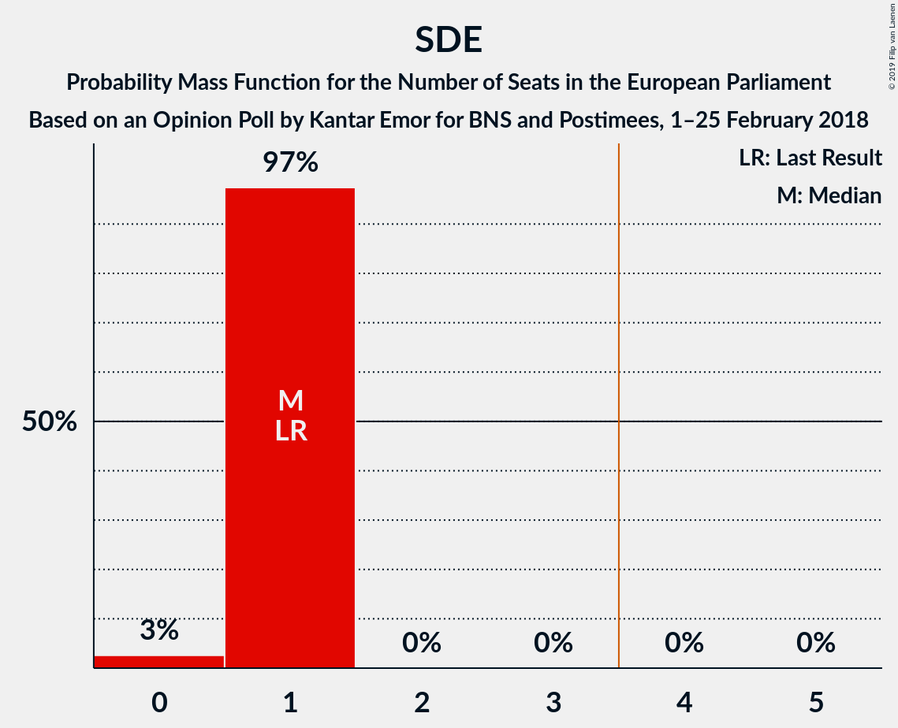

| Number of Seats | Probability | Accumulated | Special Marks |
|:---------------:|:-----------:|:-----------:|:-------------:|
| 0 | 0.5% | 100% |  |
| 1 | 99.5% | 99.5% | Last Result, Median |
| 2 | 0% | 0% |  |

### Eesti Vabaerakond (*)

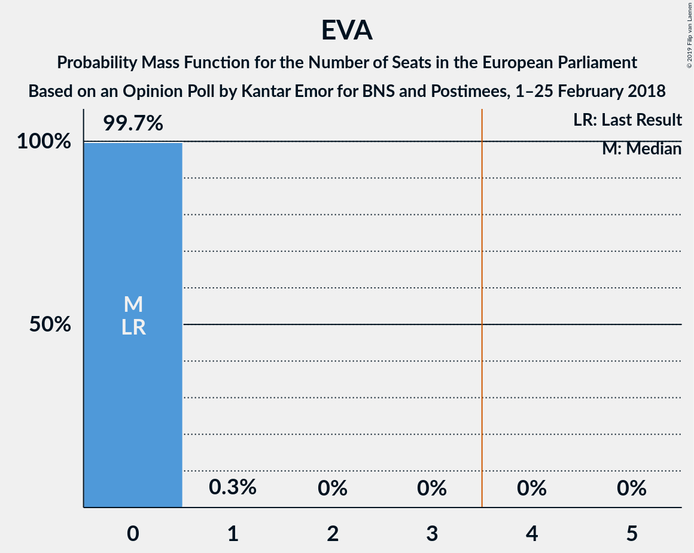

| Number of Seats | Probability | Accumulated | Special Marks |
|:---------------:|:-----------:|:-----------:|:-------------:|
| 0 | 100% | 100% | Last Result, Median |

### Erakond Eestimaa Rohelised (Greens/EFA)

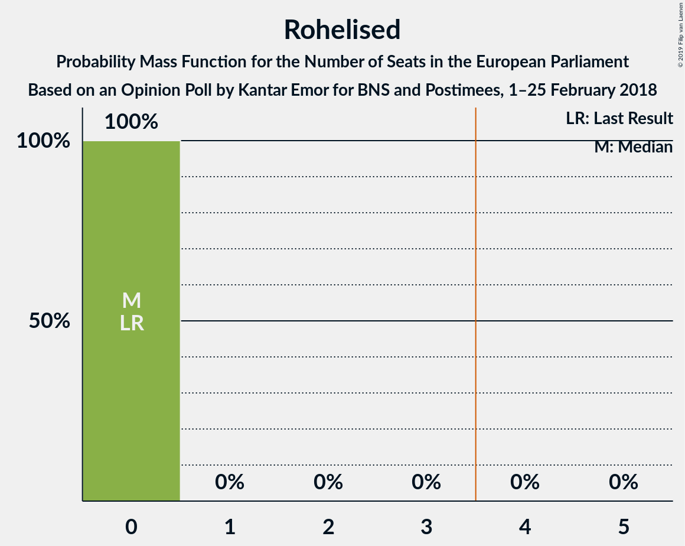

| Number of Seats | Probability | Accumulated | Special Marks |
|:---------------:|:-----------:|:-----------:|:-------------:|
| 0 | 100% | 100% | Last Result, Median |

### Erakond Isamaa (EPP)

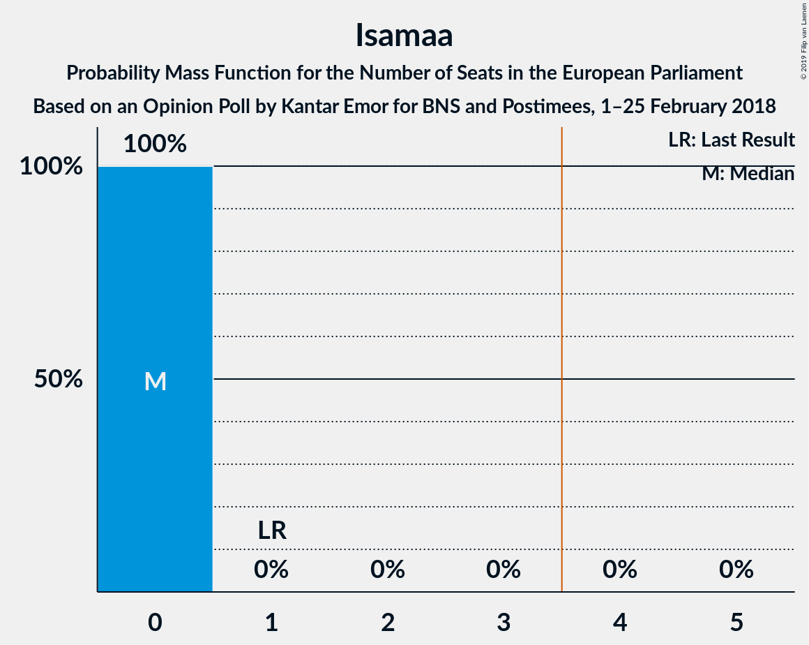

| Number of Seats | Probability | Accumulated | Special Marks |
|:---------------:|:-----------:|:-----------:|:-------------:|
| 0 | 100% | 100% | Median |
| 1 | 0% | 0% | Last Result |

## Technical Information

### Opinion Poll

+ **Polling firm:** Kantar Emor
+ **Commissioner(s):** BNS and Postimees
+ **Fieldwork period:** 1–25 February 2018

### Calculations

+ **Sample size:** 874
+ **Simulations done:** 1,024
+ **Error estimate:** 6.23%

