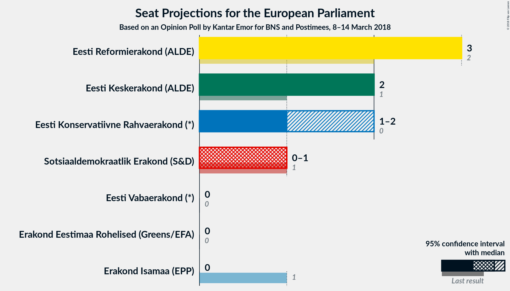
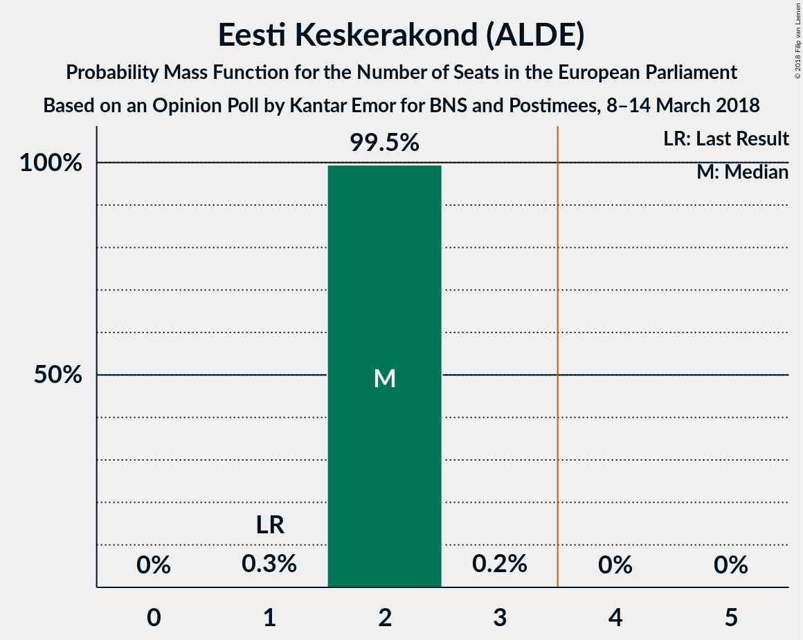
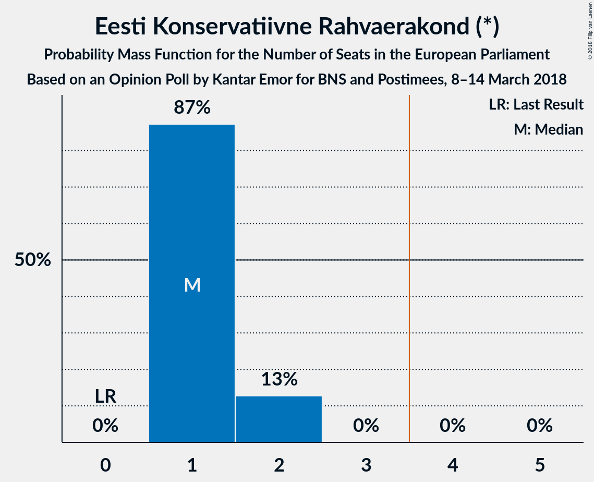
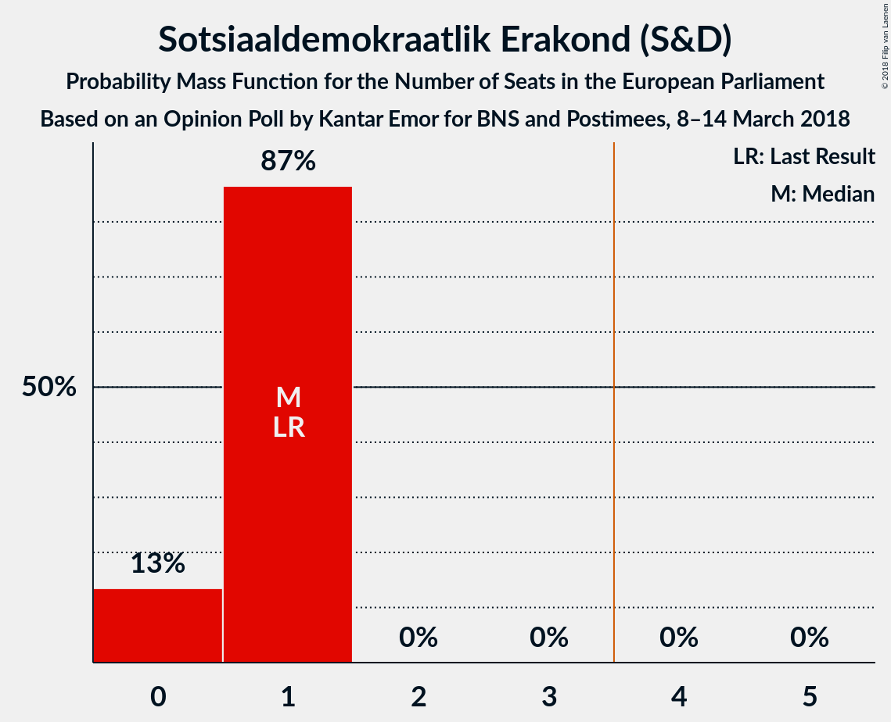
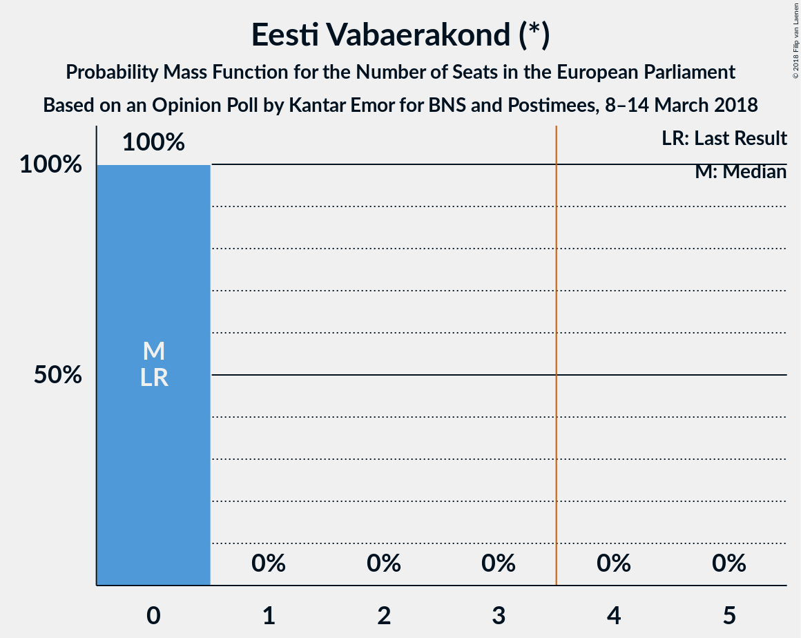
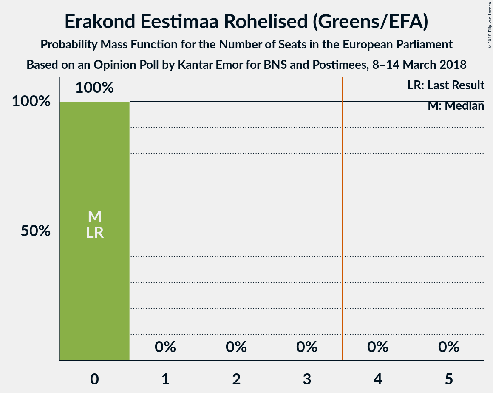
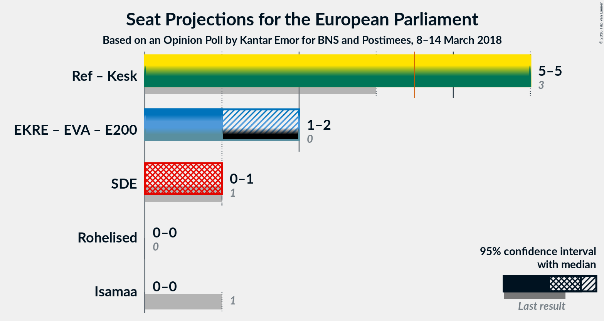

# Opinion Poll by Kantar Emor for BNS and Postimees, 8–14 March 2018

<a href="#voting-intentions">Voting Intentions</a> | <a href="#seats">Seats</a> | <a href="#coalitions">Coalitions</a> | <a href="#technical-information">Technical Information</a>

## Voting Intentions

### Confidence Intervals

| Party | Last Result | Poll Result | 80% Confidence Interval | 90% Confidence Interval | 95% Confidence Interval | 99% Confidence Interval |
|:-----:|:-----------:|:-----------:|:-----------------------:|:-----------------------:|:-----------------------:|:-----------------------:|
| Eesti Reformierakond (ALDE) | 24.3% | 34.1% | 32.2–36.2% |31.6–36.8% |31.1–37.3% |30.2–38.3% |
| Eesti Keskerakond (ALDE) | 22.4% | 23.8% | 22.1–25.7% |21.6–26.2% |21.1–26.7% |20.3–27.6% |
| Eesti Konservatiivne Rahvaerakond (*) | 4.0% | 18.4% | 16.8–20.1% |16.3–20.6% |16.0–21.0% |15.2–21.9% |
| Sotsiaaldemokraatlik Erakond (S&D) | 13.6% | 10.6% | 9.4–12.0% |9.0–12.4% |8.7–12.8% |8.2–13.5% |
| Eesti Vabaerakond (*) | 0.0% | 5.0% | 4.2–6.1% |3.9–6.4% |3.8–6.6% |3.4–7.2% |
| Isamaa ja Res Publica Liit (EPP) | 13.9% | 4.1% | 3.4–5.1% |3.2–5.4% |3.0–5.6% |2.7–6.1% |
| Erakond Eestimaa Rohelised (Greens/EFA) | 0.3% | 3.6% | 2.9–4.5% |2.7–4.8% |2.5–5.0% |2.2–5.5% |

*Note:* The poll result column reflects the actual value used in the calculations. Published results may vary slightly, and in addition be rounded to fewer digits.

## Seats

### Confidence Intervals

| Party | Last Result | Median | 80% Confidence Interval | 90% Confidence Interval | 95% Confidence Interval | 99% Confidence Interval |
|:-----:|:-----------:|:------:|:-----------------------:|:-----------------------:|:-----------------------:|:-----------------------:|
| <a href="#eesti-reformierakond-(alde)">Eesti Reformierakond (ALDE)</a> | 2 | 3 | 3 |3 |3 |2–4 |
| <a href="#eesti-keskerakond-(alde)">Eesti Keskerakond (ALDE)</a> | 1 | 2 | 2 |2 |2 |2 |
| <a href="#eesti-konservatiivne-rahvaerakond-(*)">Eesti Konservatiivne Rahvaerakond (*)</a> | 0 | 1 | 1–2 |1–2 |1–2 |1–2 |
| <a href="#sotsiaaldemokraatlik-erakond-(s&d)">Sotsiaaldemokraatlik Erakond (S&D)</a> | 1 | 1 | 0–1 |0–1 |0–1 |0–1 |
| <a href="#eesti-vabaerakond-(*)">Eesti Vabaerakond (*)</a> | 0 | 0 | 0 |0 |0 |0 |
| <a href="#isamaa-ja-res-publica-liit-(epp)">Isamaa ja Res Publica Liit (EPP)</a> | 1 | 0 | 0 |0 |0 |0 |
| <a href="#erakond-eestimaa-rohelised-(greens/efa)">Erakond Eestimaa Rohelised (Greens/EFA)</a> | 0 | 0 | 0 |0 |0 |0 |

### Eesti Reformierakond (ALDE)

*For a full overview of the results for this party, see the [Eesti Reformierakond (ALDE)](party-eestireformierakondalde.html) page.*

| Number of Seats | Probability | Accumulated | Special Marks |
|:---------------:|:-----------:|:-----------:|:-------------:|
| 2 | 0.6% | 100% | Last Result |
| 3 | 98% | 99.4% | Median |
| 4 | 1.4% | 1.4% | Majority |
| 5 | 0% | 0% |  |

### Eesti Keskerakond (ALDE)

*For a full overview of the results for this party, see the [Eesti Keskerakond (ALDE)](party-eestikeskerakondalde.html) page.*

| Number of Seats | Probability | Accumulated | Special Marks |
|:---------------:|:-----------:|:-----------:|:-------------:|
| 1 | 0.3% | 100% | Last Result |
| 2 | 99.5% | 99.7% | Median |
| 3 | 0.2% | 0.2% |  |
| 4 | 0% | 0% | Majority |

### Eesti Konservatiivne Rahvaerakond (*)

*For a full overview of the results for this party, see the [Eesti Konservatiivne Rahvaerakond (*)](party-eestikonservatiivnerahvaerakond.html) page.*

| Number of Seats | Probability | Accumulated | Special Marks |
|:---------------:|:-----------:|:-----------:|:-------------:|
| 0 | 0% | 100% | Last Result |
| 1 | 87% | 100% | Median |
| 2 | 13% | 13% |  |
| 3 | 0% | 0% |  |

### Sotsiaaldemokraatlik Erakond (S&D)

*For a full overview of the results for this party, see the [Sotsiaaldemokraatlik Erakond (S&D)](party-sotsiaaldemokraatlikerakondsd.html) page.*

| Number of Seats | Probability | Accumulated | Special Marks |
|:---------------:|:-----------:|:-----------:|:-------------:|
| 0 | 13% | 100% |  |
| 1 | 87% | 87% | Last Result, Median |
| 2 | 0% | 0% |  |

### Eesti Vabaerakond (*)

*For a full overview of the results for this party, see the [Eesti Vabaerakond (*)](party-eestivabaerakond.html) page.*

| Number of Seats | Probability | Accumulated | Special Marks |
|:---------------:|:-----------:|:-----------:|:-------------:|
| 0 | 100% | 100% | Last Result, Median |

### Isamaa ja Res Publica Liit (EPP)

*For a full overview of the results for this party, see the [Isamaa ja Res Publica Liit (EPP)](party-isamaajarespublicaliitepp.html) page.*

| Number of Seats | Probability | Accumulated | Special Marks |
|:---------------:|:-----------:|:-----------:|:-------------:|
| 0 | 100% | 100% | Median |
| 1 | 0% | 0% | Last Result |

### Erakond Eestimaa Rohelised (Greens/EFA)

*For a full overview of the results for this party, see the [Erakond Eestimaa Rohelised (Greens/EFA)](party-erakondeestimaarohelisedgreensefa.html) page.*

| Number of Seats | Probability | Accumulated | Special Marks |
|:---------------:|:-----------:|:-----------:|:-------------:|
| 0 | 100% | 100% | Last Result, Median |

## Coalitions

### Confidence Intervals

| Coalition | Last Result | Median | Majority? | 80% Confidence Interval | 90% Confidence Interval | 95% Confidence Interval | 99% Confidence Interval |
|:---------:|:-----------:|:------:|:---------:|:-----------------------:|:-----------------------:|:-----------------------:|:-----------------------:|
| Eesti Reformierakond (ALDE) – Eesti Keskerakond (ALDE) | 3 | 5 | 100% | 5 | 5 | 5 | 4–6 |
| Eesti Konservatiivne Rahvaerakond (*) – Eesti Vabaerakond (*) | 0 | 1 | 0% | 1–2 | 1–2 | 1–2 | 1–2 |
| Sotsiaaldemokraatlik Erakond (S&D) | 1 | 1 | 0% | 0–1 | 0–1 | 0–1 | 0–1 |
| Erakond Eestimaa Rohelised (Greens/EFA) | 0 | 0 | 0% | 0 | 0 | 0 | 0 |
| Isamaa ja Res Publica Liit (EPP) | 1 | 0 | 0% | 0 | 0 | 0 | 0 |

### Eesti Reformierakond (ALDE) – Eesti Keskerakond (ALDE)

| Number of Seats | Probability | Accumulated | Special Marks |
|:---------------:|:-----------:|:-----------:|:-------------:|
| 3 | 0% | 100% | Last Result |
| 4 | 0.9% | 100% | Majority |
| 5 | 97% | 99.1% | Median |
| 6 | 2% | 2% |  |
| 7 | 0% | 0% |  |

### Eesti Konservatiivne Rahvaerakond (*) – Eesti Vabaerakond (*)

| Number of Seats | Probability | Accumulated | Special Marks |
|:---------------:|:-----------:|:-----------:|:-------------:|
| 0 | 0% | 100% | Last Result |
| 1 | 87% | 100% | Median |
| 2 | 13% | 13% |  |
| 3 | 0% | 0% |  |

### Sotsiaaldemokraatlik Erakond (S&D)

| Number of Seats | Probability | Accumulated | Special Marks |
|:---------------:|:-----------:|:-----------:|:-------------:|
| 0 | 13% | 100% |  |
| 1 | 87% | 87% | Last Result, Median |
| 2 | 0% | 0% |  |

### Erakond Eestimaa Rohelised (Greens/EFA)

| Number of Seats | Probability | Accumulated | Special Marks |
|:---------------:|:-----------:|:-----------:|:-------------:|
| 0 | 100% | 100% | Last Result, Median |

### Isamaa ja Res Publica Liit (EPP)

| Number of Seats | Probability | Accumulated | Special Marks |
|:---------------:|:-----------:|:-----------:|:-------------:|
| 0 | 100% | 100% | Median |
| 1 | 0% | 0% | Last Result |

## Technical Information

### Opinion Poll

+ **Polling firm:** Kantar Emor
+ **Commissioner(s):** BNS and Postimees
+ **Fieldwork period:** 8–14 March 2018

### Calculations

+ **Sample size:** 899
+ **Simulations done:** 1,048,576
+ **Error estimate:** 0.78%

