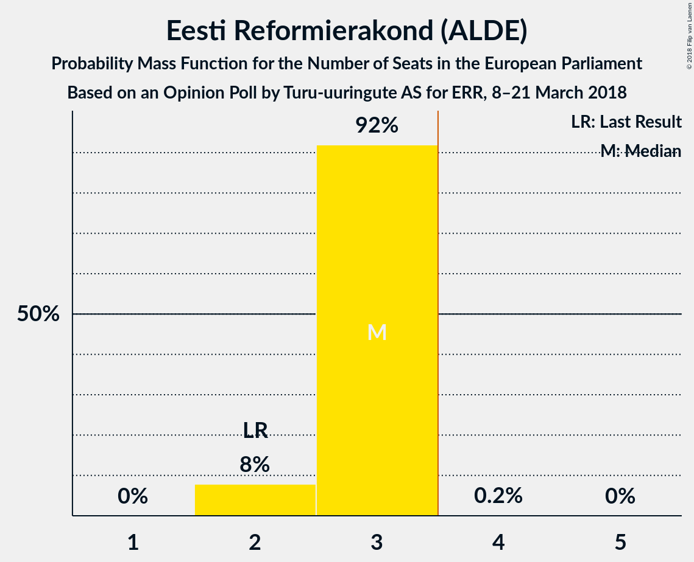
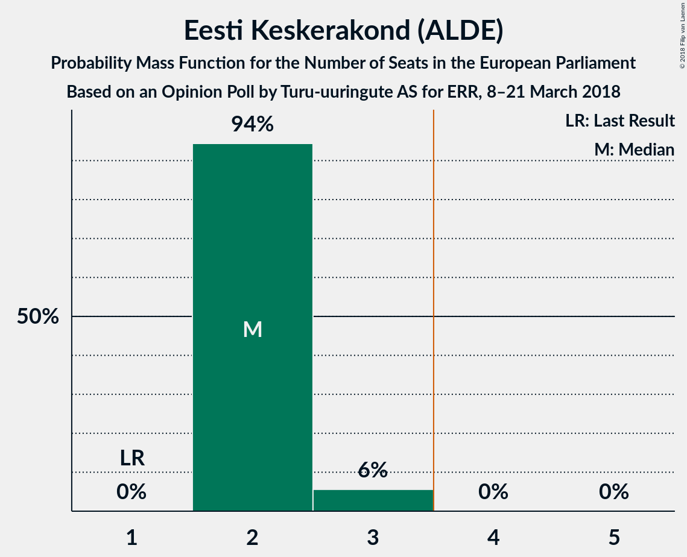
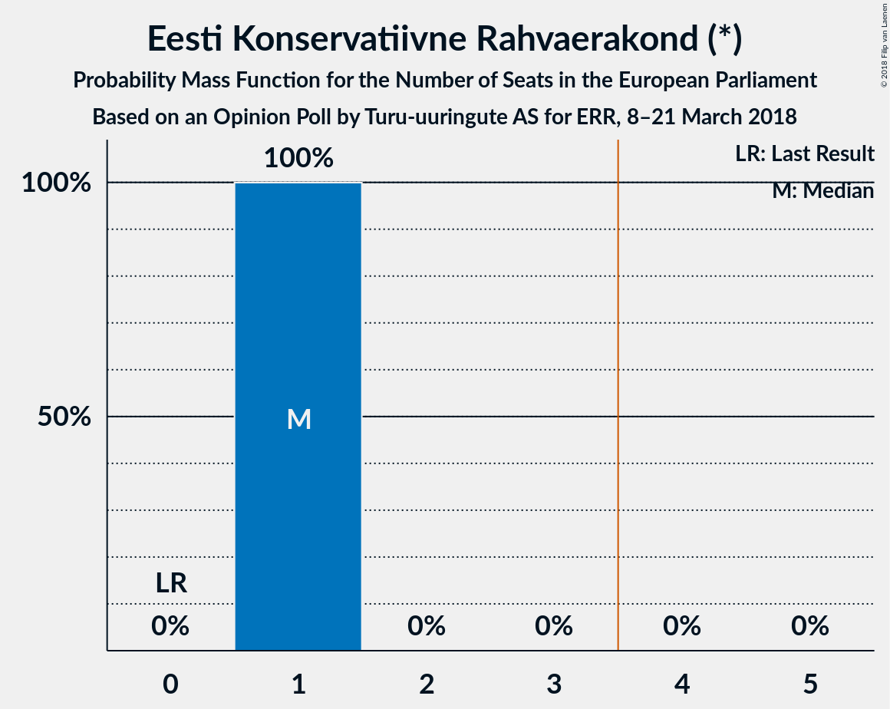
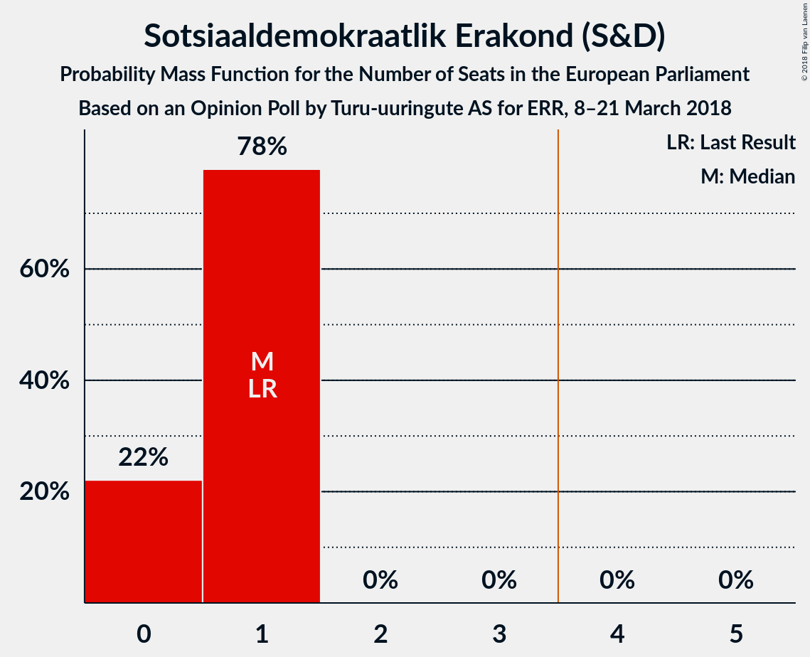
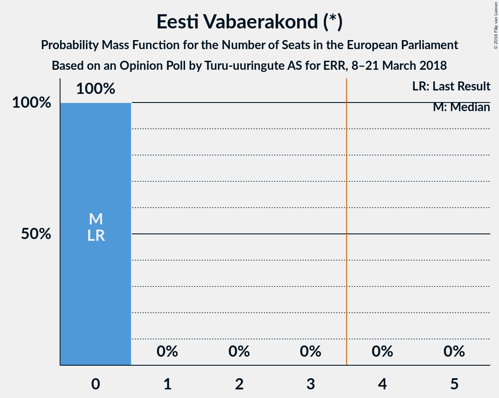
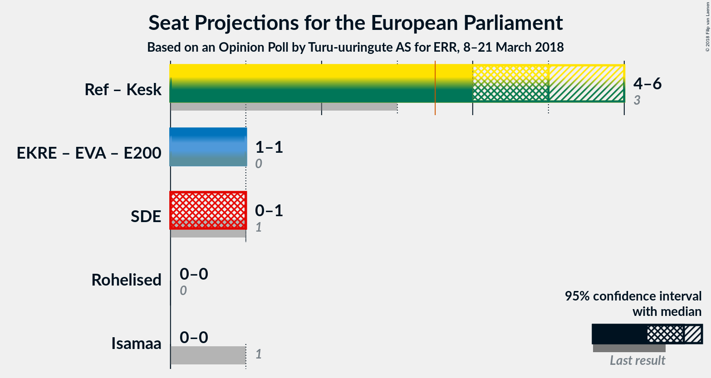

# Opinion Poll by Turu-uuringute AS for ERR, 8–21 March 2018

<a href="#voting-intentions">Voting Intentions</a> | <a href="#seats">Seats</a> | <a href="#coalitions">Coalitions</a> | <a href="#technical-information">Technical Information</a>

## Voting Intentions

### Confidence Intervals

| Party | Last Result | Poll Result | 80% Confidence Interval | 90% Confidence Interval | 95% Confidence Interval | 99% Confidence Interval |
|:-----:|:-----------:|:-----------:|:-----------------------:|:-----------------------:|:-----------------------:|:-----------------------:|
| Eesti Reformierakond (ALDE) | 24.3% | 31.0% | 29.2–33.0% |28.7–33.5% |28.3–34.0% |27.4–34.9% |
| Eesti Keskerakond (ALDE) | 22.4% | 26.0% | 24.2–27.8% |23.8–28.3% |23.4–28.8% |22.5–29.7% |
| Eesti Konservatiivne Rahvaerakond (*) | 4.0% | 13.0% | 11.8–14.5% |11.4–14.9% |11.1–15.3% |10.5–16.0% |
| Sotsiaaldemokraatlik Erakond (S&D) | 13.6% | 10.0% | 8.9–11.4% |8.6–11.7% |8.3–12.1% |7.8–12.7% |
| Isamaa ja Res Publica Liit (EPP) | 13.9% | 5.0% | 4.2–6.0% |4.0–6.2% |3.8–6.5% |3.4–7.0% |
| Eesti Vabaerakond (*) | 0.0% | 3.0% | 2.4–3.8% |2.2–4.0% |2.1–4.2% |1.8–4.7% |
| Erakond Eestimaa Rohelised (Greens/EFA) | 0.3% | 3.0% | 2.4–3.8% |2.2–4.0% |2.1–4.2% |1.8–4.7% |

*Note:* The poll result column reflects the actual value used in the calculations. Published results may vary slightly, and in addition be rounded to fewer digits.

## Seats

### Confidence Intervals

| Party | Last Result | Median | 80% Confidence Interval | 90% Confidence Interval | 95% Confidence Interval | 99% Confidence Interval |
|:-----:|:-----------:|:------:|:-----------------------:|:-----------------------:|:-----------------------:|:-----------------------:|
| <a href="#eesti-reformierakond-(alde)">Eesti Reformierakond (ALDE)</a> | 2 | 3 | 3 |2–3 |2–3 |2–3 |
| <a href="#eesti-keskerakond-(alde)">Eesti Keskerakond (ALDE)</a> | 1 | 2 | 2 |2–3 |2–3 |2–3 |
| <a href="#eesti-konservatiivne-rahvaerakond-(*)">Eesti Konservatiivne Rahvaerakond (*)</a> | 0 | 1 | 1 |1 |1 |1 |
| <a href="#sotsiaaldemokraatlik-erakond-(s&d)">Sotsiaaldemokraatlik Erakond (S&D)</a> | 1 | 1 | 0–1 |0–1 |0–1 |0–1 |
| <a href="#isamaa-ja-res-publica-liit-(epp)">Isamaa ja Res Publica Liit (EPP)</a> | 1 | 0 | 0 |0 |0 |0 |
| <a href="#eesti-vabaerakond-(*)">Eesti Vabaerakond (*)</a> | 0 | 0 | 0 |0 |0 |0 |
| <a href="#erakond-eestimaa-rohelised-(greens/efa)">Erakond Eestimaa Rohelised (Greens/EFA)</a> | 0 | 0 | 0 |0 |0 |0 |

### Eesti Reformierakond (ALDE)

*For a full overview of the results for this party, see the [Eesti Reformierakond (ALDE)](party-eestireformierakondalde.html) page.*

| Number of Seats | Probability | Accumulated | Special Marks |
|:---------------:|:-----------:|:-----------:|:-------------:|
| 2 | 8% | 100% | Last Result |
| 3 | 92% | 92% | Median |
| 4 | 0.2% | 0.2% | Majority |
| 5 | 0% | 0% |  |

### Eesti Keskerakond (ALDE)

*For a full overview of the results for this party, see the [Eesti Keskerakond (ALDE)](party-eestikeskerakondalde.html) page.*

| Number of Seats | Probability | Accumulated | Special Marks |
|:---------------:|:-----------:|:-----------:|:-------------:|
| 1 | 0% | 100% | Last Result |
| 2 | 94% | 100% | Median |
| 3 | 6% | 6% |  |
| 4 | 0% | 0% | Majority |

### Eesti Konservatiivne Rahvaerakond (*)

*For a full overview of the results for this party, see the [Eesti Konservatiivne Rahvaerakond (*)](party-eestikonservatiivnerahvaerakond.html) page.*

| Number of Seats | Probability | Accumulated | Special Marks |
|:---------------:|:-----------:|:-----------:|:-------------:|
| 0 | 0% | 100% | Last Result |
| 1 | 100% | 100% | Median |

### Sotsiaaldemokraatlik Erakond (S&D)

*For a full overview of the results for this party, see the [Sotsiaaldemokraatlik Erakond (S&D)](party-sotsiaaldemokraatlikerakondsd.html) page.*

| Number of Seats | Probability | Accumulated | Special Marks |
|:---------------:|:-----------:|:-----------:|:-------------:|
| 0 | 22% | 100% |  |
| 1 | 78% | 78% | Last Result, Median |
| 2 | 0% | 0% |  |

### Isamaa ja Res Publica Liit (EPP)

*For a full overview of the results for this party, see the [Isamaa ja Res Publica Liit (EPP)](party-isamaajarespublicaliitepp.html) page.*

| Number of Seats | Probability | Accumulated | Special Marks |
|:---------------:|:-----------:|:-----------:|:-------------:|
| 0 | 100% | 100% | Median |
| 1 | 0% | 0% | Last Result |

### Eesti Vabaerakond (*)

*For a full overview of the results for this party, see the [Eesti Vabaerakond (*)](party-eestivabaerakond.html) page.*

| Number of Seats | Probability | Accumulated | Special Marks |
|:---------------:|:-----------:|:-----------:|:-------------:|
| 0 | 100% | 100% | Last Result, Median |

### Erakond Eestimaa Rohelised (Greens/EFA)

*For a full overview of the results for this party, see the [Erakond Eestimaa Rohelised (Greens/EFA)](party-erakondeestimaarohelisedgreensefa.html) page.*

| Number of Seats | Probability | Accumulated | Special Marks |
|:---------------:|:-----------:|:-----------:|:-------------:|
| 0 | 100% | 100% | Last Result, Median |

## Coalitions

### Confidence Intervals

| Coalition | Last Result | Median | Majority? | 80% Confidence Interval | 90% Confidence Interval | 95% Confidence Interval | 99% Confidence Interval |
|:---------:|:-----------:|:------:|:---------:|:-----------------------:|:-----------------------:|:-----------------------:|:-----------------------:|
| Eesti Reformierakond (ALDE) – Eesti Keskerakond (ALDE) | 3 | 5 | 100% | 5 | 4–5 | 4–6 | 4–6 |
| Eesti Konservatiivne Rahvaerakond (*) – Eesti Vabaerakond (*) | 0 | 1 | 0% | 1 | 1 | 1 | 1 |
| Sotsiaaldemokraatlik Erakond (S&D) | 1 | 1 | 0% | 0–1 | 0–1 | 0–1 | 0–1 |
| Erakond Eestimaa Rohelised (Greens/EFA) | 0 | 0 | 0% | 0 | 0 | 0 | 0 |
| Isamaa ja Res Publica Liit (EPP) | 1 | 0 | 0% | 0 | 0 | 0 | 0 |

### Eesti Reformierakond (ALDE) – Eesti Keskerakond (ALDE)

| Number of Seats | Probability | Accumulated | Special Marks |
|:---------------:|:-----------:|:-----------:|:-------------:|
| 3 | 0% | 100% | Last Result |
| 4 | 7% | 100% | Majority |
| 5 | 89% | 93% | Median |
| 6 | 5% | 5% |  |
| 7 | 0% | 0% |  |

### Eesti Konservatiivne Rahvaerakond (*) – Eesti Vabaerakond (*)

| Number of Seats | Probability | Accumulated | Special Marks |
|:---------------:|:-----------:|:-----------:|:-------------:|
| 0 | 0% | 100% | Last Result |
| 1 | 100% | 100% | Median |

### Sotsiaaldemokraatlik Erakond (S&D)

| Number of Seats | Probability | Accumulated | Special Marks |
|:---------------:|:-----------:|:-----------:|:-------------:|
| 0 | 22% | 100% |  |
| 1 | 78% | 78% | Last Result, Median |
| 2 | 0% | 0% |  |

### Erakond Eestimaa Rohelised (Greens/EFA)

| Number of Seats | Probability | Accumulated | Special Marks |
|:---------------:|:-----------:|:-----------:|:-------------:|
| 0 | 100% | 100% | Last Result, Median |

### Isamaa ja Res Publica Liit (EPP)

| Number of Seats | Probability | Accumulated | Special Marks |
|:---------------:|:-----------:|:-----------:|:-------------:|
| 0 | 100% | 100% | Median |
| 1 | 0% | 0% | Last Result |

## Technical Information

### Opinion Poll

+ **Polling firm:** Turu-uuringute AS
+ **Commissioner(s):** ERR
+ **Fieldwork period:** 8–21 March 2018

### Calculations

+ **Sample size:** 1005
+ **Simulations done:** 1,048,576
+ **Error estimate:** 0.72%

