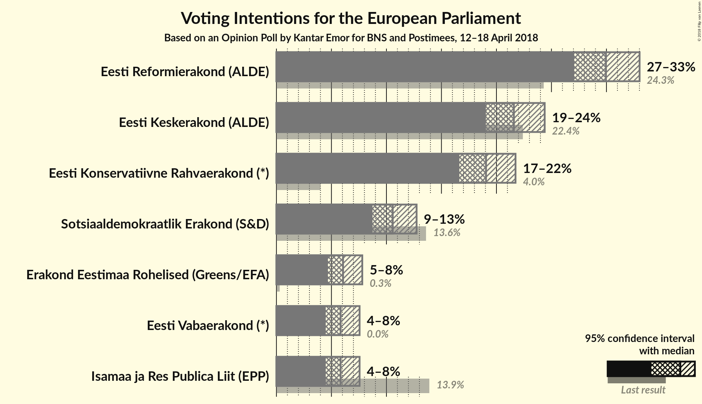
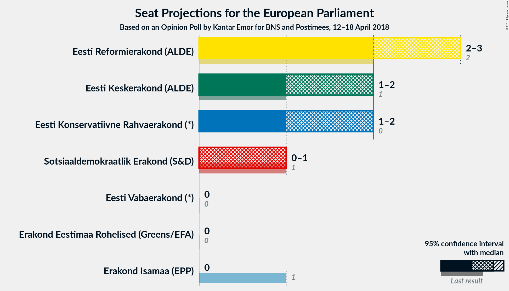

# Opinion Poll by Kantar Emor for BNS and Postimees, 12–18 April 2018

<a href="#voting-intentions">Voting Intentions</a> | <a href="#seats">Seats</a> | <a href="#coalitions">Coalitions</a> | <a href="#technical-information">Technical Information</a>

## Voting Intentions

### Confidence Intervals

| Party | Last Result | Poll Result | 80% Confidence Interval | 90% Confidence Interval | 95% Confidence Interval | 99% Confidence Interval |
|:-----:|:-----------:|:-----------:|:-----------------------:|:-----------------------:|:-----------------------:|:-----------------------:|
| Eesti Reformierakond (ALDE) | 24.3% | 30.0% | 28.1–32.0% |27.5–32.5% |27.1–33.0% |26.2–34.0% |
| Eesti Keskerakond (ALDE) | 22.4% | 21.6% | 19.9–23.4% |19.4–23.9% |19.0–24.4% |18.2–25.3% |
| Eesti Konservatiivne Rahvaerakond (*) | 4.0% | 19.1% | 17.5–20.8% |17.0–21.3% |16.6–21.7% |15.9–22.6% |
| Sotsiaaldemokraatlik Erakond (S&D) | 13.6% | 10.6% | 9.4–12.0% |9.0–12.4% |8.7–12.7% |8.2–13.5% |
| Erakond Eestimaa Rohelised (Greens/EFA) | 0.3% | 6.1% | 5.2–7.2% |4.9–7.5% |4.7–7.8% |4.3–8.4% |
| Erakond Isamaa (EPP) | 13.9% | 5.8% | N/A |N/A |N/A |N/A |
| Eesti Vabaerakond (*) | 0.0% | 5.8% | 5.0–7.0% |4.7–7.3% |4.5–7.6% |4.1–8.1% |

*Note:* The poll result column reflects the actual value used in the calculations. Published results may vary slightly, and in addition be rounded to fewer digits.

## Seats

### Confidence Intervals

| Party | Last Result | Median | 80% Confidence Interval | 90% Confidence Interval | 95% Confidence Interval | 99% Confidence Interval |
|:-----:|:-----------:|:------:|:-----------------------:|:-----------------------:|:-----------------------:|:-----------------------:|
| <a href="#eesti-reformierakond-(alde)">Eesti Reformierakond (ALDE)</a> | 2 | 3 | 2–3 |2–3 |2–3 |2–3 |
| <a href="#eesti-keskerakond-(alde)">Eesti Keskerakond (ALDE)</a> | 1 | 2 | 2 |1–2 |1–2 |1–2 |
| <a href="#eesti-konservatiivne-rahvaerakond-(*)">Eesti Konservatiivne Rahvaerakond (*)</a> | 0 | 2 | 1–2 |1–2 |1–2 |1–2 |
| <a href="#sotsiaaldemokraatlik-erakond-(s&d)">Sotsiaaldemokraatlik Erakond (S&D)</a> | 1 | 1 | 0–1 |0–1 |0–1 |0–1 |
| <a href="#erakond-eestimaa-rohelised-(greens/efa)">Erakond Eestimaa Rohelised (Greens/EFA)</a> | 0 | 0 | 0 |0 |0 |0 |
| <a href="#erakond-isamaa-(epp)">Erakond Isamaa (EPP)</a> | 1 | N/A | N/A |N/A |N/A |N/A |
| <a href="#eesti-vabaerakond-(*)">Eesti Vabaerakond (*)</a> | 0 | 0 | 0 |0 |0 |0 |

