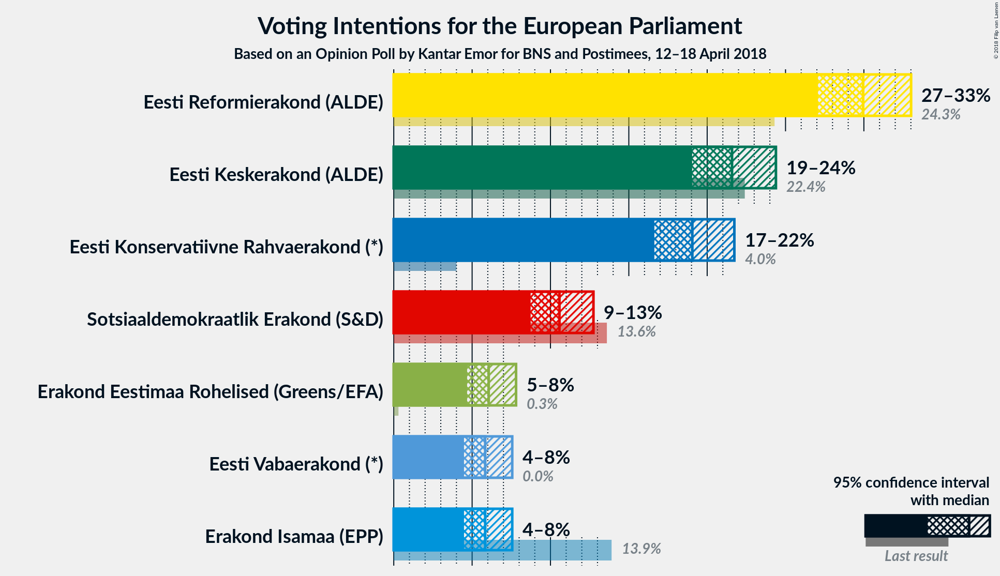
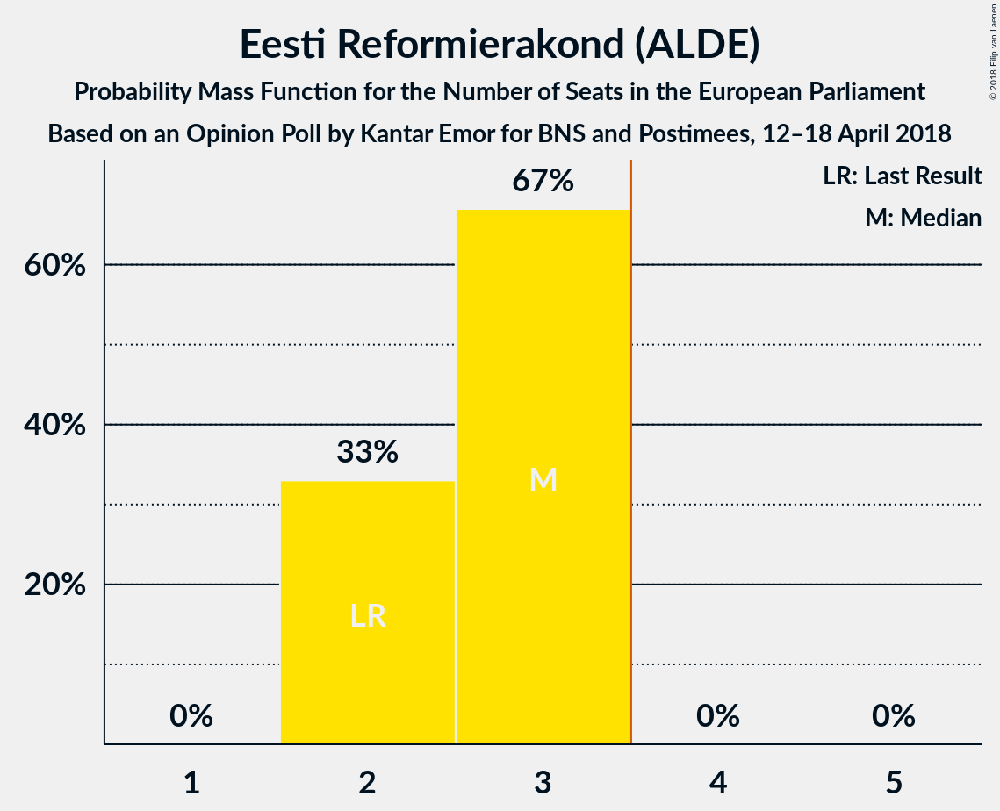
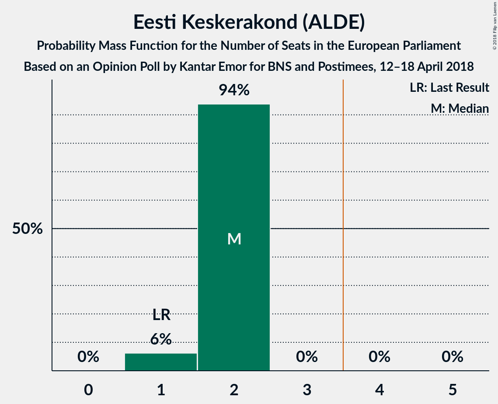
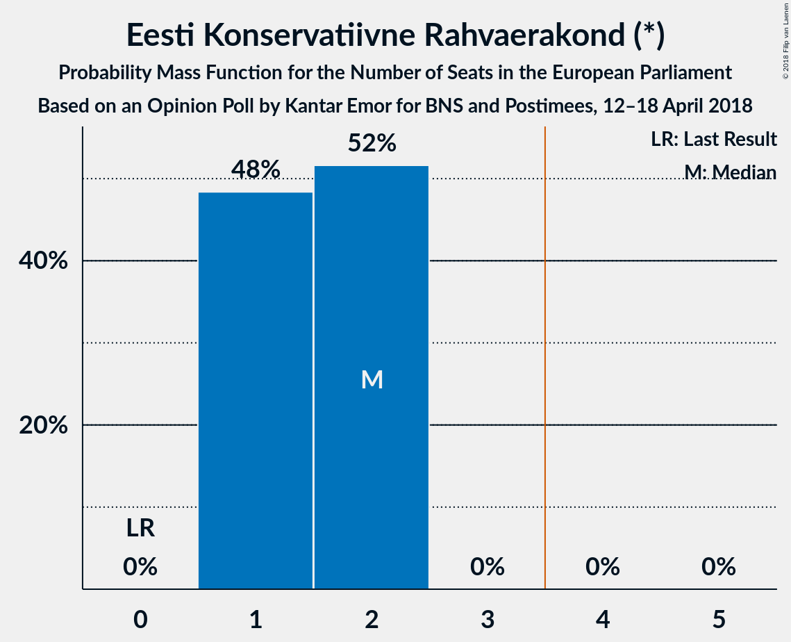
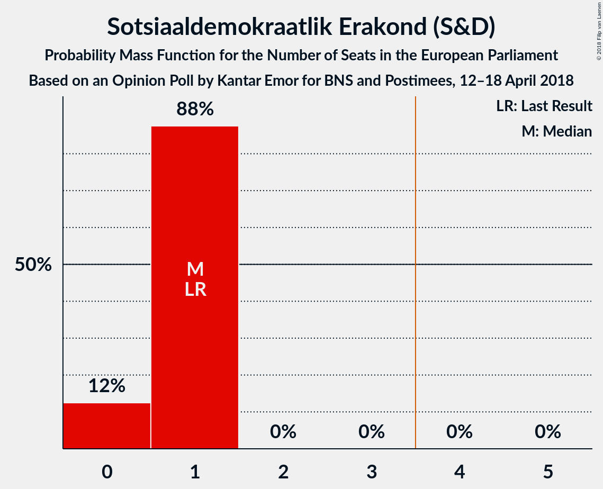
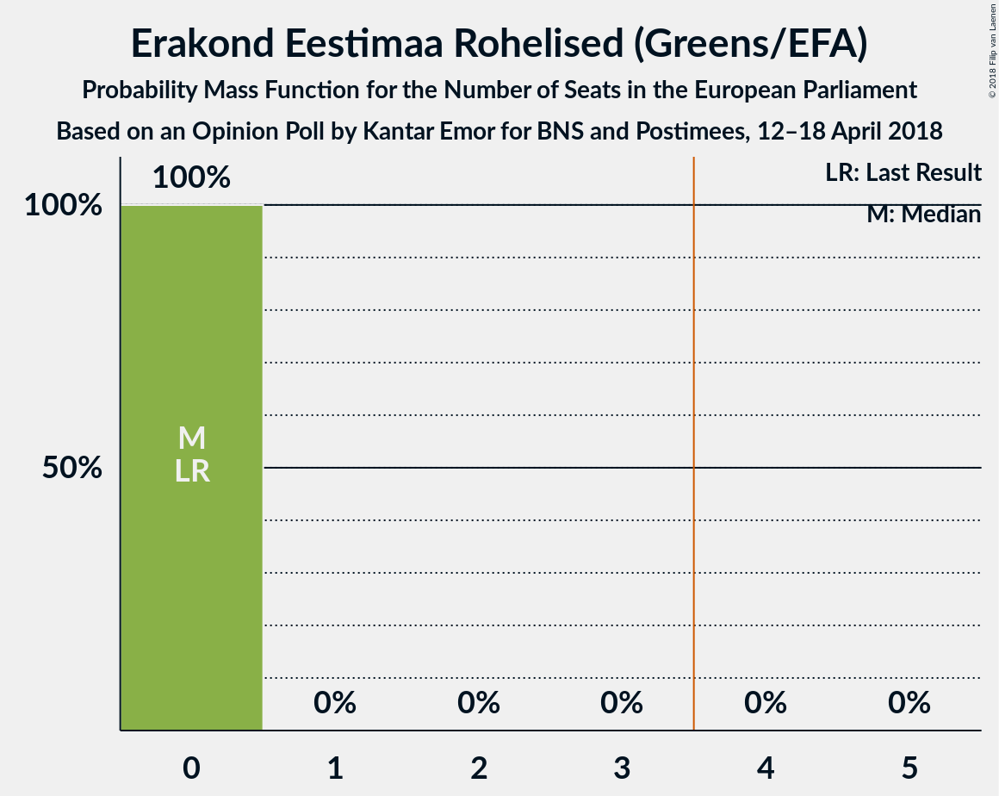
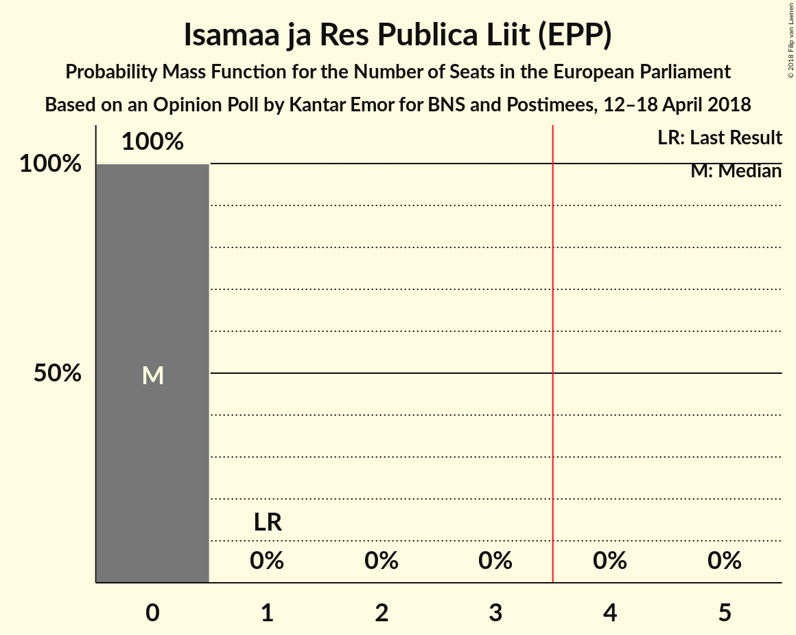
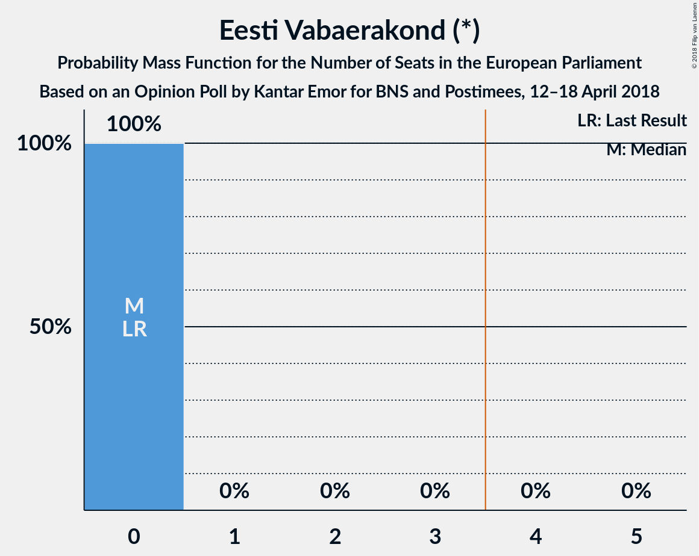
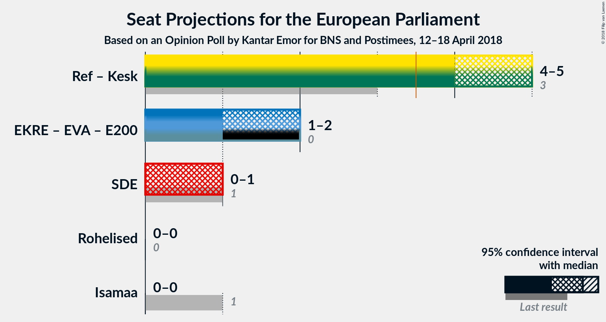

# Opinion Poll by Kantar Emor for BNS and Postimees, 12–18 April 2018

<a href="#voting-intentions">Voting Intentions</a> | <a href="#seats">Seats</a> | <a href="#coalitions">Coalitions</a> | <a href="#technical-information">Technical Information</a>

## Voting Intentions

### Confidence Intervals

| Party | Last Result | Poll Result | 80% Confidence Interval | 90% Confidence Interval | 95% Confidence Interval | 99% Confidence Interval |
|:-----:|:-----------:|:-----------:|:-----------------------:|:-----------------------:|:-----------------------:|:-----------------------:|
| Eesti Reformierakond (ALDE) | 24.3% | 30.0% | 28.1–32.0% |27.5–32.5% |27.1–33.0% |26.2–34.0% |
| Eesti Keskerakond (ALDE) | 22.4% | 21.6% | 19.9–23.4% |19.4–23.9% |19.0–24.4% |18.2–25.3% |
| Eesti Konservatiivne Rahvaerakond (*) | 4.0% | 19.1% | 17.5–20.8% |17.0–21.3% |16.6–21.7% |15.9–22.6% |
| Sotsiaaldemokraatlik Erakond (S&D) | 13.6% | 10.6% | 9.4–12.0% |9.0–12.4% |8.7–12.7% |8.2–13.5% |
| Erakond Eestimaa Rohelised (Greens/EFA) | 0.3% | 6.1% | 5.2–7.2% |4.9–7.5% |4.7–7.8% |4.3–8.4% |
| Isamaa ja Res Publica Liit (EPP) | 13.9% | 5.8% | 5.0–7.0% |4.7–7.3% |4.5–7.6% |4.1–8.1% |
| Eesti Vabaerakond (*) | 0.0% | 5.8% | 5.0–7.0% |4.7–7.3% |4.5–7.6% |4.1–8.1% |

*Note:* The poll result column reflects the actual value used in the calculations. Published results may vary slightly, and in addition be rounded to fewer digits.

## Seats

### Confidence Intervals

| Party | Last Result | Median | 80% Confidence Interval | 90% Confidence Interval | 95% Confidence Interval | 99% Confidence Interval |
|:-----:|:-----------:|:------:|:-----------------------:|:-----------------------:|:-----------------------:|:-----------------------:|
| <a href="#eesti-reformierakond-(alde)">Eesti Reformierakond (ALDE)</a> | 2 | 3 | 2–3 |2–3 |2–3 |2–3 |
| <a href="#eesti-keskerakond-(alde)">Eesti Keskerakond (ALDE)</a> | 1 | 2 | 2 |1–2 |1–2 |1–2 |
| <a href="#eesti-konservatiivne-rahvaerakond-(*)">Eesti Konservatiivne Rahvaerakond (*)</a> | 0 | 2 | 1–2 |1–2 |1–2 |1–2 |
| <a href="#sotsiaaldemokraatlik-erakond-(s&d)">Sotsiaaldemokraatlik Erakond (S&D)</a> | 1 | 1 | 0–1 |0–1 |0–1 |0–1 |
| <a href="#erakond-eestimaa-rohelised-(greens/efa)">Erakond Eestimaa Rohelised (Greens/EFA)</a> | 0 | 0 | 0 |0 |0 |0 |
| <a href="#isamaa-ja-res-publica-liit-(epp)">Isamaa ja Res Publica Liit (EPP)</a> | 1 | 0 | 0 |0 |0 |0 |
| <a href="#eesti-vabaerakond-(*)">Eesti Vabaerakond (*)</a> | 0 | 0 | 0 |0 |0 |0 |

### Eesti Reformierakond (ALDE)

*For a full overview of the results for this party, see the [Eesti Reformierakond (ALDE)](party-eestireformierakondalde.html) page.*

| Number of Seats | Probability | Accumulated | Special Marks |
|:---------------:|:-----------:|:-----------:|:-------------:|
| 2 | 33% | 100% | Last Result |
| 3 | 67% | 67% | Median |
| 4 | 0% | 0% | Majority |

### Eesti Keskerakond (ALDE)

*For a full overview of the results for this party, see the [Eesti Keskerakond (ALDE)](party-eestikeskerakondalde.html) page.*

| Number of Seats | Probability | Accumulated | Special Marks |
|:---------------:|:-----------:|:-----------:|:-------------:|
| 1 | 6% | 100% | Last Result |
| 2 | 94% | 94% | Median |
| 3 | 0% | 0% |  |

### Eesti Konservatiivne Rahvaerakond (*)

*For a full overview of the results for this party, see the [Eesti Konservatiivne Rahvaerakond (*)](party-eestikonservatiivnerahvaerakond.html) page.*

| Number of Seats | Probability | Accumulated | Special Marks |
|:---------------:|:-----------:|:-----------:|:-------------:|
| 0 | 0% | 100% | Last Result |
| 1 | 48% | 100% |  |
| 2 | 52% | 52% | Median |
| 3 | 0% | 0% |  |

### Sotsiaaldemokraatlik Erakond (S&D)

*For a full overview of the results for this party, see the [Sotsiaaldemokraatlik Erakond (S&D)](party-sotsiaaldemokraatlikerakondsd.html) page.*

| Number of Seats | Probability | Accumulated | Special Marks |
|:---------------:|:-----------:|:-----------:|:-------------:|
| 0 | 12% | 100% |  |
| 1 | 88% | 88% | Last Result, Median |
| 2 | 0% | 0% |  |

### Erakond Eestimaa Rohelised (Greens/EFA)

*For a full overview of the results for this party, see the [Erakond Eestimaa Rohelised (Greens/EFA)](party-erakondeestimaarohelisedgreensefa.html) page.*

| Number of Seats | Probability | Accumulated | Special Marks |
|:---------------:|:-----------:|:-----------:|:-------------:|
| 0 | 100% | 100% | Last Result, Median |

### Isamaa ja Res Publica Liit (EPP)

*For a full overview of the results for this party, see the [Isamaa ja Res Publica Liit (EPP)](party-isamaajarespublicaliitepp.html) page.*

| Number of Seats | Probability | Accumulated | Special Marks |
|:---------------:|:-----------:|:-----------:|:-------------:|
| 0 | 100% | 100% | Median |
| 1 | 0% | 0% | Last Result |

### Eesti Vabaerakond (*)

*For a full overview of the results for this party, see the [Eesti Vabaerakond (*)](party-eestivabaerakond.html) page.*

| Number of Seats | Probability | Accumulated | Special Marks |
|:---------------:|:-----------:|:-----------:|:-------------:|
| 0 | 100% | 100% | Last Result, Median |

## Coalitions

### Confidence Intervals

| Coalition | Last Result | Median | Majority? | 80% Confidence Interval | 90% Confidence Interval | 95% Confidence Interval | 99% Confidence Interval |
|:---------:|:-----------:|:------:|:---------:|:-----------------------:|:-----------------------:|:-----------------------:|:-----------------------:|
| Eesti Reformierakond (ALDE) – Eesti Keskerakond (ALDE) | 3 | 5 | 100% | 4–5 | 4–5 | 4–5 | 4–5 |
| Eesti Konservatiivne Rahvaerakond (*) – Eesti Vabaerakond (*) | 0 | 2 | 0% | 1–2 | 1–2 | 1–2 | 1–2 |
| Sotsiaaldemokraatlik Erakond (S&D) | 1 | 1 | 0% | 0–1 | 0–1 | 0–1 | 0–1 |
| Erakond Eestimaa Rohelised (Greens/EFA) | 0 | 0 | 0% | 0 | 0 | 0 | 0 |
| Isamaa ja Res Publica Liit (EPP) | 1 | 0 | 0% | 0 | 0 | 0 | 0 |

### Eesti Reformierakond (ALDE) – Eesti Keskerakond (ALDE)

| Number of Seats | Probability | Accumulated | Special Marks |
|:---------------:|:-----------:|:-----------:|:-------------:|
| 3 | 0% | 100% | Last Result |
| 4 | 39% | 100% | Majority |
| 5 | 61% | 61% | Median |
| 6 | 0% | 0% |  |

### Eesti Konservatiivne Rahvaerakond (*) – Eesti Vabaerakond (*)

| Number of Seats | Probability | Accumulated | Special Marks |
|:---------------:|:-----------:|:-----------:|:-------------:|
| 0 | 0% | 100% | Last Result |
| 1 | 48% | 100% |  |
| 2 | 52% | 52% | Median |
| 3 | 0% | 0% |  |

### Sotsiaaldemokraatlik Erakond (S&D)

| Number of Seats | Probability | Accumulated | Special Marks |
|:---------------:|:-----------:|:-----------:|:-------------:|
| 0 | 12% | 100% |  |
| 1 | 88% | 88% | Last Result, Median |
| 2 | 0% | 0% |  |

### Erakond Eestimaa Rohelised (Greens/EFA)

| Number of Seats | Probability | Accumulated | Special Marks |
|:---------------:|:-----------:|:-----------:|:-------------:|
| 0 | 100% | 100% | Last Result, Median |

### Isamaa ja Res Publica Liit (EPP)

| Number of Seats | Probability | Accumulated | Special Marks |
|:---------------:|:-----------:|:-----------:|:-------------:|
| 0 | 100% | 100% | Median |
| 1 | 0% | 0% | Last Result |

## Technical Information

### Opinion Poll

+ **Polling firm:** Kantar Emor
+ **Commissioner(s):** BNS and Postimees
+ **Fieldwork period:** 12–18 April 2018

### Calculations

+ **Sample size:** 908
+ **Simulations done:** 1,048,576
+ **Error estimate:** 1.17%

