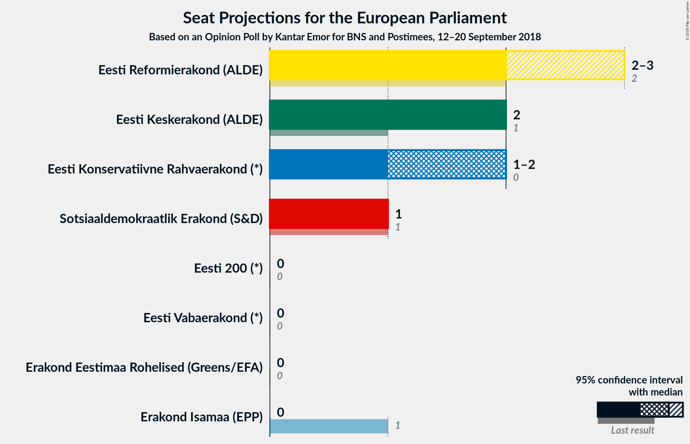

# Opinion Poll by Kantar Emor for BNS and Postimees, 12–20 September 2018

<a href="#voting-intentions">Voting Intentions</a> | <a href="#seats">Seats</a> | <a href="#coalitions">Coalitions</a> | <a href="#technical-information">Technical Information</a>

## Voting Intentions

### Confidence Intervals

| Party | Last Result | Poll Result | 80% Confidence Interval | 90% Confidence Interval | 95% Confidence Interval | 99% Confidence Interval |
|:-----:|:-----------:|:-----------:|:-----------------------:|:-----------------------:|:-----------------------:|:-----------------------:|
| Eesti Reformierakond (ALDE) | 24.3% | 26.7% | 25.0–28.6% |24.5–29.1% |24.0–29.6% |23.2–30.5% |
| Eesti Keskerakond (ALDE) | 22.4% | 24.6% | 22.8–26.4% |22.4–26.9% |22.0–27.4% |21.2–28.3% |
| Eesti Konservatiivne Rahvaerakond (*) | 4.0% | 19.9% | 18.4–21.7% |17.9–22.1% |17.5–22.6% |16.8–23.4% |
| Sotsiaaldemokraatlik Erakond (S&D) | 13.6% | 12.5% | 11.3–14.0% |10.9–14.4% |10.6–14.8% |10.0–15.5% |
| Isamaa ja Res Publica Liit (EPP) | 13.9% | 4.9% | 4.1–5.9% |3.9–6.2% |3.7–6.5% |3.4–7.0% |
| Eesti 200 (*) | N/A | 4.1% | 3.4–5.0% |3.2–5.3% |3.0–5.6% |2.7–6.0% |
| Eesti Vabaerakond (*) | 0.0% | 3.4% | 2.7–4.3% |2.6–4.5% |2.4–4.7% |2.1–5.2% |
| Erakond Eestimaa Rohelised (Greens/EFA) | 0.3% | 3.2% | 2.6–4.0% |2.4–4.3% |2.3–4.5% |2.0–4.9% |

*Note:* The poll result column reflects the actual value used in the calculations. Published results may vary slightly, and in addition be rounded to fewer digits.

## Seats

### Confidence Intervals

| Party | Last Result | Median | 80% Confidence Interval | 90% Confidence Interval | 95% Confidence Interval | 99% Confidence Interval |
|:-----:|:-----------:|:------:|:-----------------------:|:-----------------------:|:-----------------------:|:-----------------------:|
| <a href="#eesti-reformierakond-(alde)">Eesti Reformierakond (ALDE)</a> | 2 | 2 | 2 |2–3 |2–3 |2–3 |
| <a href="#eesti-keskerakond-(alde)">Eesti Keskerakond (ALDE)</a> | 1 | 2 | 2 |2 |2 |2–3 |
| <a href="#eesti-konservatiivne-rahvaerakond-(*)">Eesti Konservatiivne Rahvaerakond (*)</a> | 0 | 2 | 2 |1–2 |1–2 |1–2 |
| <a href="#sotsiaaldemokraatlik-erakond-(s&d)">Sotsiaaldemokraatlik Erakond (S&D)</a> | 1 | 1 | 1 |1 |1 |1 |
| <a href="#isamaa-ja-res-publica-liit-(epp)">Isamaa ja Res Publica Liit (EPP)</a> | 1 | 0 | 0 |0 |0 |0 |
| <a href="#eesti-200-(*)">Eesti 200 (*)</a> | N/A | 0 | 0 |0 |0 |0 |
| <a href="#eesti-vabaerakond-(*)">Eesti Vabaerakond (*)</a> | 0 | 0 | 0 |0 |0 |0 |
| <a href="#erakond-eestimaa-rohelised-(greens/efa)">Erakond Eestimaa Rohelised (Greens/EFA)</a> | 0 | 0 | 0 |0 |0 |0 |

