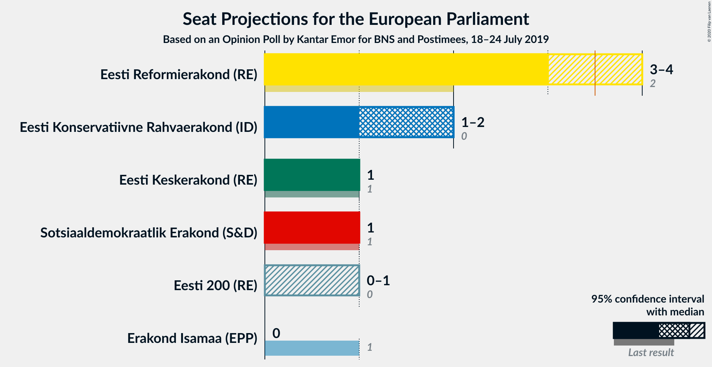
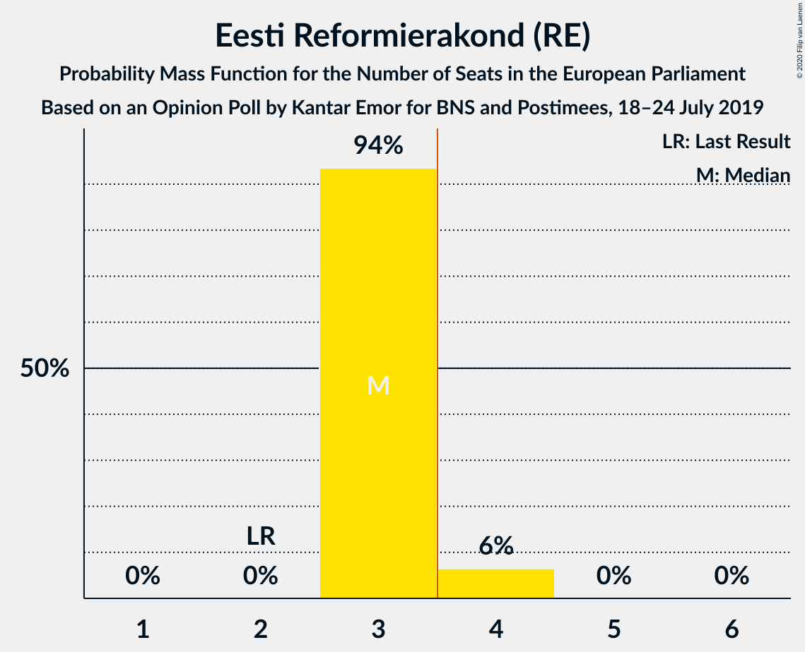
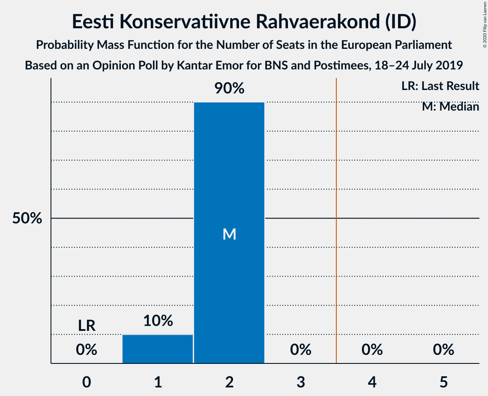
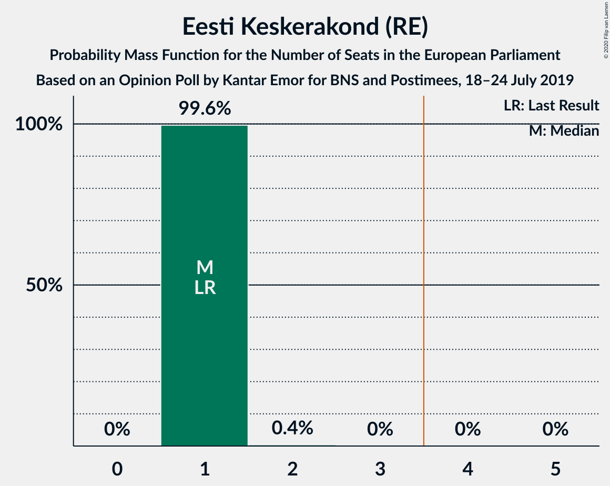
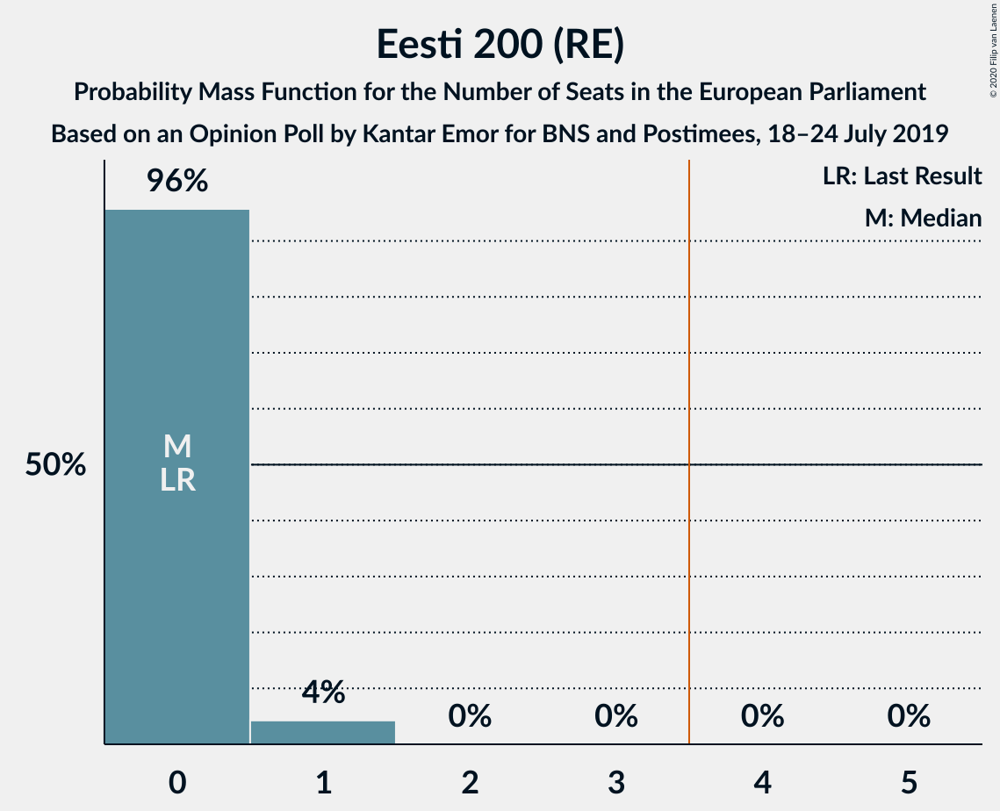
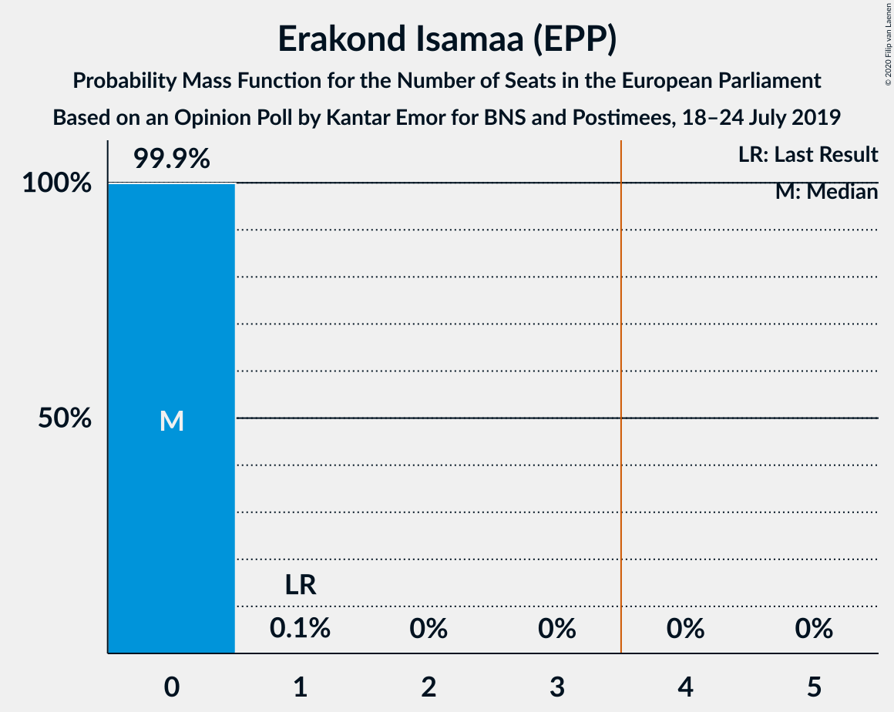
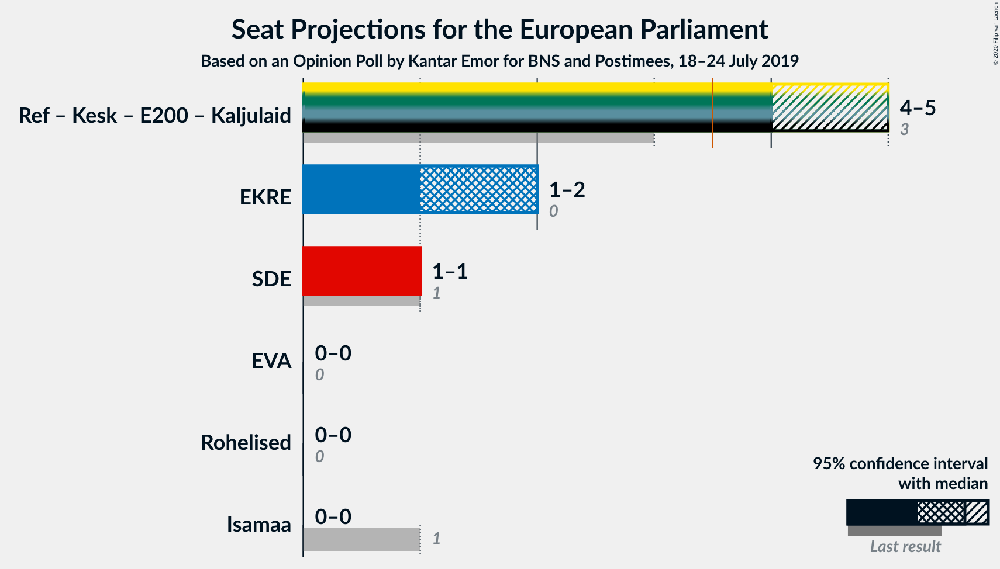
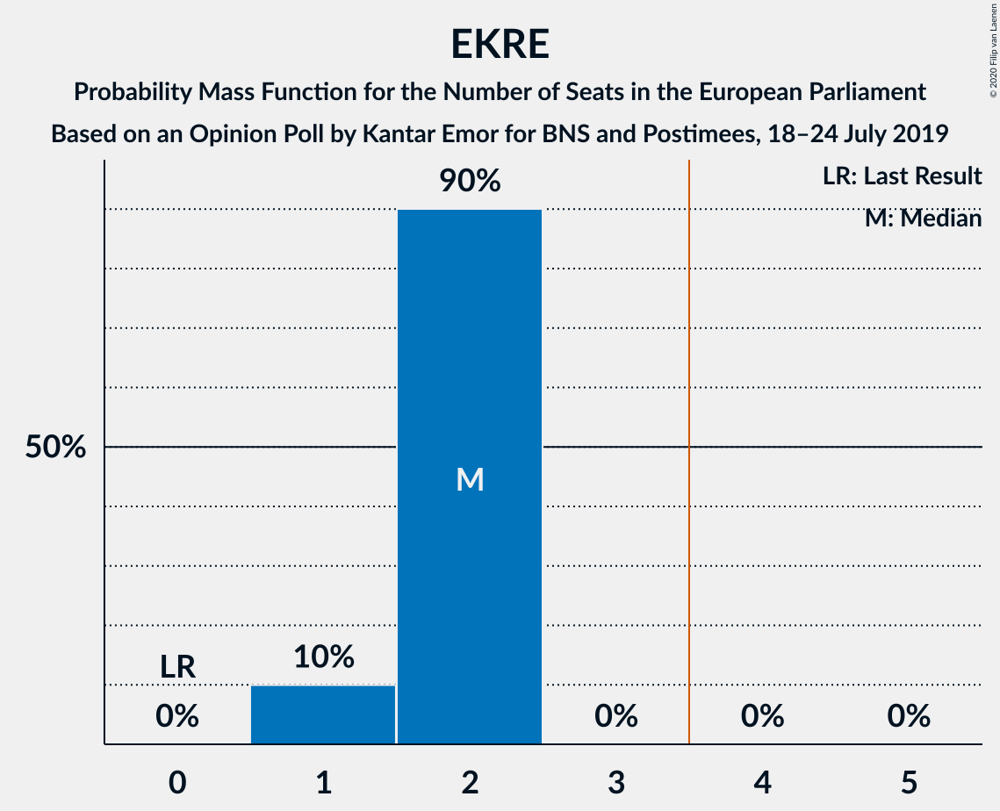
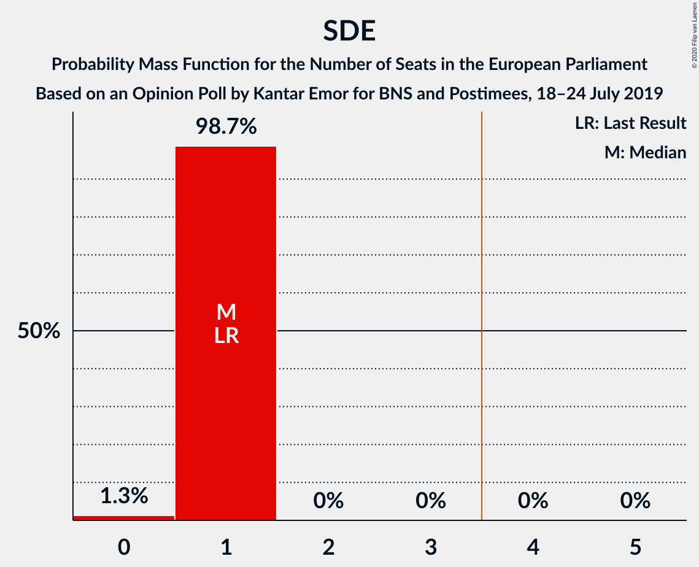
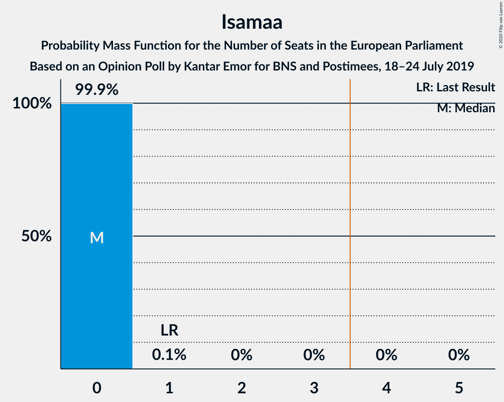

# Opinion Poll by Kantar Emor for BNS and Postimees, 18–24 July 2019

<a href="#voting-intentions">Voting Intentions</a> | <a href="#seats">Seats</a> | <a href="#coalitions">Coalitions</a> | <a href="#technical-information">Technical Information</a>

## Voting Intentions

### Confidence Intervals

| Party | Last Result | Poll Result | 80% Confidence Interval | 90% Confidence Interval | 95% Confidence Interval | 99% Confidence Interval |
|:-----:|:-----------:|:-----------:|:-----------------------:|:-----------------------:|:-----------------------:|:-----------------------:|
| Eesti Reformierakond (RE) | 24.3% | 34.5% | 32.8–36.2% |32.4–36.7% |31.9–37.1% |31.2–37.9% |
| Eesti Konservatiivne Rahvaerakond (ID) | 4.0% | 19.4% | 18.0–20.9% |17.6–21.3% |17.3–21.6% |16.7–22.3% |
| Eesti Keskerakond (RE) | 22.4% | 15.3% | 14.1–16.7% |13.8–17.1% |13.5–17.4% |12.9–18.0% |
| Sotsiaaldemokraatlik Erakond (S&D) | 13.6% | 10.8% | 9.8–12.0% |9.5–12.3% |9.2–12.6% |8.8–13.2% |
| Eesti 200 (RE) | 0.0% | 7.9% | 7.0–8.9% |6.8–9.2% |6.6–9.5% |6.1–10.0% |
| Erakond Isamaa (EPP) | 13.9% | 6.8% | 6.0–7.8% |5.8–8.1% |5.6–8.3% |5.2–8.8% |

*Note:* The poll result column reflects the actual value used in the calculations. Published results may vary slightly, and in addition be rounded to fewer digits.

## Seats

### Confidence Intervals

| Party | Last Result | Median | 80% Confidence Interval | 90% Confidence Interval | 95% Confidence Interval | 99% Confidence Interval |
|:-----:|:-----------:|:------:|:-----------------------:|:-----------------------:|:-----------------------:|:-----------------------:|
| <a href="#eesti-reformierakond-(re)">Eesti Reformierakond (RE)</a> | 2 | 3 | 3 |3–4 |3–4 |3–4 |
| <a href="#eesti-konservatiivne-rahvaerakond-(id)">Eesti Konservatiivne Rahvaerakond (ID)</a> | 0 | 2 | 2 |1–2 |1–2 |1–2 |
| <a href="#eesti-keskerakond-(re)">Eesti Keskerakond (RE)</a> | 1 | 1 | 1 |1 |1 |1 |
| <a href="#sotsiaaldemokraatlik-erakond-(s&d)">Sotsiaaldemokraatlik Erakond (S&D)</a> | 1 | 1 | 1 |1 |1 |0–1 |
| <a href="#eesti-200-(re)">Eesti 200 (RE)</a> | 0 | 0 | 0 |0 |0–1 |0–1 |
| <a href="#erakond-isamaa-(epp)">Erakond Isamaa (EPP)</a> | 1 | 0 | 0 |0 |0 |0 |

### Eesti Reformierakond (RE)

*For a full overview of the results for this party, see the [Eesti Reformierakond (RE)](party-eestireformierakondre.html) page.*

| Number of Seats | Probability | Accumulated | Special Marks |
|:---------------:|:-----------:|:-----------:|:-------------:|
| 2 | 0% | 100% | Last Result |
| 3 | 93% | 100% | Median |
| 4 | 7% | 7% | Majority |
| 5 | 0% | 0% |  |

### Eesti Konservatiivne Rahvaerakond (ID)

*For a full overview of the results for this party, see the [Eesti Konservatiivne Rahvaerakond (ID)](party-eestikonservatiivnerahvaerakondid.html) page.*

| Number of Seats | Probability | Accumulated | Special Marks |
|:---------------:|:-----------:|:-----------:|:-------------:|
| 0 | 0% | 100% | Last Result |
| 1 | 10% | 100% |  |
| 2 | 90% | 90% | Median |
| 3 | 0% | 0% |  |

### Eesti Keskerakond (RE)

*For a full overview of the results for this party, see the [Eesti Keskerakond (RE)](party-eestikeskerakondre.html) page.*

| Number of Seats | Probability | Accumulated | Special Marks |
|:---------------:|:-----------:|:-----------:|:-------------:|
| 1 | 99.5% | 100% | Last Result, Median |
| 2 | 0.5% | 0.5% |  |
| 3 | 0% | 0% |  |

### Sotsiaaldemokraatlik Erakond (S&D)

*For a full overview of the results for this party, see the [Sotsiaaldemokraatlik Erakond (S&D)](party-sotsiaaldemokraatlikerakondsd.html) page.*

| Number of Seats | Probability | Accumulated | Special Marks |
|:---------------:|:-----------:|:-----------:|:-------------:|
| 0 | 2% | 100% |  |
| 1 | 98% | 98% | Last Result, Median |
| 2 | 0% | 0% |  |

### Eesti 200 (RE)

*For a full overview of the results for this party, see the [Eesti 200 (RE)](party-eesti200re.html) page.*

| Number of Seats | Probability | Accumulated | Special Marks |
|:---------------:|:-----------:|:-----------:|:-------------:|
| 0 | 96% | 100% | Last Result, Median |
| 1 | 4% | 4% |  |
| 2 | 0% | 0% |  |

### Erakond Isamaa (EPP)

*For a full overview of the results for this party, see the [Erakond Isamaa (EPP)](party-erakondisamaaepp.html) page.*

| Number of Seats | Probability | Accumulated | Special Marks |
|:---------------:|:-----------:|:-----------:|:-------------:|
| 0 | 99.9% | 100% | Median |
| 1 | 0.1% | 0.1% | Last Result |
| 2 | 0% | 0% |  |

## Coalitions

### Confidence Intervals

| Coalition | Last Result | Median | Majority? | 80% Confidence Interval | 90% Confidence Interval | 95% Confidence Interval | 99% Confidence Interval |
|:---------:|:-----------:|:------:|:---------:|:-----------------------:|:-----------------------:|:-----------------------:|:-----------------------:|
| Eesti Konservatiivne Rahvaerakond (ID) | 0 | 2 | 0% | 2 | 1–2 | 1–2 | 1–2 |
| Sotsiaaldemokraatlik Erakond (S&D) | 1 | 1 | 0% | 1 | 1 | 1 | 0–1 |
| Erakond Isamaa (EPP) | 1 | 0 | 0% | 0 | 0 | 0 | 0 |

### Eesti Konservatiivne Rahvaerakond (ID)

| Number of Seats | Probability | Accumulated | Special Marks |
|:---------------:|:-----------:|:-----------:|:-------------:|
| 0 | 0% | 100% | Last Result |
| 1 | 10% | 100% |  |
| 2 | 90% | 90% | Median |
| 3 | 0% | 0% |  |

### Sotsiaaldemokraatlik Erakond (S&D)

| Number of Seats | Probability | Accumulated | Special Marks |
|:---------------:|:-----------:|:-----------:|:-------------:|
| 0 | 2% | 100% |  |
| 1 | 98% | 98% | Last Result, Median |
| 2 | 0% | 0% |  |

### Erakond Isamaa (EPP)

| Number of Seats | Probability | Accumulated | Special Marks |
|:---------------:|:-----------:|:-----------:|:-------------:|
| 0 | 99.9% | 100% | Median |
| 1 | 0.1% | 0.1% | Last Result |
| 2 | 0% | 0% |  |

## Technical Information

### Opinion Poll

+ **Polling firm:** Kantar Emor
+ **Commissioner(s):** BNS and Postimees
+ **Fieldwork period:** 18–24 July 2019

### Calculations

+ **Sample size:** 1305
+ **Simulations done:** 131,072
+ **Error estimate:** 1.16%

