# Opinion Poll by Turu-uuringute AS, 1–9 August 2024

<a href="#voting-intentions">Voting Intentions</a> | <a href="#seats">Seats</a> | <a href="#coalitions">Coalitions</a> | <a href="#technical-information">Technical Information</a>

## Voting Intentions

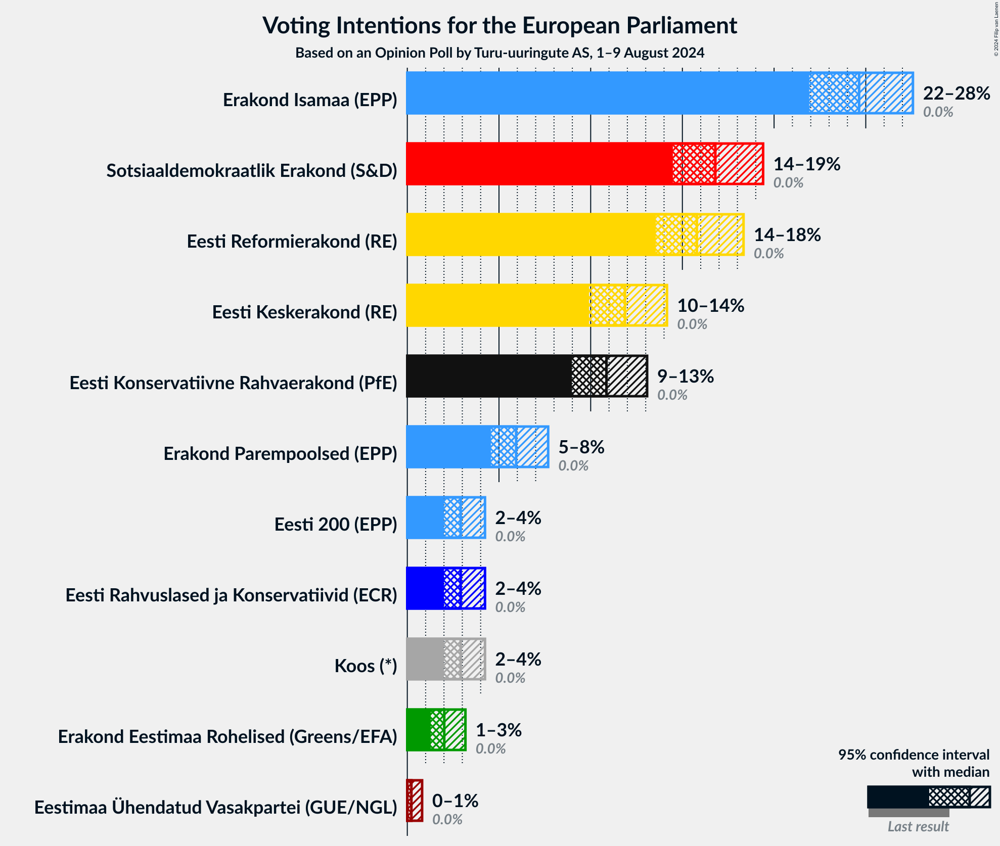

### Confidence Intervals

| Party | Last Result | Poll Result | 80% Confidence Interval | 90% Confidence Interval | 95% Confidence Interval | 99% Confidence Interval |
|:-----:|:-----------:|:-----------:|:-----------------------:|:-----------------------:|:-----------------------:|:-----------------------:|
| Erakond Isamaa (EPP) | 0.0% | 24.6% | 22.8–26.6% |22.3–27.1% |21.9–27.6% |21.1–28.5% |
| Sotsiaaldemokraatlik Erakond (S&D) | 0.0% | 16.8% | 15.3–18.5% |14.8–19.0% |14.5–19.4% |13.8–20.2% |
| Eesti Reformierakond (RE) | 0.0% | 15.8% | 14.3–17.5% |13.9–17.9% |13.5–18.3% |12.9–19.2% |
| Eesti Keskerakond (RE) | 0.0% | 11.9% | 10.6–13.4% |10.2–13.8% |9.9–14.2% |9.3–14.9% |
| Eesti Konservatiivne Rahvaerakond (PfE) | 0.0% | 10.9% | 9.6–12.3% |9.3–12.7% |9.0–13.1% |8.4–13.8% |
| Erakond Parempoolsed (EPP) | 0.0% | 5.9% | 5.0–7.1% |4.8–7.4% |4.6–7.7% |4.2–8.3% |
| Koos (*) | 0.0% | 2.9% | 2.3–3.8% |2.1–4.0% |2.0–4.2% |1.7–4.7% |
| Eesti 200 (EPP) | 0.0% | 2.9% | 2.3–3.8% |2.1–4.0% |2.0–4.2% |1.7–4.7% |
| Eesti Rahvuslased ja Konservatiivid (ERC) | 0.0% | 2.9% | 2.3–3.8% |2.1–4.0% |2.0–4.2% |1.7–4.7% |
| Erakond Eestimaa Rohelised (Greens/EFA) | 0.0% | 2.0% | 1.5–2.8% |1.4–3.0% |1.3–3.2% |1.1–3.6% |
| Eestimaa Ühendatud Vasakpartei (GUE/NGL) | 0.0% | 0.2% | 0.1–0.6% |0.1–0.7% |0.1–0.8% |0.0–1.0% |

*Note:* The poll result column reflects the actual value used in the calculations. Published results may vary slightly, and in addition be rounded to fewer digits.

## Seats

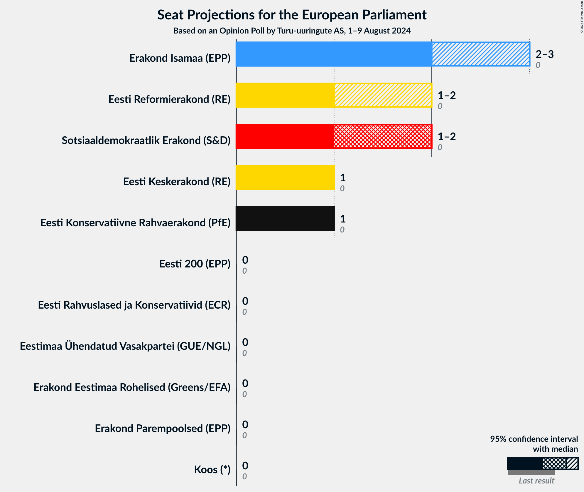

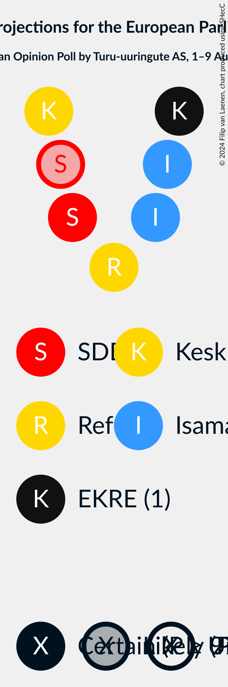

### Confidence Intervals

| Party | Last Result | Median | 80% Confidence Interval | 90% Confidence Interval | 95% Confidence Interval | 99% Confidence Interval |
|:-----:|:-----------:|:------:|:-----------------------:|:-----------------------:|:-----------------------:|:-----------------------:|
| <a href="#erakond-isamaa-(epp)">Erakond Isamaa (EPP)</a> | 0 | 2 | 2–3 |2–3 |2–3 |2–3 |
| <a href="#sotsiaaldemokraatlik-erakond-(s&d)">Sotsiaaldemokraatlik Erakond (S&D)</a> | 0 | 2 | 1–2 |1–2 |1–2 |1–2 |
| <a href="#eesti-reformierakond-(re)">Eesti Reformierakond (RE)</a> | 0 | 1 | 1 |1–2 |1–2 |1–2 |
| <a href="#eesti-keskerakond-(re)">Eesti Keskerakond (RE)</a> | 0 | 1 | 1 |1 |1 |1 |
| <a href="#eesti-konservatiivne-rahvaerakond-(pfe)">Eesti Konservatiivne Rahvaerakond (PfE)</a> | 0 | 1 | 1 |1 |1 |1 |
| <a href="#erakond-parempoolsed-(epp)">Erakond Parempoolsed (EPP)</a> | 0 | 0 | 0 |0 |0 |0 |
| <a href="#koos-(*)">Koos (*)</a> | 0 | 0 | 0 |0 |0 |0 |
| <a href="#eesti-200-(epp)">Eesti 200 (EPP)</a> | 0 | 0 | 0 |0 |0 |0 |
| <a href="#eesti-rahvuslased-ja-konservatiivid-(erc)">Eesti Rahvuslased ja Konservatiivid (ERC)</a> | 0 | 0 | 0 |0 |0 |0 |
| <a href="#erakond-eestimaa-rohelised-(greens/efa)">Erakond Eestimaa Rohelised (Greens/EFA)</a> | 0 | 0 | 0 |0 |0 |0 |
| <a href="#eestimaa-ühendatud-vasakpartei-(gue/ngl)">Eestimaa Ühendatud Vasakpartei (GUE/NGL)</a> | 0 | 0 | 0 |0 |0 |0 |

### Erakond Isamaa (EPP)

*For a full overview of the results for this party, see the [Erakond Isamaa (EPP)](party-erakondisamaaepp.html) page.*

| Number of Seats | Probability | Accumulated | Special Marks |
|:---------------:|:-----------:|:-----------:|:-------------:|
| 0 | 0% | 100% | Last Result |
| 1 | 0% | 100% |  |
| 2 | 63% | 100% | Median |
| 3 | 37% | 37% |  |
| 4 | 0% | 0% | Majority |

### Sotsiaaldemokraatlik Erakond (S&D)

*For a full overview of the results for this party, see the [Sotsiaaldemokraatlik Erakond (S&D)](party-sotsiaaldemokraatlikerakondsd.html) page.*

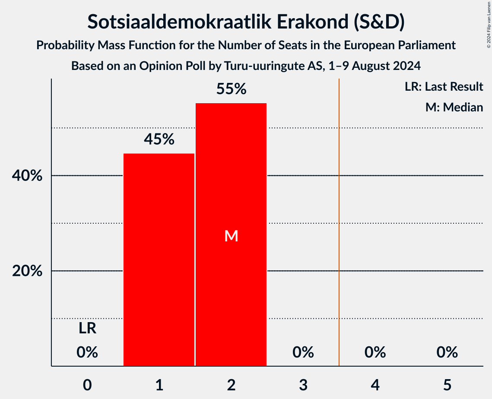

| Number of Seats | Probability | Accumulated | Special Marks |
|:---------------:|:-----------:|:-----------:|:-------------:|
| 0 | 0% | 100% | Last Result |
| 1 | 45% | 100% |  |
| 2 | 55% | 55% | Median |
| 3 | 0% | 0% |  |

### Eesti Reformierakond (RE)

*For a full overview of the results for this party, see the [Eesti Reformierakond (RE)](party-eestireformierakondre.html) page.*

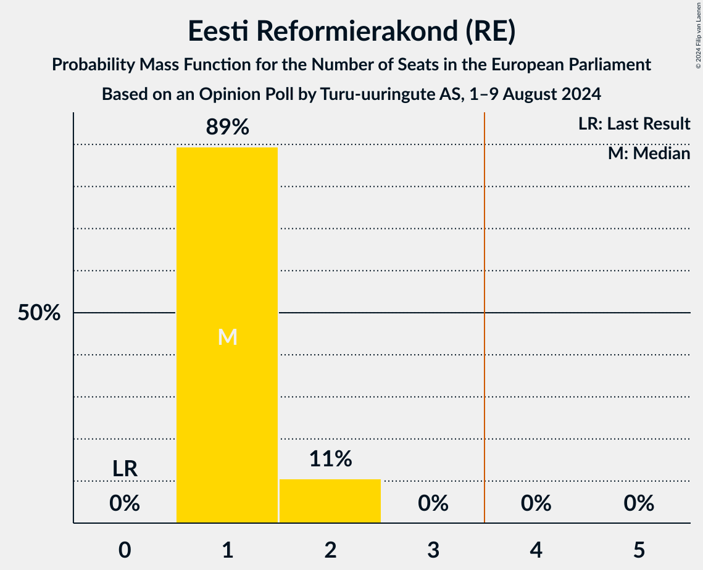

| Number of Seats | Probability | Accumulated | Special Marks |
|:---------------:|:-----------:|:-----------:|:-------------:|
| 0 | 0% | 100% | Last Result |
| 1 | 92% | 100% | Median |
| 2 | 8% | 8% |  |
| 3 | 0% | 0% |  |

### Eesti Keskerakond (RE)

*For a full overview of the results for this party, see the [Eesti Keskerakond (RE)](party-eestikeskerakondre.html) page.*

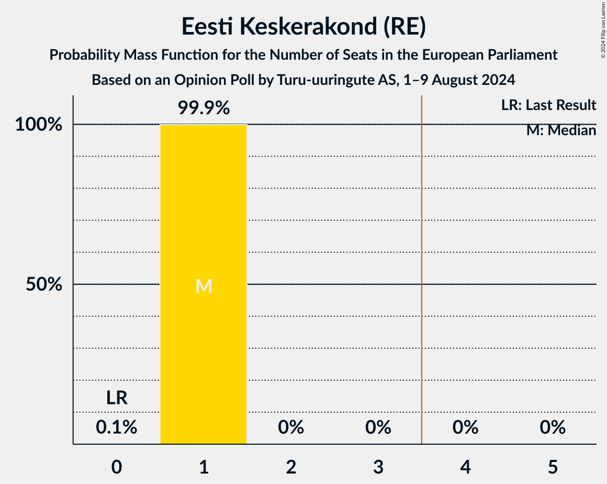

| Number of Seats | Probability | Accumulated | Special Marks |
|:---------------:|:-----------:|:-----------:|:-------------:|
| 0 | 0% | 100% | Last Result |
| 1 | 99.9% | 100% | Median |

### Eesti Konservatiivne Rahvaerakond (PfE)

*For a full overview of the results for this party, see the [Eesti Konservatiivne Rahvaerakond (PfE)](party-eestikonservatiivnerahvaerakondpfe.html) page.*

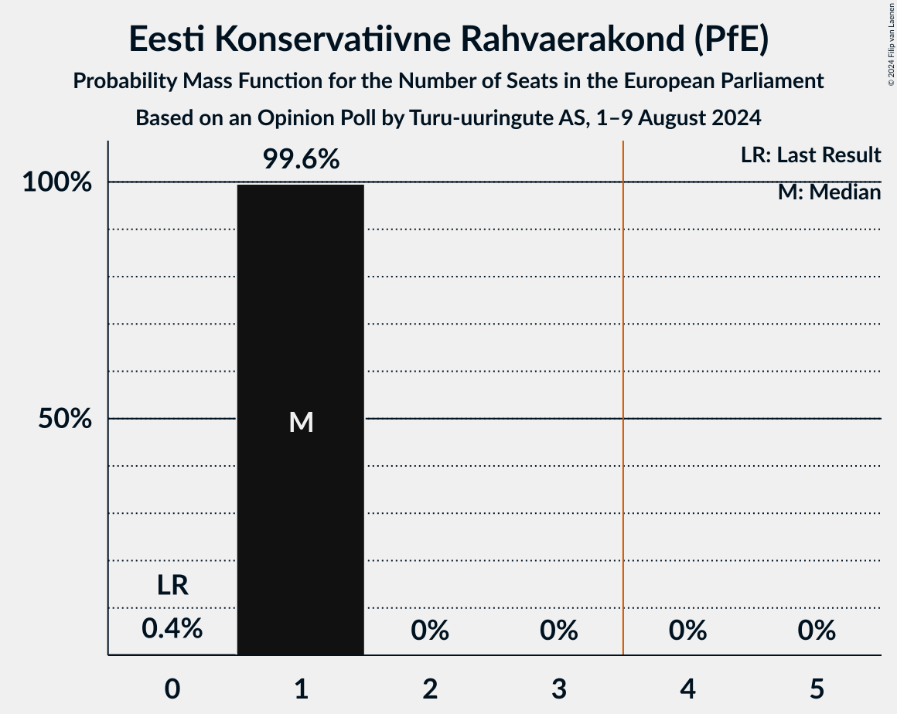

| Number of Seats | Probability | Accumulated | Special Marks |
|:---------------:|:-----------:|:-----------:|:-------------:|
| 0 | 0.1% | 100% | Last Result |
| 1 | 99.9% | 99.9% | Median |
| 2 | 0% | 0% |  |

### Erakond Parempoolsed (EPP)

*For a full overview of the results for this party, see the [Erakond Parempoolsed (EPP)](party-erakondparempoolsedepp.html) page.*

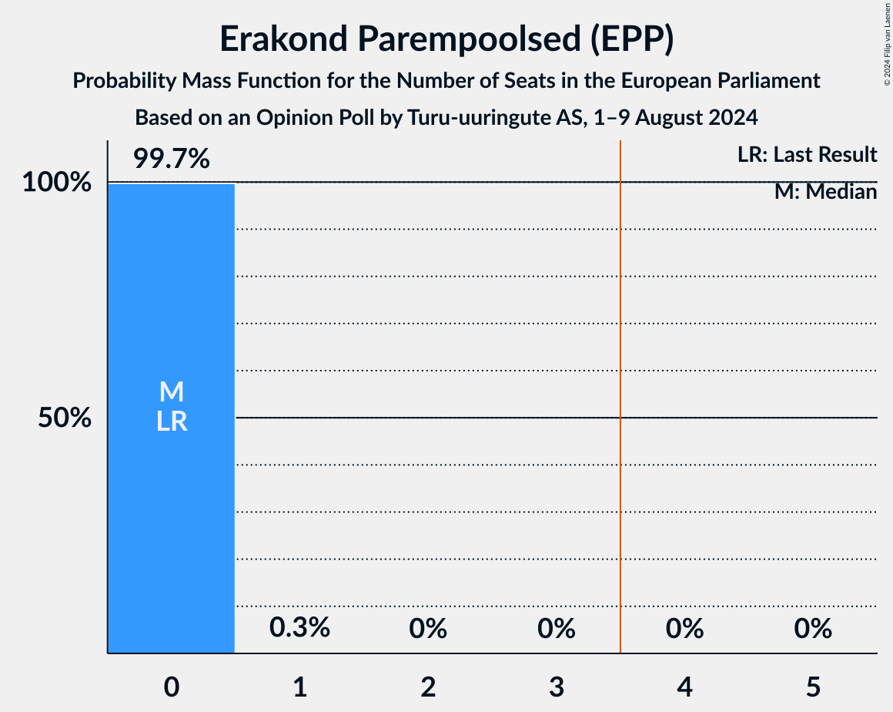

| Number of Seats | Probability | Accumulated | Special Marks |
|:---------------:|:-----------:|:-----------:|:-------------:|
| 0 | 99.7% | 100% | Last Result, Median |
| 1 | 0.3% | 0.3% |  |
| 2 | 0% | 0% |  |

### Koos (*)

*For a full overview of the results for this party, see the [Koos (*)](party-koos.html) page.*

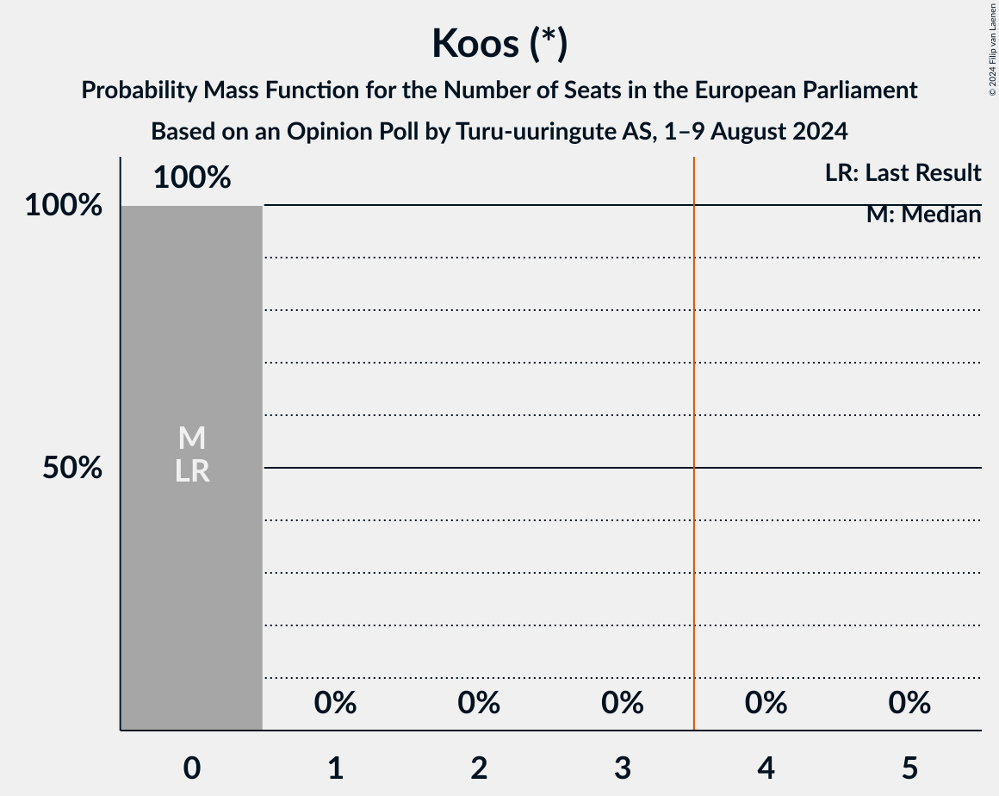

| Number of Seats | Probability | Accumulated | Special Marks |
|:---------------:|:-----------:|:-----------:|:-------------:|
| 0 | 100% | 100% | Last Result, Median |

### Eesti 200 (EPP)

*For a full overview of the results for this party, see the [Eesti 200 (EPP)](party-eesti200epp.html) page.*

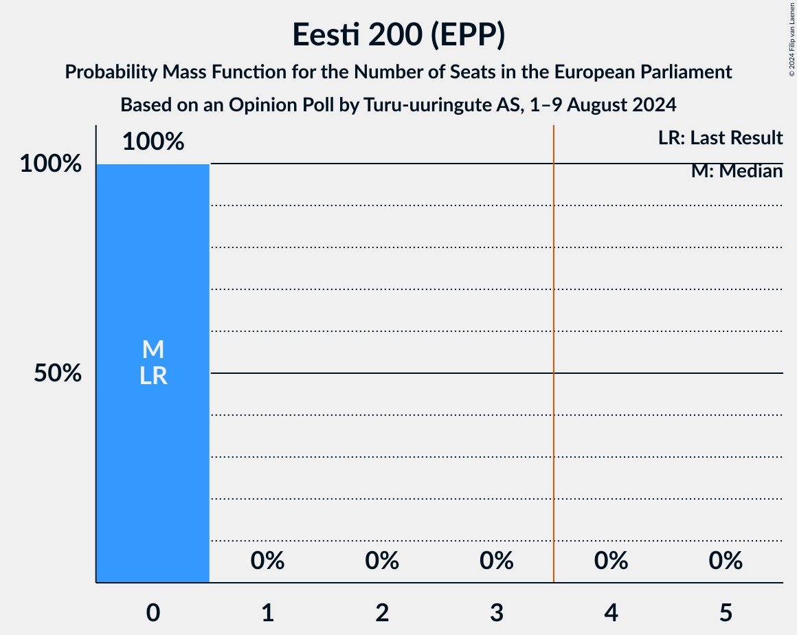

| Number of Seats | Probability | Accumulated | Special Marks |
|:---------------:|:-----------:|:-----------:|:-------------:|
| 0 | 100% | 100% | Last Result, Median |

### Eesti Rahvuslased ja Konservatiivid (ERC)

*For a full overview of the results for this party, see the [Eesti Rahvuslased ja Konservatiivid (ERC)](party-eestirahvuslasedjakonservatiividerc.html) page.*

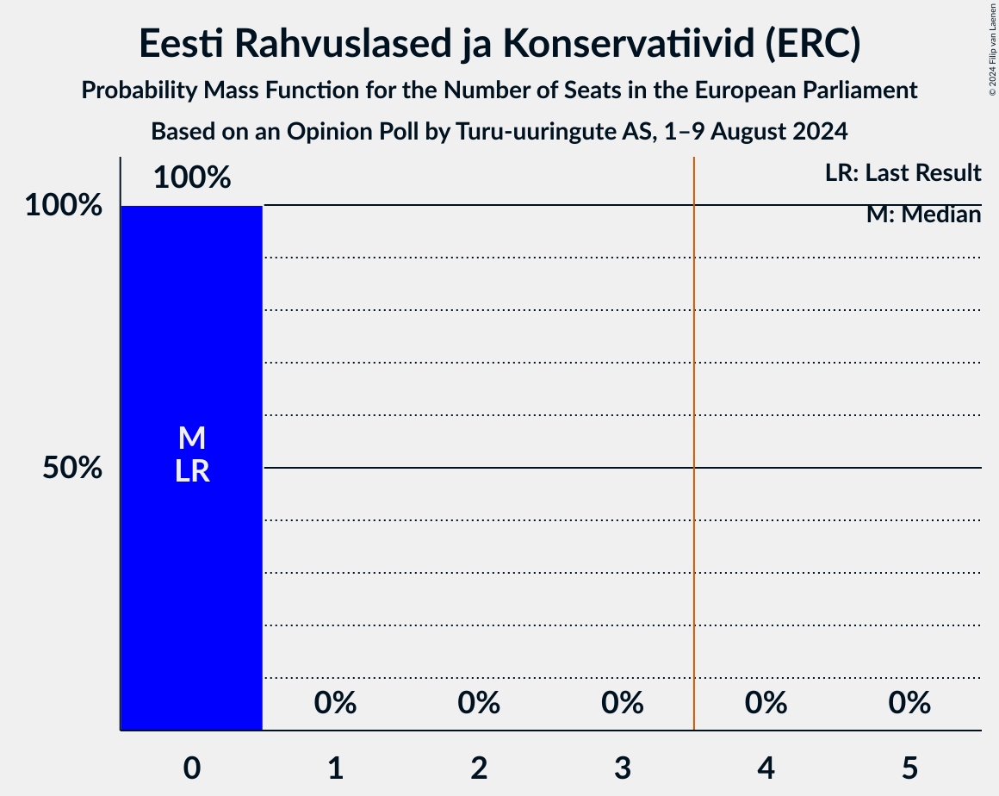

| Number of Seats | Probability | Accumulated | Special Marks |
|:---------------:|:-----------:|:-----------:|:-------------:|
| 0 | 100% | 100% | Last Result, Median |

### Erakond Eestimaa Rohelised (Greens/EFA)

*For a full overview of the results for this party, see the [Erakond Eestimaa Rohelised (Greens/EFA)](party-erakondeestimaarohelisedgreensefa.html) page.*

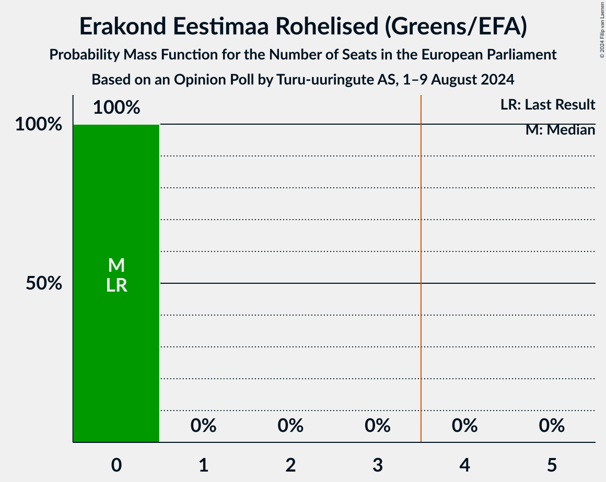

| Number of Seats | Probability | Accumulated | Special Marks |
|:---------------:|:-----------:|:-----------:|:-------------:|
| 0 | 100% | 100% | Last Result, Median |

### Eestimaa Ühendatud Vasakpartei (GUE/NGL)

*For a full overview of the results for this party, see the [Eestimaa Ühendatud Vasakpartei (GUE/NGL)](party-eestimaaühendatudvasakparteiguengl.html) page.*

| Number of Seats | Probability | Accumulated | Special Marks |
|:---------------:|:-----------:|:-----------:|:-------------:|
| 0 | 100% | 100% | Last Result, Median |

## Coalitions

### Confidence Intervals

| Coalition | Last Result | Median | Majority? | 80% Confidence Interval | 90% Confidence Interval | 95% Confidence Interval | 99% Confidence Interval |
|:---------:|:-----------:|:------:|:---------:|:-----------------------:|:-----------------------:|:-----------------------:|:-----------------------:|
| Erakond Isamaa (EPP) – Erakond Parempoolsed (EPP) – Eesti 200 (EPP) | 0 | 2 | 0% | 2–3 | 2–3 | 2–3 | 2–3 |
| Sotsiaaldemokraatlik Erakond (S&D) | 0 | 2 | 0% | 1–2 | 1–2 | 1–2 | 1–2 |
| Eesti Konservatiivne Rahvaerakond (PfE) | 0 | 1 | 0% | 1 | 1 | 1 | 1 |
| Eesti Rahvuslased ja Konservatiivid (ERC) | 0 | 0 | 0% | 0 | 0 | 0 | 0 |
| Eestimaa Ühendatud Vasakpartei (GUE/NGL) | 0 | 0 | 0% | 0 | 0 | 0 | 0 |
| Erakond Eestimaa Rohelised (Greens/EFA) | 0 | 0 | 0% | 0 | 0 | 0 | 0 |

### Erakond Isamaa (EPP) – Erakond Parempoolsed (EPP) – Eesti 200 (EPP)

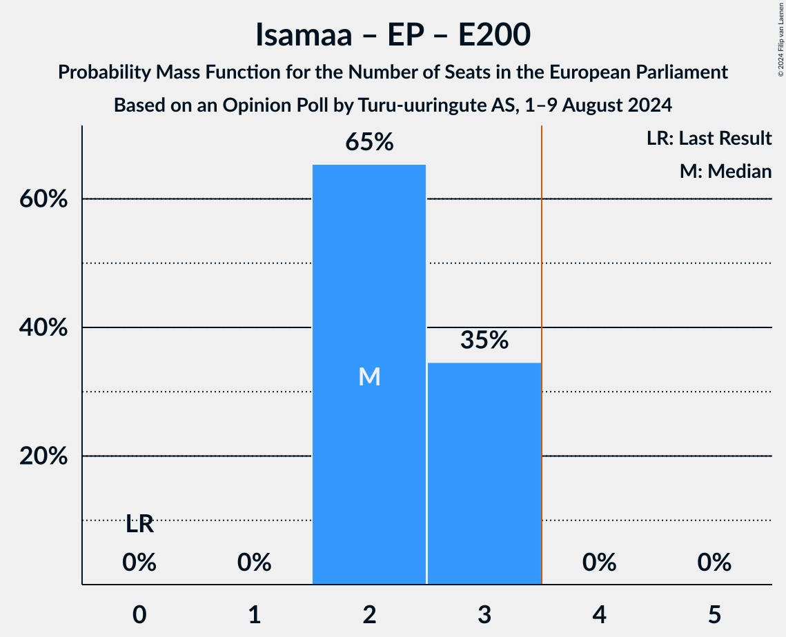

| Number of Seats | Probability | Accumulated | Special Marks |
|:---------------:|:-----------:|:-----------:|:-------------:|
| 0 | 0% | 100% | Last Result |
| 1 | 0% | 100% |  |
| 2 | 62% | 100% | Median |
| 3 | 38% | 38% |  |
| 4 | 0% | 0% | Majority |

### Sotsiaaldemokraatlik Erakond (S&D)

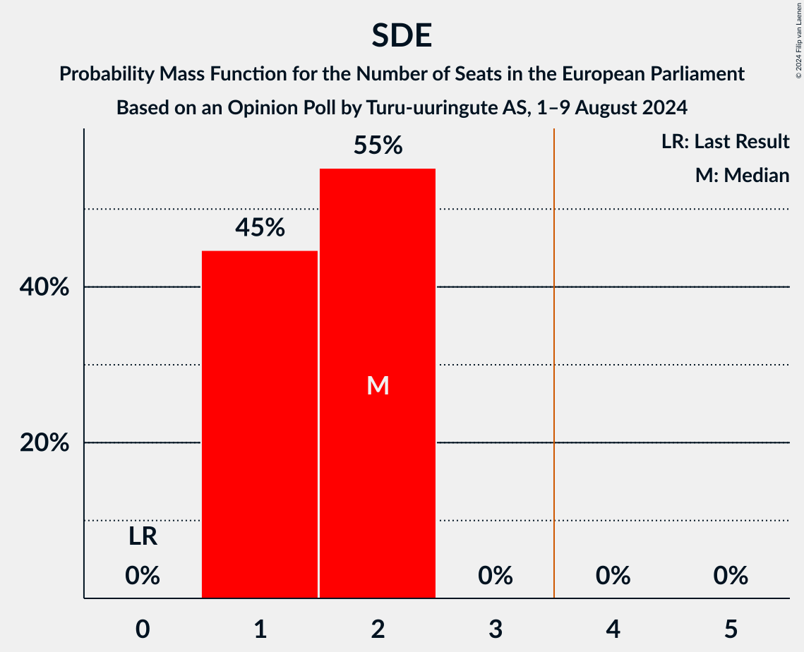

| Number of Seats | Probability | Accumulated | Special Marks |
|:---------------:|:-----------:|:-----------:|:-------------:|
| 0 | 0% | 100% | Last Result |
| 1 | 45% | 100% |  |
| 2 | 55% | 55% | Median |
| 3 | 0% | 0% |  |

### Eesti Konservatiivne Rahvaerakond (PfE)

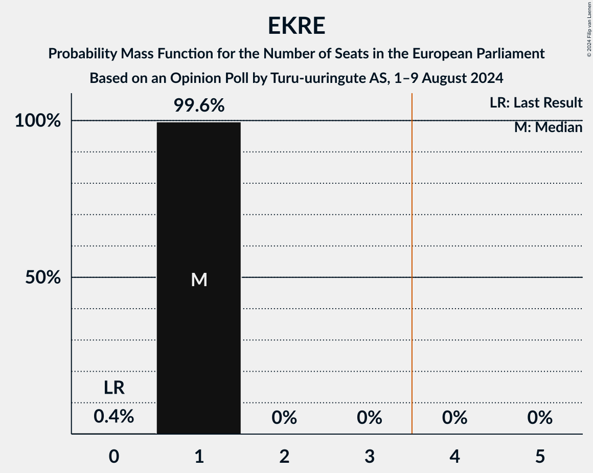

| Number of Seats | Probability | Accumulated | Special Marks |
|:---------------:|:-----------:|:-----------:|:-------------:|
| 0 | 0.1% | 100% | Last Result |
| 1 | 99.9% | 99.9% | Median |
| 2 | 0% | 0% |  |

### Eesti Rahvuslased ja Konservatiivid (ERC)

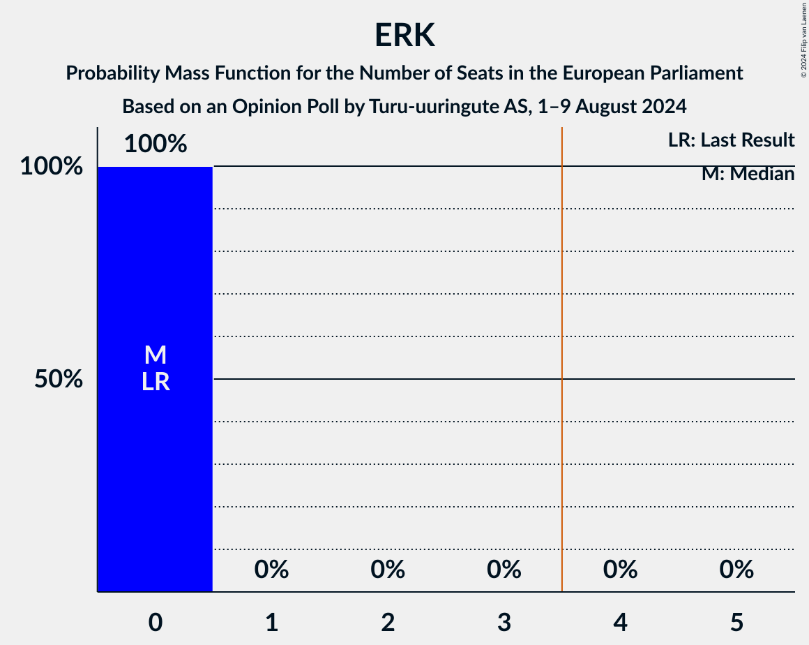

| Number of Seats | Probability | Accumulated | Special Marks |
|:---------------:|:-----------:|:-----------:|:-------------:|
| 0 | 100% | 100% | Last Result, Median |

### Eestimaa Ühendatud Vasakpartei (GUE/NGL)

| Number of Seats | Probability | Accumulated | Special Marks |
|:---------------:|:-----------:|:-----------:|:-------------:|
| 0 | 100% | 100% | Last Result, Median |

### Erakond Eestimaa Rohelised (Greens/EFA)

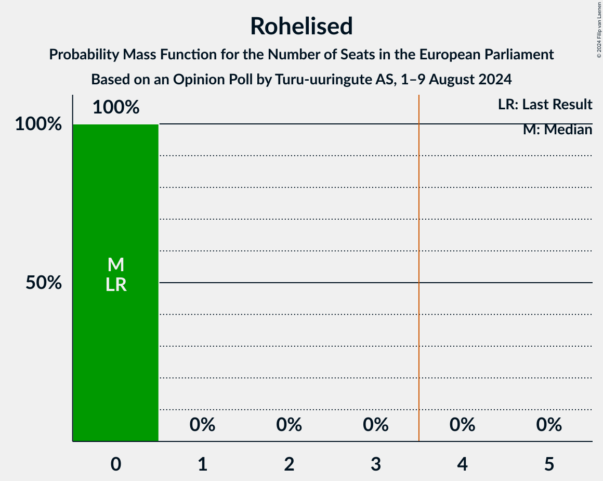

| Number of Seats | Probability | Accumulated | Special Marks |
|:---------------:|:-----------:|:-----------:|:-------------:|
| 0 | 100% | 100% | Last Result, Median |

## Technical Information

### Opinion Poll

+ **Polling firm:** Turu-uuringute AS
+ **Commissioner(s):** —
+ **Fieldwork period:** 1–9 August 2024

### Calculations

+ **Sample size:** 893
+ **Simulations done:** 1,048,576
+ **Error estimate:** 2.65%

