# Poll Average

<a href="#voting-intentions">Voting Intentions</a> | <a href="#seats">Seats</a> | <a href="#coalitions">Coalitions</a> | <a href="#technical-information">Technical Information</a>

## Summary

The table below lists the polls on which the average is based. They are the most recent polls (less than 90 days old) registered and analyzed so far.

| Period     | Polling firm/Commissioner(s) | Ref | Kesk | Isamaa | SDE | EKRE | Rohelised | EVA | E200 | Kaljulaid |
|:----------:|:----------------------------:|:--:|:--:|:--:|:--:|:--:|:--:|:--:|:--:|:--:|
| 26 May 2019 | General Election | 24.3%   2 | 22.4%   1 | 13.9%   1 | 13.6%   1 | 4.0%   0 | 0.3%   0 | 0.0%   0 | 0.0%   0 | 0.0%   0 |
| N/A | Poll Average | 23–38%   2–4 | 15–26%   1–3 | 5–10%   0–1 | 9–16%   0–1 | 11–20%   1–2 | 2–5%   0 | 0–2%   0 | 7–11%   0–1 | N/A   N/A |
| [1–31 January 2020](2020-01-31-KantarEmor.html) | Kantar Emor | 27–33%   2–3 | 15–20%   1–2 | 6–10%   0–1 | 12–16%   1 | 14–19%   1–2 | 2–4%   0 | 1–2%   0 | 7–11%   0–1 | N/A   N/A |
| [17–27 January 2020](2020-01-27-Turu-uuringuteAS.html) | Turu-uuringute AS   ERR | 22–28%   2–3 | 21–27%   2–3 | 5–9%   0–1 | 8–12%   0–1 | 15–21%   1–2 | 2–4%   0 | 1–2%   0 | 6–10%   0–1 | N/A   N/A |
| [23–27 January 2020](2020-01-27-Norstat.html) | Norstat   MTÜ Ühiskonnauuringute Instituut | 33–39%   3–4 | 17–22%   1–2 | 5–8%   0 | 9–13%   0–1 | 11–15%   1 | 3–6%   0 | 0–1%   0 | 7–10%   0–1 | N/A   N/A |
| 26 May 2019 | General Election | 24.3%   2 | 22.4%   1 | 13.9%   1 | 13.6%   1 | 4.0%   0 | 0.3%   0 | 0.0%   0 | 0.0%   0 | 0.0%   0 |

Only polls for which at least the sample size has been published are included in the table above.

**Legend:**
+ **Top half of each row:** Voting intentions (95% confidence interval)
+ **Bottom half of each row:** Seat projections for the European Parliament (95% confidence interval)
+ **Ref:** Eesti Reformierakond (RE)
+ **Kesk:** Eesti Keskerakond (RE)
+ **Isamaa:** Erakond Isamaa (EPP)
+ **SDE:** Sotsiaaldemokraatlik Erakond (S&D)
+ **EKRE:** Eesti Konservatiivne Rahvaerakond (ID)
+ **Rohelised:** Erakond Eestimaa Rohelised (Greens/EFA)
+ **EVA:** Eesti Vabaerakond (*)
+ **E200:** Eesti 200 (RE)
+ **Kaljulaid:** Raimond Kaljulaid (RE)
+ **N/A (single party):** Party not included the published results
+ **N/A (entire row):** Calculation for this opinion poll not started yet

## Voting Intentions

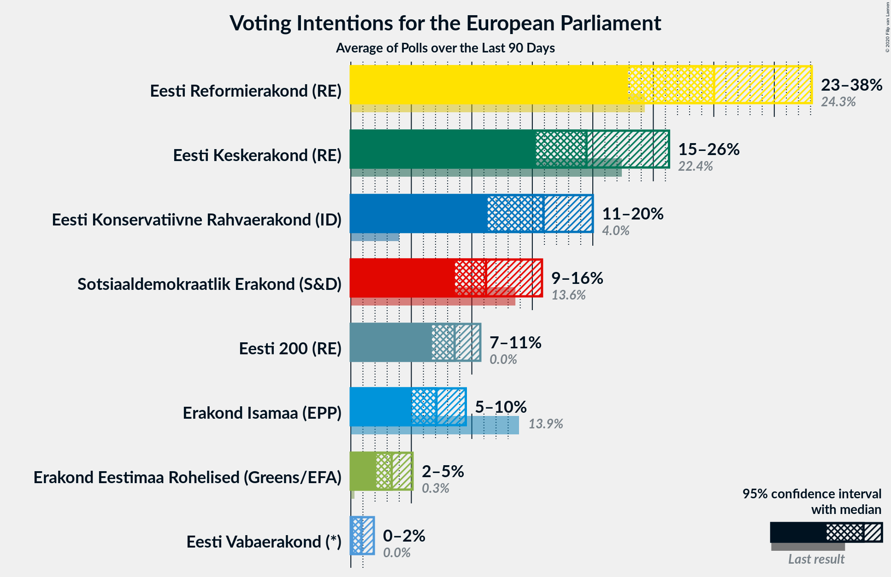

### Confidence Intervals

| Party | Last Result | Median | 80% Confidence Interval | 90% Confidence Interval | 95% Confidence Interval | 99% Confidence Interval |
|:-----:|:-----------:|:------:|:-----------------------:|:-----------------------:|:-----------------------:|:-----------------------:|
| <a href="#eesti-reformierakond-(re)">Eesti Reformierakond (RE)</a> | 24.3% | 30.0% | 24.2–36.7% |23.5–37.5% | 22.9–38.1% | 21.8–39.2% |
| <a href="#eesti-keskerakond-(re)">Eesti Keskerakond (RE)</a> | 22.4% | 19.5% | 16.4–24.9% |15.8–25.6% | 15.3–26.3% | 14.5–27.4% |
| <a href="#erakond-isamaa-(epp)">Erakond Isamaa (EPP)</a> | 13.9% | 7.1% | 5.6–8.7% |5.3–9.2% | 5.0–9.5% | 4.5–10.2% |
| <a href="#sotsiaaldemokraatlik-erakond-(s&d)">Sotsiaaldemokraatlik Erakond (S&D)</a> | 13.6% | 11.2% | 9.3–14.6% |8.9–15.3% | 8.6–15.8% | 7.9–16.7% |
| <a href="#eesti-konservatiivne-rahvaerakond-(id)">Eesti Konservatiivne Rahvaerakond (ID)</a> | 4.0% | 15.9% | 12.2–18.8% |11.7–19.5% | 11.3–20.0% | 10.6–21.1% |
| <a href="#erakond-eestimaa-rohelised-(greens/efa)">Erakond Eestimaa Rohelised (Greens/EFA)</a> | 0.3% | 3.4% | 2.5–4.5% |2.3–4.9% | 2.1–5.1% | 1.8–5.7% |
| <a href="#eesti-vabaerakond-(*)">Eesti Vabaerakond (*)</a> | 0.0% | 0.9% | 0.4–1.5% |0.3–1.7% | 0.2–1.9% | 0.1–2.2% |
| <a href="#eesti-200-(re)">Eesti 200 (RE)</a> | 0.0% | 8.6% | 7.3–9.9% |7.0–10.4% | 6.7–10.7% | 6.2–11.4% |
| <a href="#raimond-kaljulaid-(re)">Raimond Kaljulaid (RE)</a> | 0.0% | N/A | N/A |N/A | N/A | N/A |

### Eesti Reformierakond (RE)

*For a full overview of the results for this party, see the [Eesti Reformierakond (RE)](party-eestireformierakondre.html) page.*

| Voting Intentions | Probability | Accumulated | Special Marks |
|:-----------------:|:-----------:|:-----------:|:-------------:|
| 19.5–20.5% | 0% | 100% |  |
| 20.5–21.5% | 0.3% | 100% |  |
| 21.5–22.5% | 1.3% | 99.7% |  |
| 22.5–23.5% | 4% | 98% |  |
| 23.5–24.5% | 7% | 95% | Last Result |
| 24.5–25.5% | 9% | 88% |  |
| 25.5–26.5% | 7% | 79% |  |
| 26.5–27.5% | 5% | 72% |  |
| 27.5–28.5% | 5% | 67% |  |
| 28.5–29.5% | 7% | 61% |  |
| 29.5–30.5% | 8% | 54% | Median |
| 30.5–31.5% | 7% | 45% |  |
| 31.5–32.5% | 4% | 39% |  |
| 32.5–33.5% | 3% | 35% |  |
| 33.5–34.5% | 5% | 32% |  |
| 34.5–35.5% | 7% | 27% |  |
| 35.5–36.5% | 9% | 20% |  |
| 36.5–37.5% | 7% | 11% |  |
| 37.5–38.5% | 3% | 5% |  |
| 38.5–39.5% | 1.1% | 1.4% |  |
| 39.5–40.5% | 0.3% | 0.3% |  |
| 40.5–41.5% | 0% | 0% |  |

### Eesti Keskerakond (RE)

*For a full overview of the results for this party, see the [Eesti Keskerakond (RE)](party-eestikeskerakondre.html) page.*

| Voting Intentions | Probability | Accumulated | Special Marks |
|:-----------------:|:-----------:|:-----------:|:-------------:|
| 12.5–13.5% | 0% | 100% |  |
| 13.5–14.5% | 0.6% | 100% |  |
| 14.5–15.5% | 3% | 99.4% |  |
| 15.5–16.5% | 8% | 96% |  |
| 16.5–17.5% | 12% | 89% |  |
| 17.5–18.5% | 14% | 76% |  |
| 18.5–19.5% | 14% | 62% | Median |
| 19.5–20.5% | 10% | 49% |  |
| 20.5–21.5% | 6% | 39% |  |
| 21.5–22.5% | 5% | 33% | Last Result |
| 22.5–23.5% | 7% | 28% |  |
| 23.5–24.5% | 9% | 21% |  |
| 24.5–25.5% | 7% | 12% |  |
| 25.5–26.5% | 4% | 5% |  |
| 26.5–27.5% | 1.3% | 2% |  |
| 27.5–28.5% | 0.3% | 0.4% |  |
| 28.5–29.5% | 0.1% | 0.1% |  |
| 29.5–30.5% | 0% | 0% |  |

### Erakond Isamaa (EPP)

*For a full overview of the results for this party, see the [Erakond Isamaa (EPP)](party-erakondisamaaepp.html) page.*

| Voting Intentions | Probability | Accumulated | Special Marks |
|:-----------------:|:-----------:|:-----------:|:-------------:|
| 2.5–3.5% | 0% | 100% |  |
| 3.5–4.5% | 0.5% | 100% |  |
| 4.5–5.5% | 9% | 99.5% |  |
| 5.5–6.5% | 25% | 91% |  |
| 6.5–7.5% | 29% | 65% | Median |
| 7.5–8.5% | 23% | 36% |  |
| 8.5–9.5% | 10% | 12% |  |
| 9.5–10.5% | 2% | 2% |  |
| 10.5–11.5% | 0.2% | 0.2% |  |
| 11.5–12.5% | 0% | 0% |  |
| 12.5–13.5% | 0% | 0% |  |
| 13.5–14.5% | 0% | 0% | Last Result |

### Sotsiaaldemokraatlik Erakond (S&D)

*For a full overview of the results for this party, see the [Sotsiaaldemokraatlik Erakond (S&D)](party-sotsiaaldemokraatlikerakondsd.html) page.*

| Voting Intentions | Probability | Accumulated | Special Marks |
|:-----------------:|:-----------:|:-----------:|:-------------:|
| 5.5–6.5% | 0% | 100% |  |
| 6.5–7.5% | 0.1% | 100% |  |
| 7.5–8.5% | 2% | 99.8% |  |
| 8.5–9.5% | 11% | 98% |  |
| 9.5–10.5% | 23% | 86% |  |
| 10.5–11.5% | 21% | 64% | Median |
| 11.5–12.5% | 11% | 43% |  |
| 12.5–13.5% | 10% | 32% |  |
| 13.5–14.5% | 11% | 22% | Last Result |
| 14.5–15.5% | 7% | 11% |  |
| 15.5–16.5% | 3% | 3% |  |
| 16.5–17.5% | 0.6% | 0.6% |  |
| 17.5–18.5% | 0.1% | 0.1% |  |
| 18.5–19.5% | 0% | 0% |  |

### Eesti Konservatiivne Rahvaerakond (ID)

*For a full overview of the results for this party, see the [Eesti Konservatiivne Rahvaerakond (ID)](party-eestikonservatiivnerahvaerakondid.html) page.*

| Voting Intentions | Probability | Accumulated | Special Marks |
|:-----------------:|:-----------:|:-----------:|:-------------:|
| 3.5–4.5% | 0% | 100% | Last Result |
| 4.5–5.5% | 0% | 100% |  |
| 5.5–6.5% | 0% | 100% |  |
| 6.5–7.5% | 0% | 100% |  |
| 7.5–8.5% | 0% | 100% |  |
| 8.5–9.5% | 0% | 100% |  |
| 9.5–10.5% | 0.4% | 100% |  |
| 10.5–11.5% | 4% | 99.5% |  |
| 11.5–12.5% | 10% | 96% |  |
| 12.5–13.5% | 12% | 86% |  |
| 13.5–14.5% | 9% | 74% |  |
| 14.5–15.5% | 10% | 65% |  |
| 15.5–16.5% | 14% | 55% | Median |
| 16.5–17.5% | 15% | 40% |  |
| 17.5–18.5% | 13% | 25% |  |
| 18.5–19.5% | 8% | 12% |  |
| 19.5–20.5% | 3% | 4% |  |
| 20.5–21.5% | 0.9% | 1.1% |  |
| 21.5–22.5% | 0.2% | 0.2% |  |
| 22.5–23.5% | 0% | 0% |  |

### Erakond Eestimaa Rohelised (Greens/EFA)

*For a full overview of the results for this party, see the [Erakond Eestimaa Rohelised (Greens/EFA)](party-erakondeestimaarohelisedgreensefa.html) page.*

| Voting Intentions | Probability | Accumulated | Special Marks |
|:-----------------:|:-----------:|:-----------:|:-------------:|
| 0.0–0.5% | 0% | 100% | Last Result |
| 0.5–1.5% | 0.1% | 100% |  |
| 1.5–2.5% | 12% | 99.9% |  |
| 2.5–3.5% | 46% | 88% | Median |
| 3.5–4.5% | 32% | 42% |  |
| 4.5–5.5% | 9% | 10% |  |
| 5.5–6.5% | 0.7% | 0.8% |  |
| 6.5–7.5% | 0% | 0% |  |

### Eesti Vabaerakond (*)

*For a full overview of the results for this party, see the [Eesti Vabaerakond (*)](party-eestivabaerakond.html) page.*

| Voting Intentions | Probability | Accumulated | Special Marks |
|:-----------------:|:-----------:|:-----------:|:-------------:|
| 0.0–0.5% | 23% | 100% | Last Result |
| 0.5–1.5% | 68% | 77% | Median |
| 1.5–2.5% | 8% | 8% |  |
| 2.5–3.5% | 0.1% | 0.1% |  |
| 3.5–4.5% | 0% | 0% |  |

### Eesti 200 (RE)

*For a full overview of the results for this party, see the [Eesti 200 (RE)](party-eesti200re.html) page.*

| Voting Intentions | Probability | Accumulated | Special Marks |
|:-----------------:|:-----------:|:-----------:|:-------------:|
| 0.0–0.5% | 0% | 100% | Last Result |
| 0.5–1.5% | 0% | 100% |  |
| 1.5–2.5% | 0% | 100% |  |
| 2.5–3.5% | 0% | 100% |  |
| 3.5–4.5% | 0% | 100% |  |
| 4.5–5.5% | 0% | 100% |  |
| 5.5–6.5% | 2% | 100% |  |
| 6.5–7.5% | 13% | 98% |  |
| 7.5–8.5% | 34% | 86% |  |
| 8.5–9.5% | 34% | 52% | Median |
| 9.5–10.5% | 14% | 18% |  |
| 10.5–11.5% | 3% | 3% |  |
| 11.5–12.5% | 0.3% | 0.4% |  |
| 12.5–13.5% | 0% | 0% |  |

## Seats

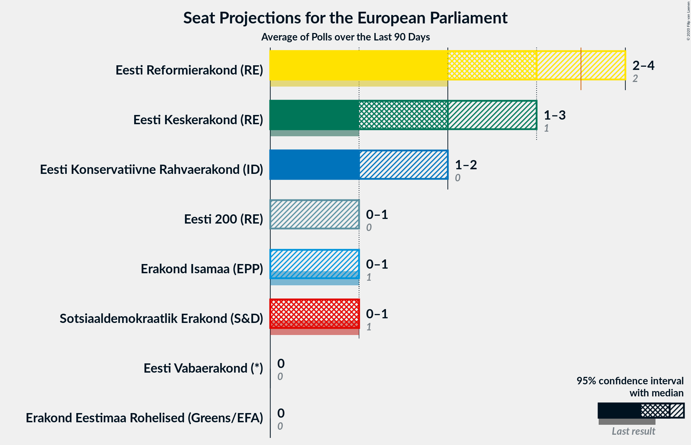

### Confidence Intervals

| Party | Last Result | Median | 80% Confidence Interval | 90% Confidence Interval | 95% Confidence Interval | 99% Confidence Interval |
|:-----:|:-----------:|:------:|:-----------------------:|:-----------------------:|:-----------------------:|:-----------------------:|
| <a href="#eesti-reformierakond-(re)">Eesti Reformierakond (RE)</a> | 2 | 3 | 2–3 |2–4 | 2–4 | 2–4 |
| <a href="#eesti-keskerakond-(re)">Eesti Keskerakond (RE)</a> | 1 | 2 | 1–2 |1–2 | 1–3 | 1–3 |
| <a href="#erakond-isamaa-(epp)">Erakond Isamaa (EPP)</a> | 1 | 0 | 0 |0–1 | 0–1 | 0–1 |
| <a href="#sotsiaaldemokraatlik-erakond-(s&d)">Sotsiaaldemokraatlik Erakond (S&D)</a> | 1 | 1 | 1 |0–1 | 0–1 | 0–1 |
| <a href="#eesti-konservatiivne-rahvaerakond-(id)">Eesti Konservatiivne Rahvaerakond (ID)</a> | 0 | 1 | 1–2 |1–2 | 1–2 | 1–2 |
| <a href="#erakond-eestimaa-rohelised-(greens/efa)">Erakond Eestimaa Rohelised (Greens/EFA)</a> | 0 | 0 | 0 |0 | 0 | 0 |
| <a href="#eesti-vabaerakond-(*)">Eesti Vabaerakond (*)</a> | 0 | 0 | 0 |0 | 0 | 0 |
| <a href="#eesti-200-(re)">Eesti 200 (RE)</a> | 0 | 0 | 0–1 |0–1 | 0–1 | 0–1 |
| <a href="#raimond-kaljulaid-(re)">Raimond Kaljulaid (RE)</a> | 0 | N/A | N/A |N/A | N/A | N/A |

### Eesti Reformierakond (RE)

*For a full overview of the results for this party, see the [Eesti Reformierakond (RE)](party-eestireformierakondre.html) page.*

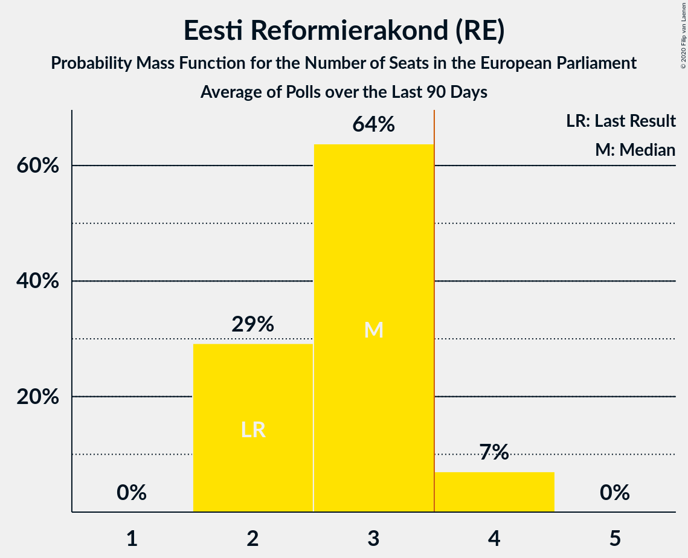

| Number of Seats | Probability | Accumulated | Special Marks |
|:---------------:|:-----------:|:-----------:|:-------------:|
| 2 | 29% | 100% | Last Result |
| 3 | 64% | 71% | Median |
| 4 | 7% | 7% | Majority |
| 5 | 0% | 0% |  |

### Eesti Keskerakond (RE)

*For a full overview of the results for this party, see the [Eesti Keskerakond (RE)](party-eestikeskerakondre.html) page.*

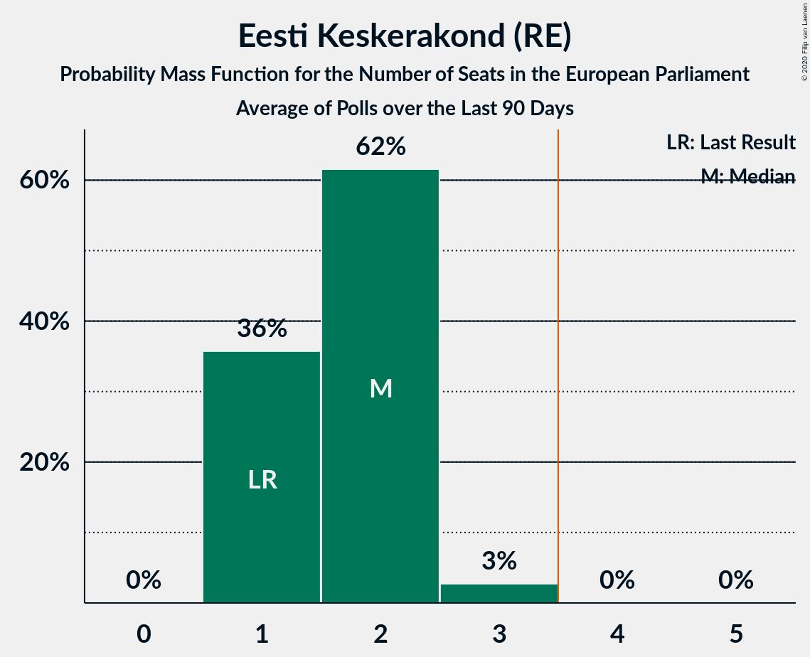

| Number of Seats | Probability | Accumulated | Special Marks |
|:---------------:|:-----------:|:-----------:|:-------------:|
| 1 | 36% | 100% | Last Result |
| 2 | 62% | 64% | Median |
| 3 | 3% | 3% |  |
| 4 | 0% | 0% | Majority |

### Erakond Isamaa (EPP)

*For a full overview of the results for this party, see the [Erakond Isamaa (EPP)](party-erakondisamaaepp.html) page.*

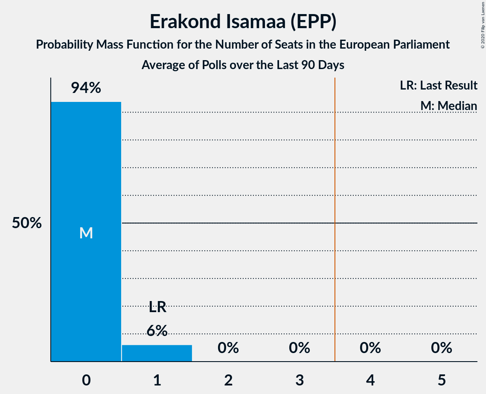

| Number of Seats | Probability | Accumulated | Special Marks |
|:---------------:|:-----------:|:-----------:|:-------------:|
| 0 | 94% | 100% | Median |
| 1 | 6% | 6% | Last Result |
| 2 | 0% | 0% |  |

### Sotsiaaldemokraatlik Erakond (S&D)

*For a full overview of the results for this party, see the [Sotsiaaldemokraatlik Erakond (S&D)](party-sotsiaaldemokraatlikerakondsd.html) page.*

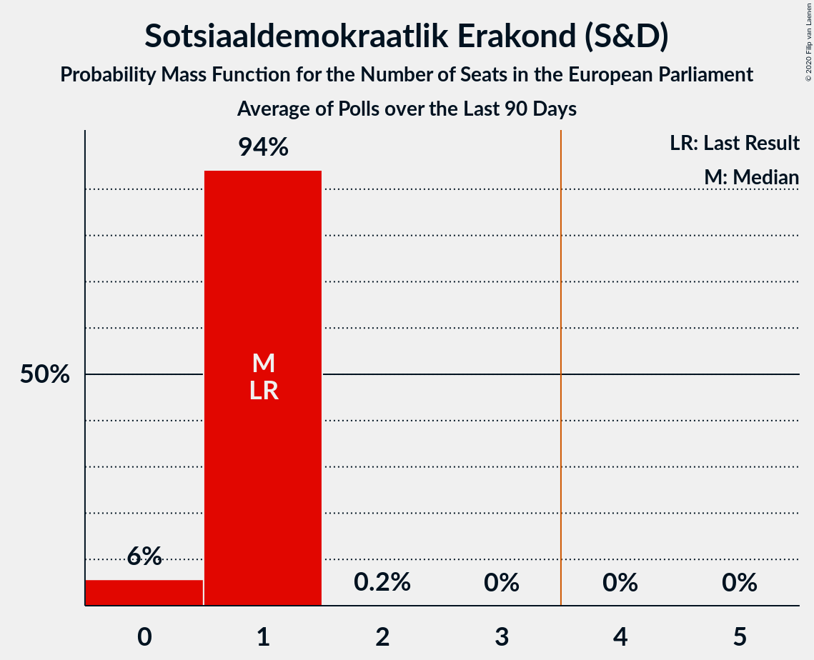

| Number of Seats | Probability | Accumulated | Special Marks |
|:---------------:|:-----------:|:-----------:|:-------------:|
| 0 | 6% | 100% |  |
| 1 | 94% | 94% | Last Result, Median |
| 2 | 0.2% | 0.2% |  |
| 3 | 0% | 0% |  |

### Eesti Konservatiivne Rahvaerakond (ID)

*For a full overview of the results for this party, see the [Eesti Konservatiivne Rahvaerakond (ID)](party-eestikonservatiivnerahvaerakondid.html) page.*

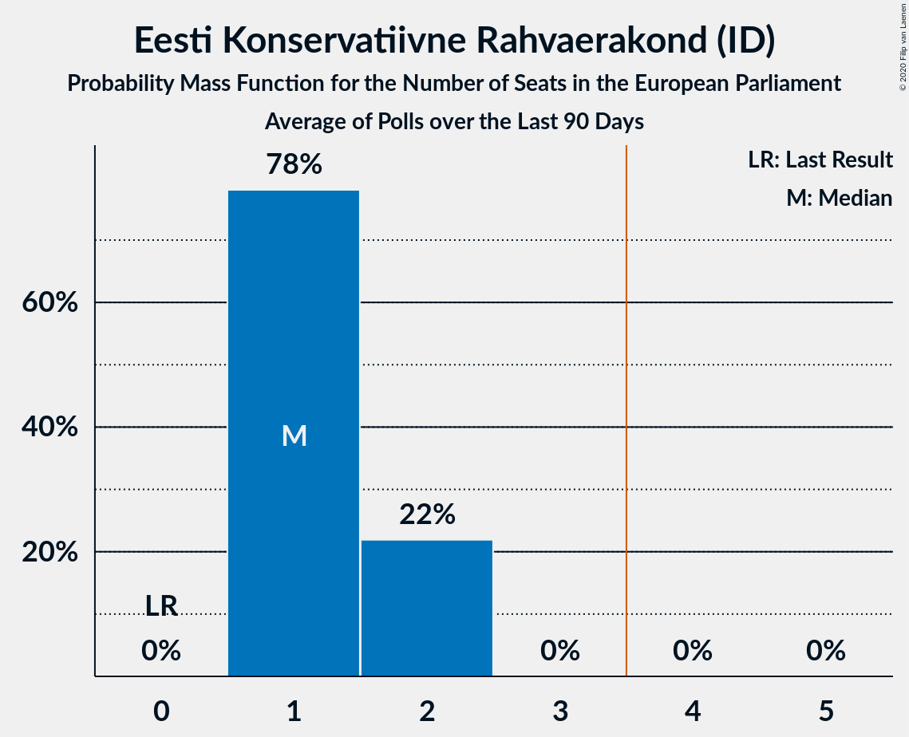

| Number of Seats | Probability | Accumulated | Special Marks |
|:---------------:|:-----------:|:-----------:|:-------------:|
| 0 | 0% | 100% | Last Result |
| 1 | 78% | 100% | Median |
| 2 | 22% | 22% |  |
| 3 | 0% | 0% |  |

### Erakond Eestimaa Rohelised (Greens/EFA)

*For a full overview of the results for this party, see the [Erakond Eestimaa Rohelised (Greens/EFA)](party-erakondeestimaarohelisedgreensefa.html) page.*

| Number of Seats | Probability | Accumulated | Special Marks |
|:---------------:|:-----------:|:-----------:|:-------------:|
| 0 | 100% | 100% | Last Result, Median |

### Eesti Vabaerakond (*)

*For a full overview of the results for this party, see the [Eesti Vabaerakond (*)](party-eestivabaerakond.html) page.*

| Number of Seats | Probability | Accumulated | Special Marks |
|:---------------:|:-----------:|:-----------:|:-------------:|
| 0 | 100% | 100% | Last Result, Median |

### Eesti 200 (RE)

*For a full overview of the results for this party, see the [Eesti 200 (RE)](party-eesti200re.html) page.*

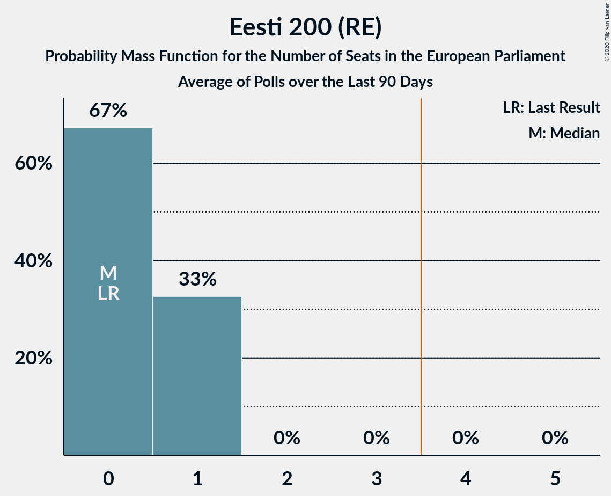

| Number of Seats | Probability | Accumulated | Special Marks |
|:---------------:|:-----------:|:-----------:|:-------------:|
| 0 | 67% | 100% | Last Result, Median |
| 1 | 33% | 33% |  |
| 2 | 0% | 0% |  |

## Coalitions

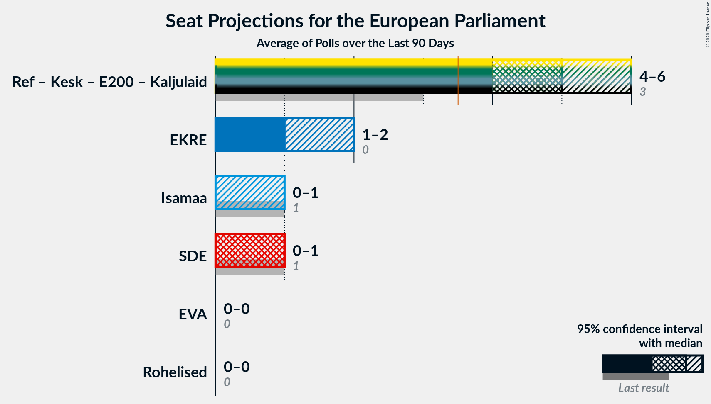

### Confidence Intervals

| Coalition | Last Result | Median | Majority? | 80% Confidence Interval | 90% Confidence Interval | 95% Confidence Interval | 99% Confidence Interval |
|:---------:|:-----------:|:------:|:---------:|:-----------------------:|:-----------------------:|:-----------------------:|:-----------------------:|
| Eesti Reformierakond (RE) – Eesti Keskerakond (RE) – Eesti 200 (RE) – Raimond Kaljulaid (RE) | 3 | 5 | 100% | 4–5 | 4–5 | 4–6 | 4–6 |
| Eesti Konservatiivne Rahvaerakond (ID) | 0 | 1 | 0% | 1–2 | 1–2 | 1–2 | 1–2 |
| Erakond Isamaa (EPP) | 1 | 0 | 0% | 0 | 0–1 | 0–1 | 0–1 |
| Sotsiaaldemokraatlik Erakond (S&D) | 1 | 1 | 0% | 1 | 0–1 | 0–1 | 0–1 |
| Eesti Vabaerakond (*) | 0 | 0 | 0% | 0 | 0 | 0 | 0 |
| Erakond Eestimaa Rohelised (Greens/EFA) | 0 | 0 | 0% | 0 | 0 | 0 | 0 |

### Eesti Reformierakond (RE) – Eesti Keskerakond (RE) – Eesti 200 (RE) – Raimond Kaljulaid (RE)

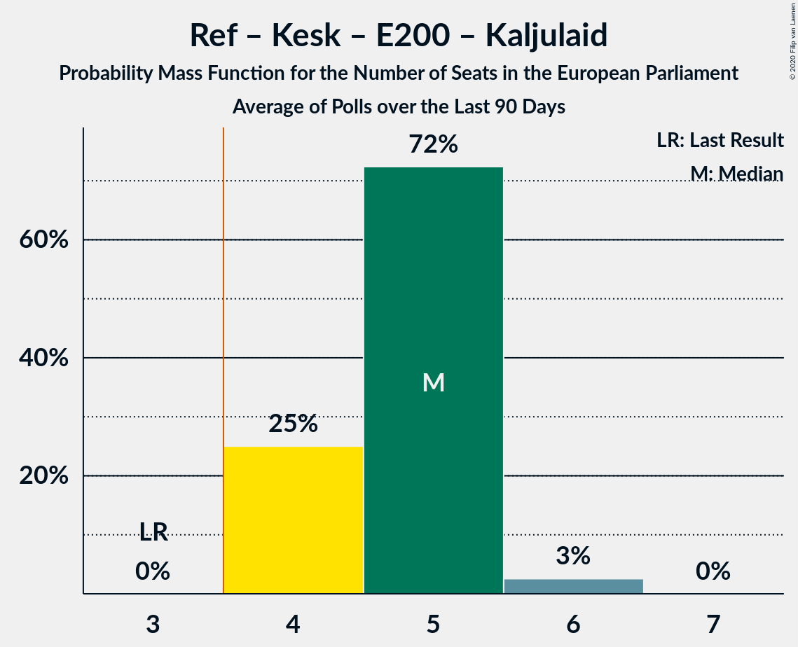

| Number of Seats | Probability | Accumulated | Special Marks |
|:---------------:|:-----------:|:-----------:|:-------------:|
| 3 | 0% | 100% | Last Result |
| 4 | 25% | 100% | Majority |
| 5 | 72% | 75% | Median |
| 6 | 3% | 3% |  |
| 7 | 0% | 0% |  |

### Eesti Konservatiivne Rahvaerakond (ID)

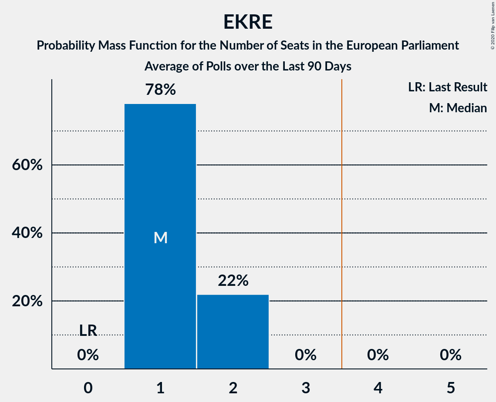

| Number of Seats | Probability | Accumulated | Special Marks |
|:---------------:|:-----------:|:-----------:|:-------------:|
| 0 | 0% | 100% | Last Result |
| 1 | 78% | 100% | Median |
| 2 | 22% | 22% |  |
| 3 | 0% | 0% |  |

### Erakond Isamaa (EPP)

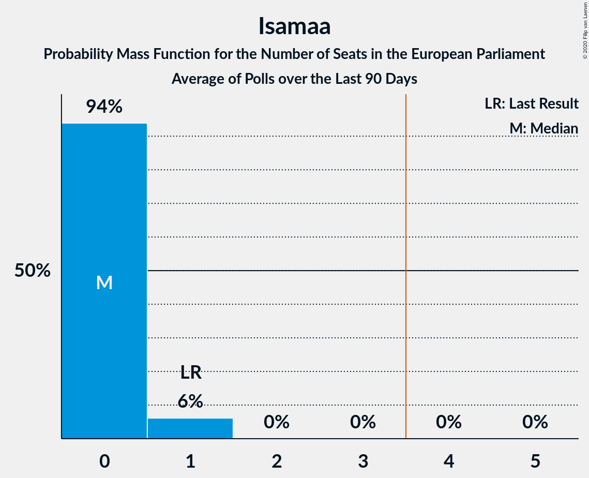

| Number of Seats | Probability | Accumulated | Special Marks |
|:---------------:|:-----------:|:-----------:|:-------------:|
| 0 | 94% | 100% | Median |
| 1 | 6% | 6% | Last Result |
| 2 | 0% | 0% |  |

### Sotsiaaldemokraatlik Erakond (S&D)

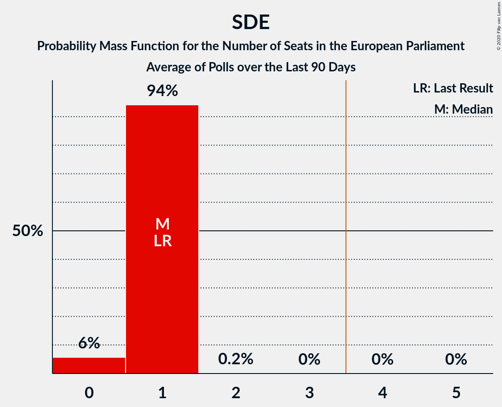

| Number of Seats | Probability | Accumulated | Special Marks |
|:---------------:|:-----------:|:-----------:|:-------------:|
| 0 | 6% | 100% |  |
| 1 | 94% | 94% | Last Result, Median |
| 2 | 0.2% | 0.2% |  |
| 3 | 0% | 0% |  |

### Eesti Vabaerakond (*)

| Number of Seats | Probability | Accumulated | Special Marks |
|:---------------:|:-----------:|:-----------:|:-------------:|
| 0 | 100% | 100% | Last Result, Median |

### Erakond Eestimaa Rohelised (Greens/EFA)

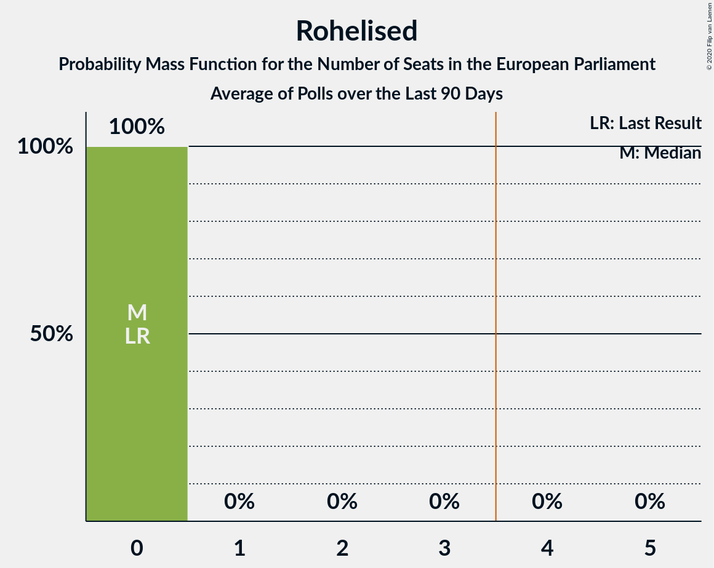

| Number of Seats | Probability | Accumulated | Special Marks |
|:---------------:|:-----------:|:-----------:|:-------------:|
| 0 | 100% | 100% | Last Result, Median |

## Technical Information

+ **Number of polls included in this average:** 3
+ **Lowest number of simulations done in a poll included in this average:** 1,048,576
+ **Total number of simulations done in the polls included in this average:** 3,145,728
+ **Error estimate:** 1.86%
