# Poll Average

<a href="#voting-intentions">Voting Intentions</a> | <a href="#seats">Seats</a> | <a href="#coalitions">Coalitions</a> | <a href="#technical-information">Technical Information</a>

## Summary

The table below lists the polls on which the average is based. They are the most recent polls (less than 90 days old) registered and analyzed so far.

| Period     | Polling firm/Commissioner(s) | Ref | Kesk | Isamaa | SDE | EKRE | Rohelised | EVA | E200 | Kaljulaid | EP |
|:----------:|:----------------------------:|:--:|:--:|:--:|:--:|:--:|:--:|:--:|:--:|:--:|:--:|
| 26 May 2019 | General Election | 24.3%   2 | 22.4%   1 | 13.9%   1 | 13.6%   1 | 4.0%   0 | 0.3%   0 | 0.0%   0 | 0.0%   0 | 0.0%   0 | 0.0%   0 |
| N/A | Poll Average | 26–36%   2–3 | 12–22%   1–2 | 5–9%   0 | 5–12%   0–1 | 16–30%   1–3 | 1–4%   0 | N/A   N/A | 8–14%   0–1 | N/A   N/A | 0–2%   0 |
| [20–26 September 2022](2022-09-26-Norstat.html) | Norstat   MTÜ Ühiskonnauuringute Instituut | 26–31%   2–3 | 17–22%   1–2 | 5–8%   0 | 5–8%   0 | 25–30%   2–3 | 1–2%   0 | N/A   N/A | 7–11%   0–1 | N/A   N/A | 0–1%   0 |
| [16 September 2022](2022-09-16-Turu-uuringuteAS.html) | Turu-uuringute AS | 29–37%   3–4 | 12–18%   1–2 | 5–10%   0 | 7–12%   0–1 | 15–22%   1–2 | 1–4%   0 | N/A   N/A | 9–15%   1 | N/A   N/A | 0–2%   0 |
| [8–14 September 2022](2022-09-14-KantarEmor.html) | Kantar Emor   ERR | 26–31%   2–3 | 12–16%   1 | 7–9%   0 | 9–13%   0–1 | 21–25%   2 | 2–4%   0 | N/A   N/A | 9–13%   0–1 | N/A   N/A | 1–2%   0 |
| 26 May 2019 | General Election | 24.3%   2 | 22.4%   1 | 13.9%   1 | 13.6%   1 | 4.0%   0 | 0.3%   0 | 0.0%   0 | 0.0%   0 | 0.0%   0 | 0.0%   0 |

Only polls for which at least the sample size has been published are included in the table above.

**Legend:**
+ **Top half of each row:** Voting intentions (95% confidence interval)
+ **Bottom half of each row:** Seat projections for the European Parliament (95% confidence interval)
+ **Ref:** Eesti Reformierakond (RE)
+ **Kesk:** Eesti Keskerakond (RE)
+ **Isamaa:** Erakond Isamaa (EPP)
+ **SDE:** Sotsiaaldemokraatlik Erakond (S&D)
+ **EKRE:** Eesti Konservatiivne Rahvaerakond (ID)
+ **Rohelised:** Erakond Eestimaa Rohelised (Greens/EFA)
+ **EVA:** Eesti Vabaerakond (*)
+ **E200:** Eesti 200 (RE)
+ **Kaljulaid:** Raimond Kaljulaid (RE)
+ **EP:** Erakond Parempoolsed (*)
+ **N/A (single party):** Party not included the published results
+ **N/A (entire row):** Calculation for this opinion poll not started yet

## Voting Intentions

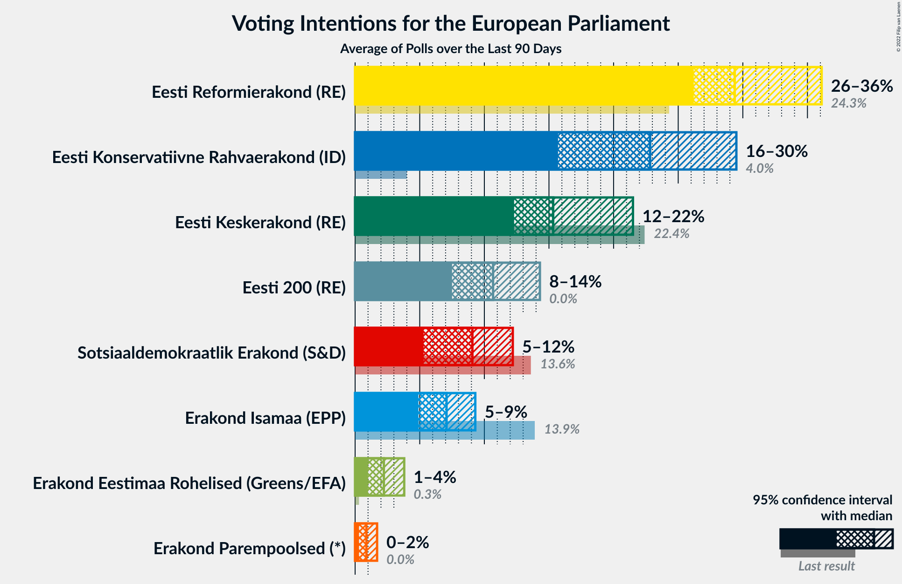

### Confidence Intervals

| Party | Last Result | Median | 80% Confidence Interval | 90% Confidence Interval | 95% Confidence Interval | 99% Confidence Interval |
|:-----:|:-----------:|:------:|:-----------------------:|:-----------------------:|:-----------------------:|:-----------------------:|
| <a href="#eesti-reformierakond-(re)">Eesti Reformierakond (RE)</a> | 24.3% | 29.4% | 27.2–34.1% |26.6–35.2% | 26.2–36.1% | 25.3–37.7% |
| <a href="#eesti-keskerakond-(re)">Eesti Keskerakond (RE)</a> | 22.4% | 15.3% | 13.1–20.3% |12.7–21.0% | 12.3–21.5% | 11.6–22.5% |
| <a href="#erakond-isamaa-(epp)">Erakond Isamaa (EPP)</a> | 13.9% | 7.1% | 5.4–8.6% |5.1–9.0% | 4.9–9.3% | 4.4–10.0% |
| <a href="#sotsiaaldemokraatlik-erakond-(s&d)">Sotsiaaldemokraatlik Erakond (S&D)</a> | 13.6% | 9.1% | 6.0–11.5% |5.6–11.9% | 5.3–12.2% | 4.8–12.9% |
| <a href="#eesti-konservatiivne-rahvaerakond-(id)">Eesti Konservatiivne Rahvaerakond (ID)</a> | 4.0% | 22.8% | 17.2–28.2% |16.3–28.9% | 15.7–29.5% | 14.6–30.6% |
| <a href="#erakond-eestimaa-rohelised-(greens/efa)">Erakond Eestimaa Rohelised (Greens/EFA)</a> | 0.3% | 2.2% | 1.3–3.4% |1.2–3.6% | 1.0–3.8% | 0.8–4.2% |
| <a href="#eesti-vabaerakond-(*)">Eesti Vabaerakond (*)</a> | 0.0% | N/A | N/A |N/A | N/A | N/A |
| <a href="#eesti-200-(re)">Eesti 200 (RE)</a> | 0.0% | 10.7% | 8.3–12.9% |7.9–13.7% | 7.5–14.3% | 6.9–15.5% |
| <a href="#raimond-kaljulaid-(re)">Raimond Kaljulaid (RE)</a> | 0.0% | N/A | N/A |N/A | N/A | N/A |
| <a href="#erakond-parempoolsed-(*)">Erakond Parempoolsed (*)</a> | 0.0% | 0.9% | 0.5–1.4% |0.4–1.6% | 0.3–1.7% | 0.2–2.2% |

### Eesti Reformierakond (RE)

*For a full overview of the results for this party, see the [Eesti Reformierakond (RE)](party-eestireformierakondre.html) page.*

| Voting Intentions | Probability | Accumulated | Special Marks |
|:-----------------:|:-----------:|:-----------:|:-------------:|
| 22.5–23.5% | 0% | 100% |  |
| 23.5–24.5% | 0.1% | 100% | Last Result |
| 24.5–25.5% | 0.8% | 99.9% |  |
| 25.5–26.5% | 4% | 99.1% |  |
| 26.5–27.5% | 11% | 96% |  |
| 27.5–28.5% | 19% | 85% |  |
| 28.5–29.5% | 20% | 66% | Median |
| 29.5–30.5% | 13% | 47% |  |
| 30.5–31.5% | 8% | 34% |  |
| 31.5–32.5% | 6% | 26% |  |
| 32.5–33.5% | 6% | 20% |  |
| 33.5–34.5% | 6% | 14% |  |
| 34.5–35.5% | 4% | 8% |  |
| 35.5–36.5% | 2% | 4% |  |
| 36.5–37.5% | 1.1% | 2% |  |
| 37.5–38.5% | 0.4% | 0.6% |  |
| 38.5–39.5% | 0.1% | 0.2% |  |
| 39.5–40.5% | 0% | 0% |  |

### Eesti Keskerakond (RE)

*For a full overview of the results for this party, see the [Eesti Keskerakond (RE)](party-eestikeskerakondre.html) page.*

| Voting Intentions | Probability | Accumulated | Special Marks |
|:-----------------:|:-----------:|:-----------:|:-------------:|
| 9.5–10.5% | 0% | 100% |  |
| 10.5–11.5% | 0.4% | 100% |  |
| 11.5–12.5% | 3% | 99.6% |  |
| 12.5–13.5% | 14% | 96% |  |
| 13.5–14.5% | 21% | 83% |  |
| 14.5–15.5% | 15% | 62% | Median |
| 15.5–16.5% | 8% | 48% |  |
| 16.5–17.5% | 5% | 39% |  |
| 17.5–18.5% | 7% | 34% |  |
| 18.5–19.5% | 10% | 28% |  |
| 19.5–20.5% | 10% | 18% |  |
| 20.5–21.5% | 6% | 8% |  |
| 21.5–22.5% | 2% | 2% | Last Result |
| 22.5–23.5% | 0.4% | 0.4% |  |
| 23.5–24.5% | 0% | 0% |  |
| 24.5–25.5% | 0% | 0% |  |

### Erakond Isamaa (EPP)

*For a full overview of the results for this party, see the [Erakond Isamaa (EPP)](party-erakondisamaaepp.html) page.*

| Voting Intentions | Probability | Accumulated | Special Marks |
|:-----------------:|:-----------:|:-----------:|:-------------:|
| 2.5–3.5% | 0% | 100% |  |
| 3.5–4.5% | 0.9% | 100% |  |
| 4.5–5.5% | 11% | 99.1% |  |
| 5.5–6.5% | 25% | 88% |  |
| 6.5–7.5% | 27% | 63% | Median |
| 7.5–8.5% | 26% | 36% |  |
| 8.5–9.5% | 9% | 11% |  |
| 9.5–10.5% | 1.2% | 1.4% |  |
| 10.5–11.5% | 0.1% | 0.1% |  |
| 11.5–12.5% | 0% | 0% |  |
| 12.5–13.5% | 0% | 0% |  |
| 13.5–14.5% | 0% | 0% | Last Result |

### Sotsiaaldemokraatlik Erakond (S&D)

*For a full overview of the results for this party, see the [Sotsiaaldemokraatlik Erakond (S&D)](party-sotsiaaldemokraatlikerakondsd.html) page.*

| Voting Intentions | Probability | Accumulated | Special Marks |
|:-----------------:|:-----------:|:-----------:|:-------------:|
| 2.5–3.5% | 0% | 100% |  |
| 3.5–4.5% | 0.2% | 100% |  |
| 4.5–5.5% | 4% | 99.8% |  |
| 5.5–6.5% | 16% | 95% |  |
| 6.5–7.5% | 14% | 80% |  |
| 7.5–8.5% | 10% | 66% |  |
| 8.5–9.5% | 12% | 56% | Median |
| 9.5–10.5% | 17% | 44% |  |
| 10.5–11.5% | 19% | 28% |  |
| 11.5–12.5% | 8% | 9% |  |
| 12.5–13.5% | 1.2% | 1.3% |  |
| 13.5–14.5% | 0.1% | 0.1% | Last Result |
| 14.5–15.5% | 0% | 0% |  |

### Eesti Konservatiivne Rahvaerakond (ID)

*For a full overview of the results for this party, see the [Eesti Konservatiivne Rahvaerakond (ID)](party-eestikonservatiivnerahvaerakondid.html) page.*

| Voting Intentions | Probability | Accumulated | Special Marks |
|:-----------------:|:-----------:|:-----------:|:-------------:|
| 3.5–4.5% | 0% | 100% | Last Result |
| 4.5–5.5% | 0% | 100% |  |
| 5.5–6.5% | 0% | 100% |  |
| 6.5–7.5% | 0% | 100% |  |
| 7.5–8.5% | 0% | 100% |  |
| 8.5–9.5% | 0% | 100% |  |
| 9.5–10.5% | 0% | 100% |  |
| 10.5–11.5% | 0% | 100% |  |
| 11.5–12.5% | 0% | 100% |  |
| 12.5–13.5% | 0.1% | 100% |  |
| 13.5–14.5% | 0.4% | 99.9% |  |
| 14.5–15.5% | 2% | 99.5% |  |
| 15.5–16.5% | 4% | 98% |  |
| 16.5–17.5% | 6% | 94% |  |
| 17.5–18.5% | 8% | 87% |  |
| 18.5–19.5% | 6% | 80% |  |
| 19.5–20.5% | 4% | 73% |  |
| 20.5–21.5% | 5% | 69% |  |
| 21.5–22.5% | 10% | 63% |  |
| 22.5–23.5% | 11% | 53% | Median |
| 23.5–24.5% | 7% | 42% |  |
| 24.5–25.5% | 4% | 35% |  |
| 25.5–26.5% | 6% | 31% |  |
| 26.5–27.5% | 9% | 25% |  |
| 27.5–28.5% | 8% | 15% |  |
| 28.5–29.5% | 5% | 7% |  |
| 29.5–30.5% | 2% | 2% |  |
| 30.5–31.5% | 0.4% | 0.5% |  |
| 31.5–32.5% | 0.1% | 0.1% |  |
| 32.5–33.5% | 0% | 0% |  |

### Erakond Eestimaa Rohelised (Greens/EFA)

*For a full overview of the results for this party, see the [Erakond Eestimaa Rohelised (Greens/EFA)](party-erakondeestimaarohelisedgreensefa.html) page.*

| Voting Intentions | Probability | Accumulated | Special Marks |
|:-----------------:|:-----------:|:-----------:|:-------------:|
| 0.0–0.5% | 0% | 100% | Last Result |
| 0.5–1.5% | 22% | 100% |  |
| 1.5–2.5% | 39% | 78% | Median |
| 2.5–3.5% | 33% | 39% |  |
| 3.5–4.5% | 6% | 6% |  |
| 4.5–5.5% | 0.1% | 0.1% |  |
| 5.5–6.5% | 0% | 0% |  |

### Eesti 200 (RE)

*For a full overview of the results for this party, see the [Eesti 200 (RE)](party-eesti200re.html) page.*

| Voting Intentions | Probability | Accumulated | Special Marks |
|:-----------------:|:-----------:|:-----------:|:-------------:|
| 0.0–0.5% | 0% | 100% | Last Result |
| 0.5–1.5% | 0% | 100% |  |
| 1.5–2.5% | 0% | 100% |  |
| 2.5–3.5% | 0% | 100% |  |
| 3.5–4.5% | 0% | 100% |  |
| 4.5–5.5% | 0% | 100% |  |
| 5.5–6.5% | 0.1% | 100% |  |
| 6.5–7.5% | 2% | 99.9% |  |
| 7.5–8.5% | 11% | 97% |  |
| 8.5–9.5% | 16% | 86% |  |
| 9.5–10.5% | 18% | 71% |  |
| 10.5–11.5% | 23% | 53% | Median |
| 11.5–12.5% | 16% | 29% |  |
| 12.5–13.5% | 8% | 14% |  |
| 13.5–14.5% | 4% | 6% |  |
| 14.5–15.5% | 1.4% | 2% |  |
| 15.5–16.5% | 0.4% | 0.5% |  |
| 16.5–17.5% | 0.1% | 0.1% |  |
| 17.5–18.5% | 0% | 0% |  |

### Erakond Parempoolsed (*)

*For a full overview of the results for this party, see the [Erakond Parempoolsed (*)](party-erakondparempoolsed.html) page.*

| Voting Intentions | Probability | Accumulated | Special Marks |
|:-----------------:|:-----------:|:-----------:|:-------------:|
| 0.0–0.5% | 16% | 100% | Last Result |
| 0.5–1.5% | 79% | 84% | Median |
| 1.5–2.5% | 5% | 5% |  |
| 2.5–3.5% | 0.1% | 0.1% |  |
| 3.5–4.5% | 0% | 0% |  |

## Seats

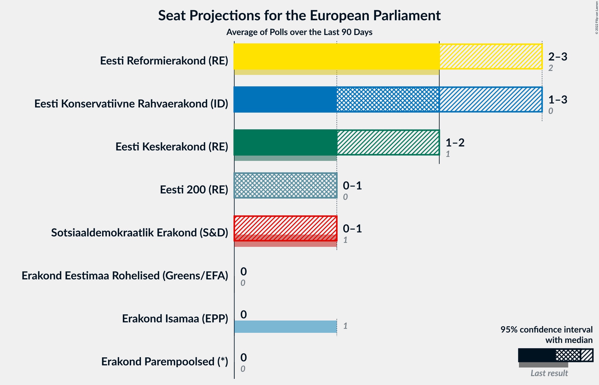

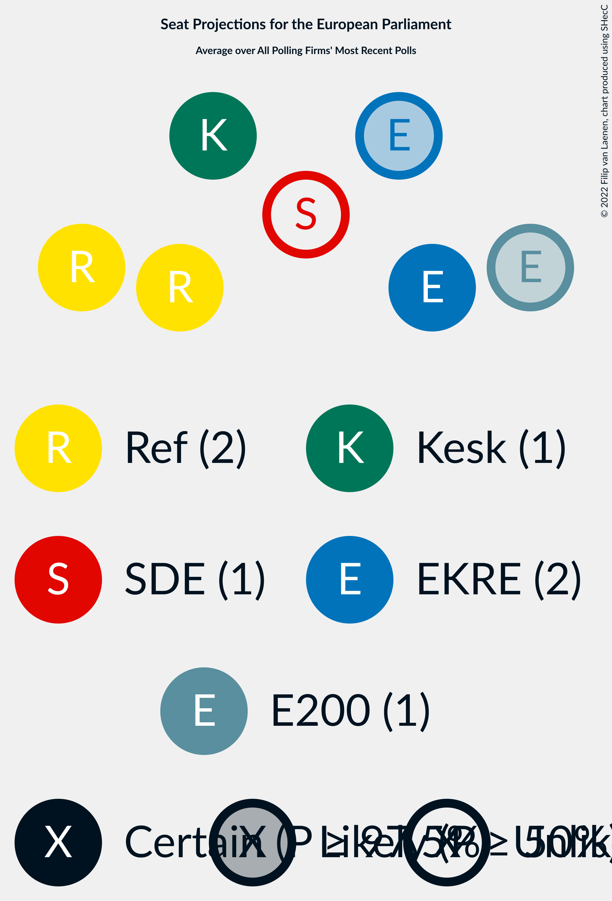

### Confidence Intervals

| Party | Last Result | Median | 80% Confidence Interval | 90% Confidence Interval | 95% Confidence Interval | 99% Confidence Interval |
|:-----:|:-----------:|:------:|:-----------------------:|:-----------------------:|:-----------------------:|:-----------------------:|
| <a href="#eesti-reformierakond-(re)">Eesti Reformierakond (RE)</a> | 2 | 2 | 2–3 |2–3 | 2–3 | 2–4 |
| <a href="#eesti-keskerakond-(re)">Eesti Keskerakond (RE)</a> | 1 | 1 | 1–2 |1–2 | 1–2 | 1–2 |
| <a href="#erakond-isamaa-(epp)">Erakond Isamaa (EPP)</a> | 1 | 0 | 0 |0 | 0 | 0–1 |
| <a href="#sotsiaaldemokraatlik-erakond-(s&d)">Sotsiaaldemokraatlik Erakond (S&D)</a> | 1 | 0 | 0–1 |0–1 | 0–1 | 0–1 |
| <a href="#eesti-konservatiivne-rahvaerakond-(id)">Eesti Konservatiivne Rahvaerakond (ID)</a> | 0 | 2 | 1–3 |1–3 | 1–3 | 1–3 |
| <a href="#erakond-eestimaa-rohelised-(greens/efa)">Erakond Eestimaa Rohelised (Greens/EFA)</a> | 0 | 0 | 0 |0 | 0 | 0 |
| <a href="#eesti-vabaerakond-(*)">Eesti Vabaerakond (*)</a> | 0 | N/A | N/A |N/A | N/A | N/A |
| <a href="#eesti-200-(re)">Eesti 200 (RE)</a> | 0 | 1 | 0–1 |0–1 | 0–1 | 0–1 |
| <a href="#raimond-kaljulaid-(re)">Raimond Kaljulaid (RE)</a> | 0 | N/A | N/A |N/A | N/A | N/A |
| <a href="#erakond-parempoolsed-(*)">Erakond Parempoolsed (*)</a> | 0 | 0 | 0 |0 | 0 | 0 |

### Eesti Reformierakond (RE)

*For a full overview of the results for this party, see the [Eesti Reformierakond (RE)](party-eestireformierakondre.html) page.*

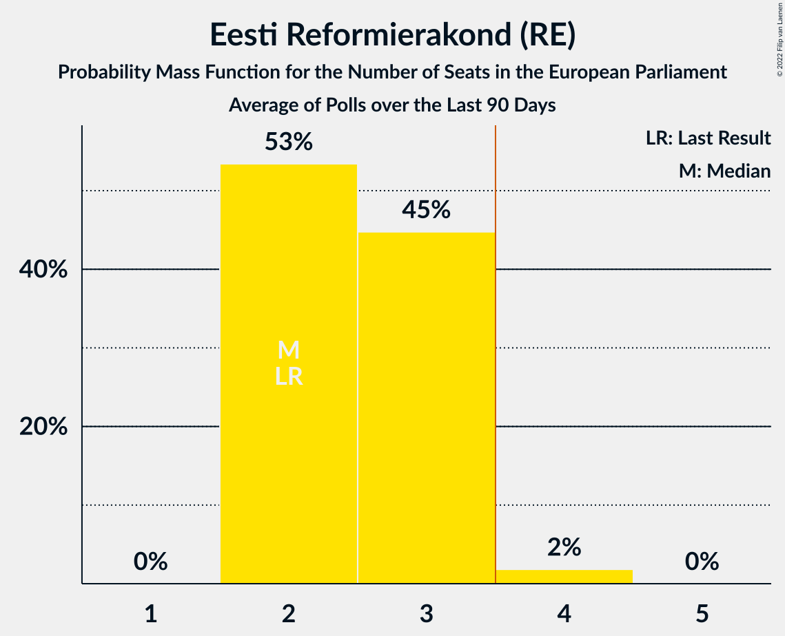

| Number of Seats | Probability | Accumulated | Special Marks |
|:---------------:|:-----------:|:-----------:|:-------------:|
| 2 | 53% | 100% | Last Result, Median |
| 3 | 45% | 47% |  |
| 4 | 2% | 2% | Majority |
| 5 | 0% | 0% |  |

### Eesti Keskerakond (RE)

*For a full overview of the results for this party, see the [Eesti Keskerakond (RE)](party-eestikeskerakondre.html) page.*

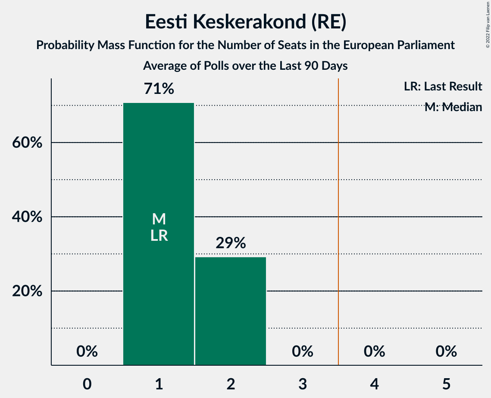

| Number of Seats | Probability | Accumulated | Special Marks |
|:---------------:|:-----------:|:-----------:|:-------------:|
| 1 | 71% | 100% | Last Result, Median |
| 2 | 29% | 29% |  |
| 3 | 0% | 0% |  |

### Erakond Isamaa (EPP)

*For a full overview of the results for this party, see the [Erakond Isamaa (EPP)](party-erakondisamaaepp.html) page.*

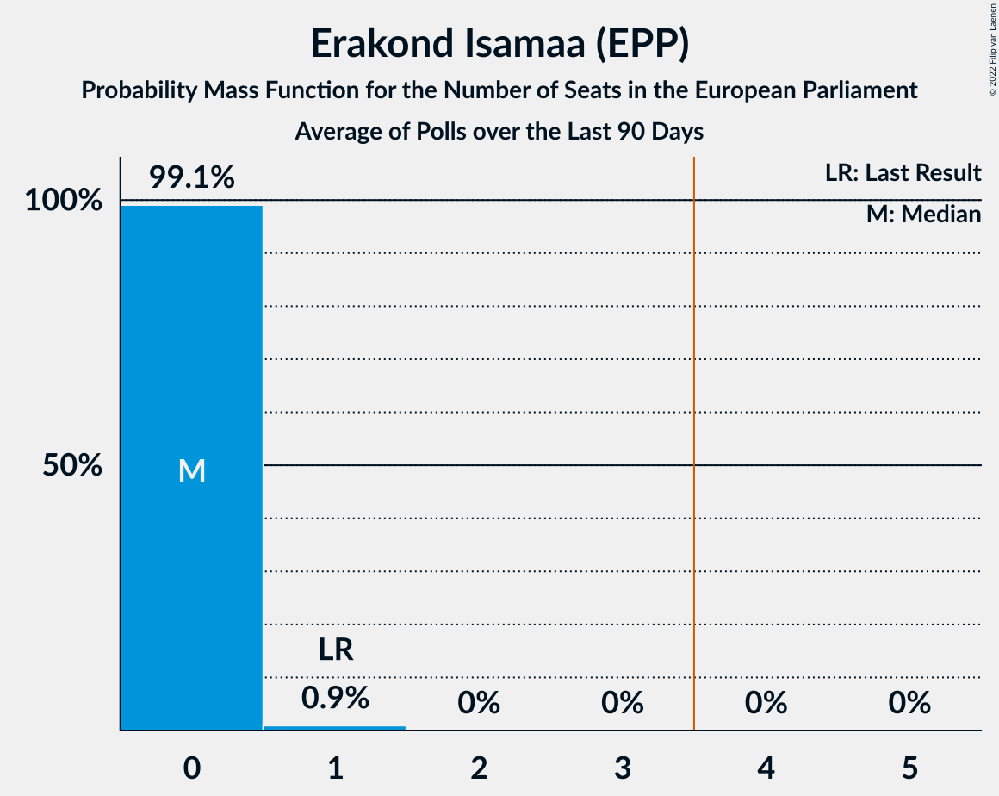

| Number of Seats | Probability | Accumulated | Special Marks |
|:---------------:|:-----------:|:-----------:|:-------------:|
| 0 | 99.1% | 100% | Median |
| 1 | 0.9% | 0.9% | Last Result |
| 2 | 0% | 0% |  |

### Sotsiaaldemokraatlik Erakond (S&D)

*For a full overview of the results for this party, see the [Sotsiaaldemokraatlik Erakond (S&D)](party-sotsiaaldemokraatlikerakondsd.html) page.*

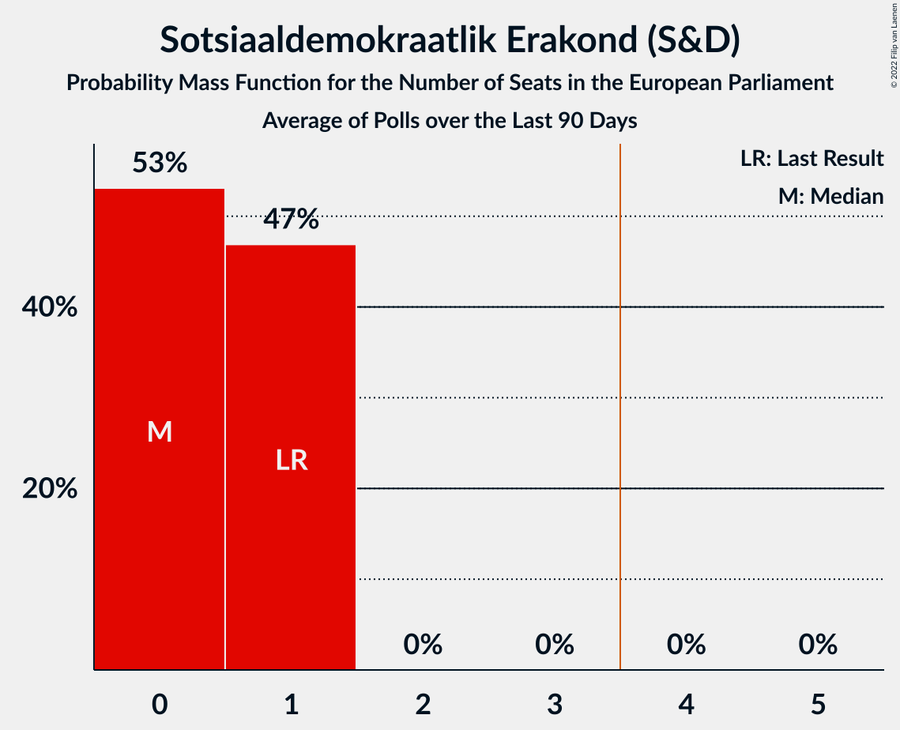

| Number of Seats | Probability | Accumulated | Special Marks |
|:---------------:|:-----------:|:-----------:|:-------------:|
| 0 | 53% | 100% | Median |
| 1 | 47% | 47% | Last Result |
| 2 | 0% | 0% |  |

### Eesti Konservatiivne Rahvaerakond (ID)

*For a full overview of the results for this party, see the [Eesti Konservatiivne Rahvaerakond (ID)](party-eestikonservatiivnerahvaerakondid.html) page.*

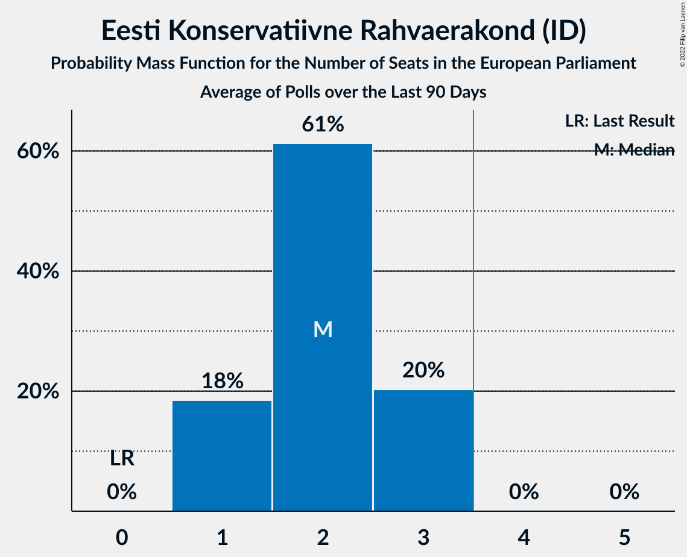

| Number of Seats | Probability | Accumulated | Special Marks |
|:---------------:|:-----------:|:-----------:|:-------------:|
| 0 | 0% | 100% | Last Result |
| 1 | 18% | 100% |  |
| 2 | 61% | 82% | Median |
| 3 | 20% | 20% |  |
| 4 | 0% | 0% | Majority |

### Erakond Eestimaa Rohelised (Greens/EFA)

*For a full overview of the results for this party, see the [Erakond Eestimaa Rohelised (Greens/EFA)](party-erakondeestimaarohelisedgreensefa.html) page.*

| Number of Seats | Probability | Accumulated | Special Marks |
|:---------------:|:-----------:|:-----------:|:-------------:|
| 0 | 100% | 100% | Last Result, Median |

### Eesti Vabaerakond (*)

*For a full overview of the results for this party, see the [Eesti Vabaerakond (*)](party-eestivabaerakond.html) page.*

### Eesti 200 (RE)

*For a full overview of the results for this party, see the [Eesti 200 (RE)](party-eesti200re.html) page.*

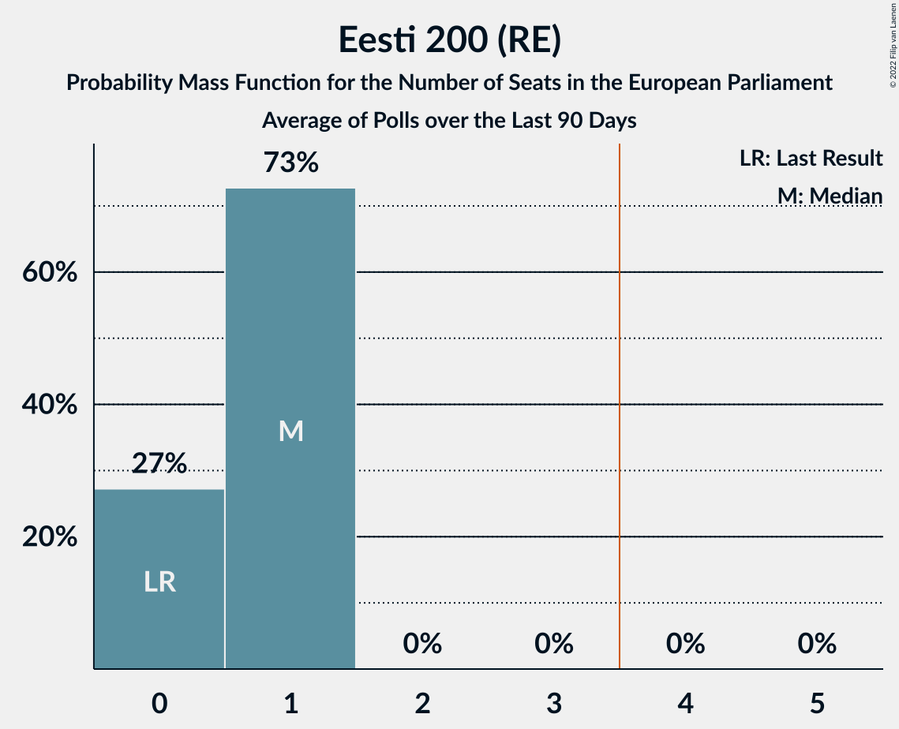

| Number of Seats | Probability | Accumulated | Special Marks |
|:---------------:|:-----------:|:-----------:|:-------------:|
| 0 | 27% | 100% | Last Result |
| 1 | 73% | 73% | Median |
| 2 | 0% | 0% |  |

### Raimond Kaljulaid (RE)

*For a full overview of the results for this party, see the [Raimond Kaljulaid (RE)](party-raimondkaljulaidre.html) page.*

### Erakond Parempoolsed (*)

*For a full overview of the results for this party, see the [Erakond Parempoolsed (*)](party-erakondparempoolsed.html) page.*

| Number of Seats | Probability | Accumulated | Special Marks |
|:---------------:|:-----------:|:-----------:|:-------------:|
| 0 | 100% | 100% | Last Result, Median |

## Coalitions

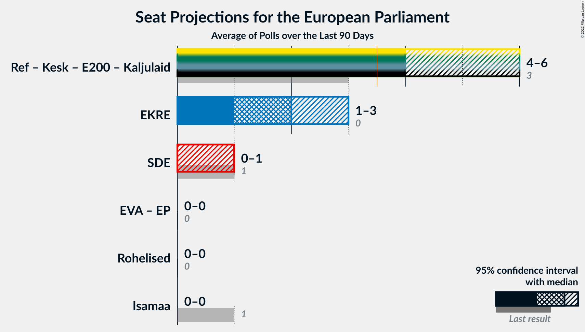

### Confidence Intervals

| Coalition | Last Result | Median | Majority? | 80% Confidence Interval | 90% Confidence Interval | 95% Confidence Interval | 99% Confidence Interval |
|:---------:|:-----------:|:------:|:---------:|:-----------------------:|:-----------------------:|:-----------------------:|:-----------------------:|
| Eesti Reformierakond (RE) – Eesti Keskerakond (RE) – Eesti 200 (RE) – Raimond Kaljulaid (RE) | 3 | 4 | 99.9% | 4–5 | 4–5 | 4–6 | 4–6 |
| Eesti Konservatiivne Rahvaerakond (ID) | 0 | 2 | 0% | 1–3 | 1–3 | 1–3 | 1–3 |
| Sotsiaaldemokraatlik Erakond (S&D) | 1 | 0 | 0% | 0–1 | 0–1 | 0–1 | 0–1 |
| Eesti Vabaerakond (*) – Erakond Parempoolsed (*) | 0 | 0 | 0% | 0 | 0 | 0 | 0 |
| Erakond Eestimaa Rohelised (Greens/EFA) | 0 | 0 | 0% | 0 | 0 | 0 | 0 |
| Erakond Isamaa (EPP) | 1 | 0 | 0% | 0 | 0 | 0 | 0–1 |

### Eesti Reformierakond (RE) – Eesti Keskerakond (RE) – Eesti 200 (RE) – Raimond Kaljulaid (RE)

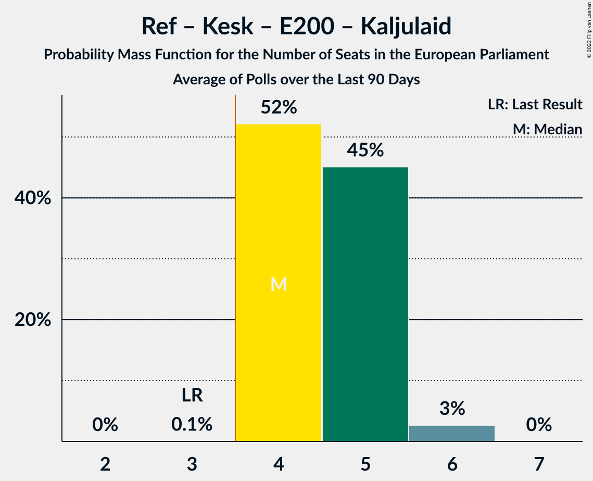

| Number of Seats | Probability | Accumulated | Special Marks |
|:---------------:|:-----------:|:-----------:|:-------------:|
| 3 | 0.1% | 100% | Last Result |
| 4 | 52% | 99.9% | Median, Majority |
| 5 | 45% | 48% |  |
| 6 | 3% | 3% |  |
| 7 | 0% | 0% |  |

### Eesti Konservatiivne Rahvaerakond (ID)

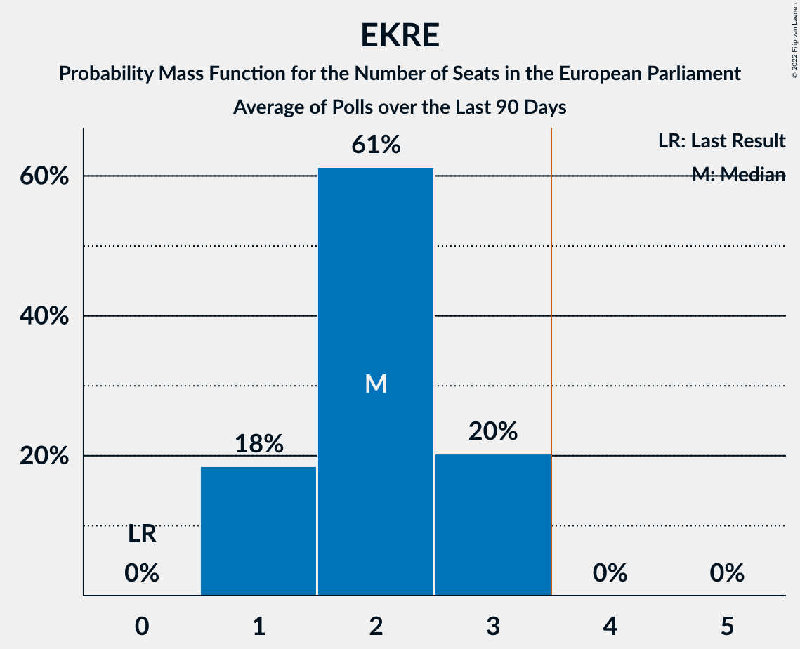

| Number of Seats | Probability | Accumulated | Special Marks |
|:---------------:|:-----------:|:-----------:|:-------------:|
| 0 | 0% | 100% | Last Result |
| 1 | 18% | 100% |  |
| 2 | 61% | 82% | Median |
| 3 | 20% | 20% |  |
| 4 | 0% | 0% | Majority |

### Sotsiaaldemokraatlik Erakond (S&D)

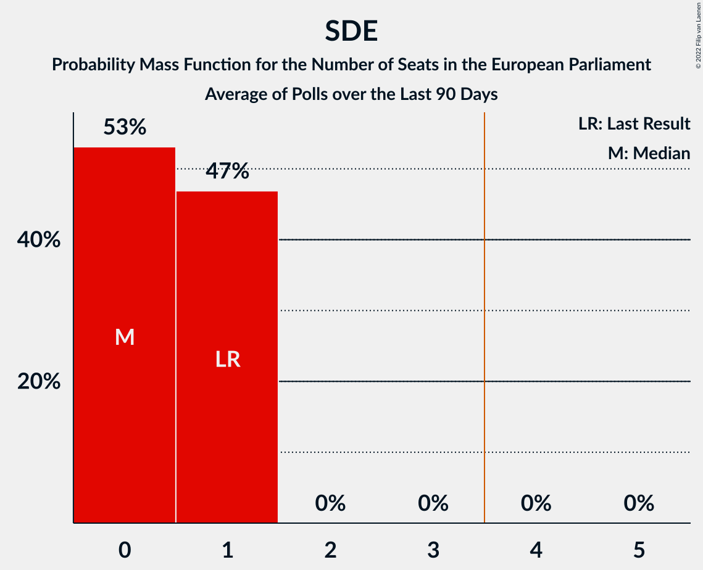

| Number of Seats | Probability | Accumulated | Special Marks |
|:---------------:|:-----------:|:-----------:|:-------------:|
| 0 | 53% | 100% | Median |
| 1 | 47% | 47% | Last Result |
| 2 | 0% | 0% |  |

### Eesti Vabaerakond (*) – Erakond Parempoolsed (*)

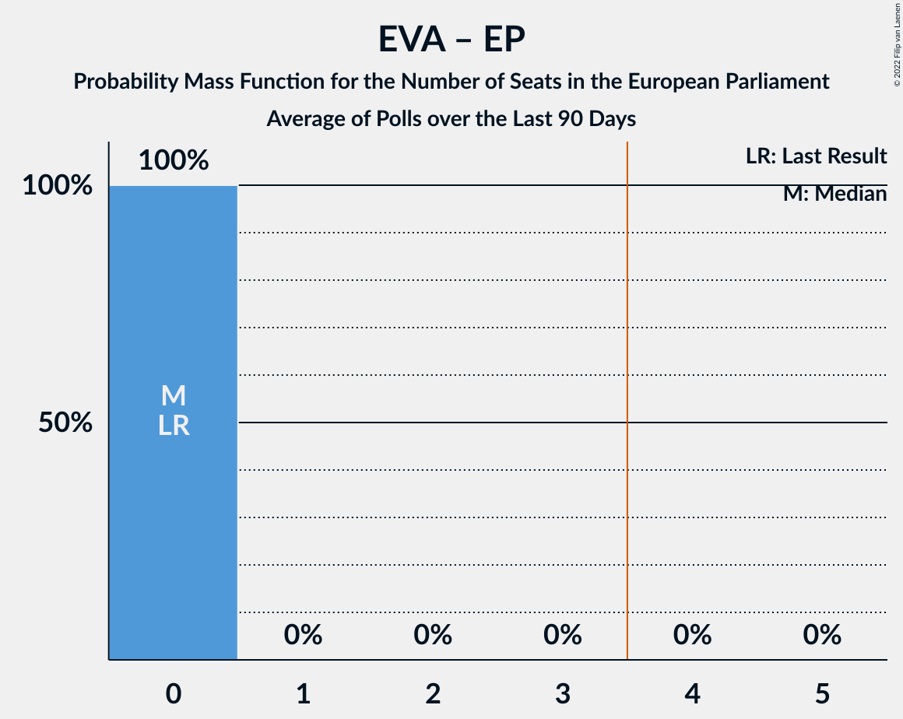

| Number of Seats | Probability | Accumulated | Special Marks |
|:---------------:|:-----------:|:-----------:|:-------------:|
| 0 | 100% | 100% | Last Result, Median |

### Erakond Eestimaa Rohelised (Greens/EFA)

| Number of Seats | Probability | Accumulated | Special Marks |
|:---------------:|:-----------:|:-----------:|:-------------:|
| 0 | 100% | 100% | Last Result, Median |

### Erakond Isamaa (EPP)

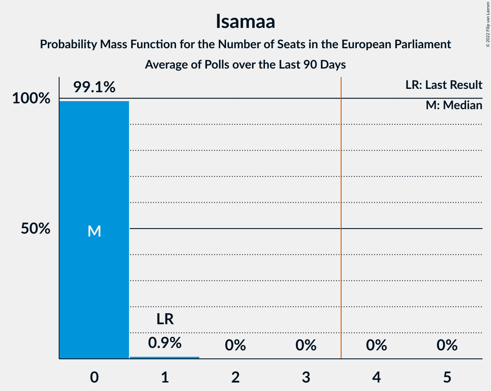

| Number of Seats | Probability | Accumulated | Special Marks |
|:---------------:|:-----------:|:-----------:|:-------------:|
| 0 | 99.1% | 100% | Median |
| 1 | 0.9% | 0.9% | Last Result |
| 2 | 0% | 0% |  |

## Technical Information

+ **Number of polls included in this average:** 3
+ **Lowest number of simulations done in a poll included in this average:** 1,048,576
+ **Total number of simulations done in the polls included in this average:** 3,145,728
+ **Error estimate:** 1.98%
