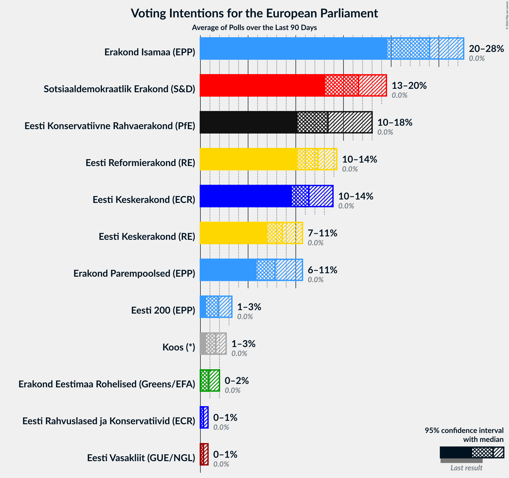
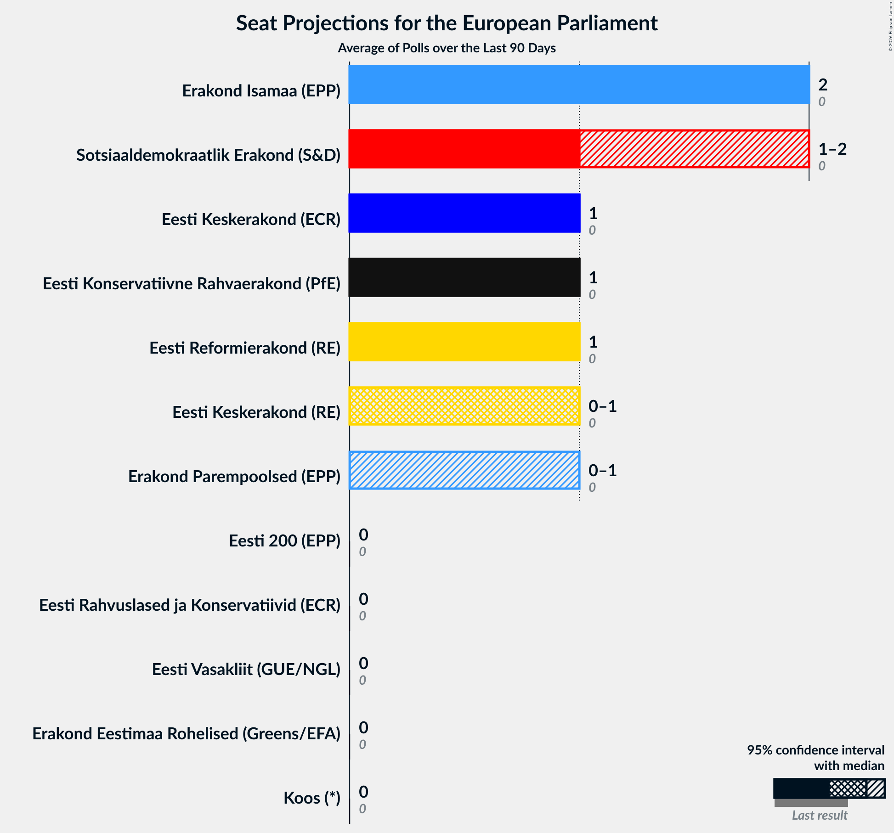

# Overview

The table below lists the most recent polls (less than 90 days old) registered and analyzed so far.

| Period     | Polling firm/Commissioner(s) | VL | Rohelised | SDE | Ref | Kesk | Kaljulaid | Isamaa | EP | E200 | Kesk | ERK | EKRE | EVA | Koos |
|:----------:|:----------------------------:|:--:|:--:|:--:|:--:|:--:|:--:|:--:|:--:|:--:|:--:|:--:|:--:|:--:|:--:|
| 9 June 2024 | General Election | 0.0%   0 | 0.0%   0 | 0.0%   0 | 0.0%   0 | 0.0%   0 | 0.0%   0 | 0.0%   0 | 0.0%   0 | 0.0%   0 | 0.0%   0 | 0.0%   0 | 0.0%   0 | 0.0%   0 | 0.0%   0 |
| N/A | [Poll Average](average.html) | 0–1%   0 | 0–2%   0 | 12–19%   1–2 | 10–15%   0–1 | 7–12%   0–1 | N/A   N/A | 22–28%   2 | 6–10%   0–1 | 1–3%   0 | 10–15%   1 | 0–1%   0 | 10–15%   1 | N/A   N/A | 0–3%   0 |
| [17–23 August 2026](2026-08-23-Norstat.html) | Norstat   MTÜ Ühiskonnauuringute Instituut | 0%   0 | 0–1%   0 | 12–16%   1 | 11–16%   1 | 8–12%   1 | N/A   N/A | 23–29%   2 | 6–9%   0 | 1–2%   0 | 12–16%   1 | 0–1%   0 | 9–13%   1 | N/A   N/A | 0–2%   0 |
| [11–19 August 2026](2026-08-19-Emor.html) | Emor   ERR | N/A   N/A | 1–2%   0 | 16–20%   1–2 | 11–14%   1 | 7–10%   0–1 | N/A   N/A | 24–28%   2–3 | 6–8%   0 | 2–3%   0 | 9–13%   1 | N/A   N/A | 10–13%   1 | N/A   N/A | 1–3%   0 |
| [4–12 August 2026](2026-08-12-Turu-uuringuteAS.html) | Turu-uuringute AS | 0–1%   0 | 1–2%   0 | 13–17%   1 | 9–13%   0–1 | 7–11%   0–1 | N/A   N/A | 21–27%   2 | 7–11%   0–1 | 1–2%   0 | 10–14%   1 | 0–1%   0 | 11–15%   1 | N/A   N/A | 1–2%   0 |
| 9 June 2024 | General Election | 0.0%   0 | 0.0%   0 | 0.0%   0 | 0.0%   0 | 0.0%   0 | 0.0%   0 | 0.0%   0 | 0.0%   0 | 0.0%   0 | 0.0%   0 | 0.0%   0 | 0.0%   0 | 0.0%   0 | 0.0%   0 |

Only polls for which at least the sample size has been published are included in the table above.

**Legend:**
+ **Top half of each row:** Voting intentions (95% confidence interval)
+ **Bottom half of each row:** Seat projections for the European Parliament (95% confidence interval)
+ **VL:** Eesti Vasakliit (GUE/NGL)
+ **Rohelised:** Erakond Eestimaa Rohelised (Greens/EFA)
+ **SDE:** Sotsiaaldemokraatlik Erakond (S&D)
+ **Ref:** Eesti Reformierakond (RE)
+ **Kesk:** Eesti Keskerakond (RE)
+ **Kaljulaid:** Raimond Kaljulaid (RE)
+ **Isamaa:** Erakond Isamaa (EPP)
+ **EP:** Erakond Parempoolsed (EPP)
+ **E200:** Eesti 200 (EPP)
+ **Kesk:** Eesti Keskerakond (ECR)
+ **ERK:** Eesti Rahvuslased ja Konservatiivid (ECR)
+ **EKRE:** Eesti Konservatiivne Rahvaerakond (PfE)
+ **EVA:** Eesti Vabaerakond (*)
+ **Koos:** Koos (*)
+ **N/A (single party):** Party not included the published results
+ **N/A (entire row):** Calculation for this opinion poll not started yet

