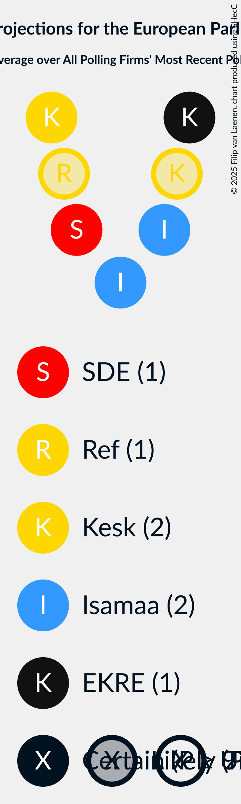

# Overview

The table below lists the most recent polls (less than 90 days old) registered and analyzed so far.

| Period     | Polling firm/Commissioner(s) | VL | Rohelised | SDE | Ref | Kesk | Kaljulaid | Isamaa | EP | E200 | ERK | EKRE | EVA | Koos |
|:----------:|:----------------------------:|:--:|:--:|:--:|:--:|:--:|:--:|:--:|:--:|:--:|:--:|:--:|:--:|:--:|
| 9 June 2024 | General Election | 0.0%   0 | 0.0%   0 | 0.0%   0 | 0.0%   0 | 0.0%   0 | 0.0%   0 | 0.0%   0 | 0.0%   0 | 0.0%   0 | 0.0%   0 | 0.0%   0 | 0.0%   0 | 0.0%   0 |
| N/A | [Poll Average](average.html) | 0–1%   0 | 1–2%   0 | 11–17%   1 | 10–14%   1 | 19–24%   1–2 | N/A   N/A | 20–29%   2 | 6–10%   0 | 1–3%   0 | 0–2%   0 | 12–16%   1 | N/A   N/A | 0–2%   0 |
| [11–18 February 2026](2026-02-18-KantarEmor.html) | Kantar Emor   ERR | 0%   0 | 1–2%   0 | 14–17%   1 | 11–14%   1 | 19–23%   2 | N/A   N/A | 22–27%   2 | 7–10%   0 | 1–3%   0 | N/A   N/A | 12–15%   1 | N/A   N/A | 0–1%   0 |
| [9–15 February 2026](2026-02-15-Norstat.html) | Norstat   MTÜ Ühiskonnauuringute Instituut | N/A   N/A | 1–2%   0 | 11–15%   1 | 11–15%   1 | 19–24%   1–2 | N/A   N/A | 24–29%   2–3 | 5–8%   0 | 2–3%   0 | N/A   N/A | 12–16%   1 | N/A   N/A | N/A   N/A |
| [5–9 February 2026](2026-02-09-Turu-uuringuteAS.html) | Turu-uuringute AS | 0–1%   0 | 1–2%   0 | 12–16%   1 | 10–14%   1 | 18–24%   1–2 | N/A   N/A | 19–25%   2 | 6–10%   0–1 | 1–3%   0 | 1–2%   0 | 12–16%   1 | N/A   N/A | 1–2%   0 |
| 9 June 2024 | General Election | 0.0%   0 | 0.0%   0 | 0.0%   0 | 0.0%   0 | 0.0%   0 | 0.0%   0 | 0.0%   0 | 0.0%   0 | 0.0%   0 | 0.0%   0 | 0.0%   0 | 0.0%   0 | 0.0%   0 |

Only polls for which at least the sample size has been published are included in the table above.

**Legend:**
+ **Top half of each row:** Voting intentions (95% confidence interval)
+ **Bottom half of each row:** Seat projections for the European Parliament (95% confidence interval)
+ **VL:** Eesti Vasakliit (GUE/NGL)
+ **Rohelised:** Erakond Eestimaa Rohelised (Greens/EFA)
+ **SDE:** Sotsiaaldemokraatlik Erakond (S&D)
+ **Ref:** Eesti Reformierakond (RE)
+ **Kesk:** Eesti Keskerakond (RE)
+ **Kaljulaid:** Raimond Kaljulaid (RE)
+ **Isamaa:** Erakond Isamaa (EPP)
+ **EP:** Erakond Parempoolsed (EPP)
+ **E200:** Eesti 200 (EPP)
+ **ERK:** Eesti Rahvuslased ja Konservatiivid (ECR)
+ **EKRE:** Eesti Konservatiivne Rahvaerakond (PfE)
+ **EVA:** Eesti Vabaerakond (*)
+ **Koos:** Koos (*)
+ **N/A (single party):** Party not included the published results
+ **N/A (entire row):** Calculation for this opinion poll not started yet

