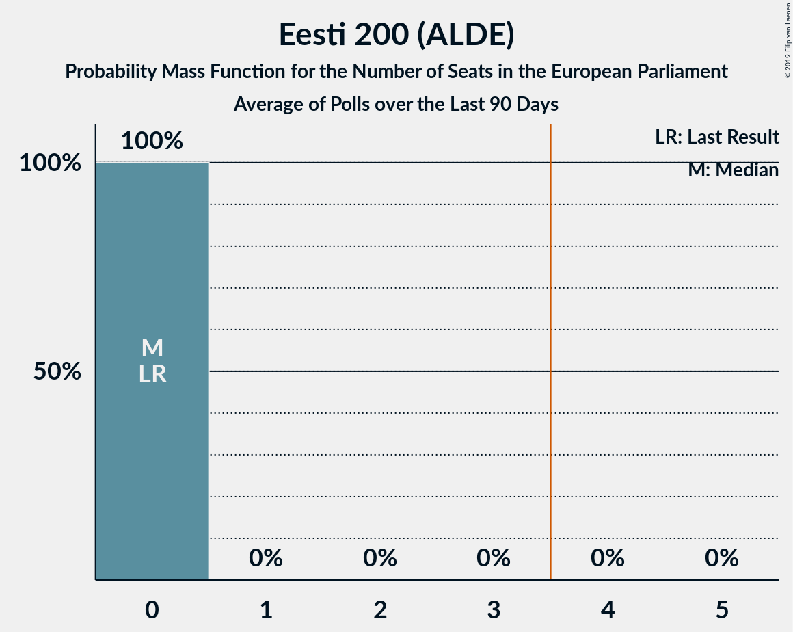

# Eesti 200 (ALDE)

<a href="#voting-intentions">Voting Intentions</a> | <a href="#seats">Seats</a>

## Voting Intentions

Last result: **0.0%** (General Election of 26 May 2019)

### Confidence Intervals

| Period     | Polling firm/Commissioner(s) | Median | 80% Confidence Interval | 90% Confidence Interval | 95% Confidence Interval | 99% Confidence Interval |
|:----------:|:----------------:|:-----------:|:-----------------------:|:-----------------------:|:-----------------------:|:-----------------------:|
| N/A | [Poll Average](average.html) | 8.4% | 7.4–9.5% | 7.1–9.8% | 6.9–10.1% | 6.4–10.7% |
| [6–13 June 2019](2019-06-13-KantarEmor.html) | Kantar Emor   BNS and Postimees | 8.3% | 7.3–9.5% | 7.1–9.8% | 6.8–10.1% | 6.4–10.7% |
| [4–11 June 2019](2019-06-11-Norstat.html) | Norstat   MTÜ Ühiskonnauuringute Instituut | 5.8% | N/A | N/A | N/A | N/A |
| [28 May–10 June 2019](2019-06-10-Turu-uuringuteAS.html) | Turu-uuringute AS   ERR | 4.2% | N/A | N/A | N/A | N/A |
| [27 May–3 June 2019](2019-06-03-Norstat.html) | Norstat   MTÜ Ühiskonnauuringute Instituut | 3.0% | 2.4–3.8% | 2.2–4.1% | 2.1–4.3% | 1.9–4.7% |

### Probability Mass Function

The following table shows the probability mass function per percentage block of voting intentions for the [poll average](average.html) for Eesti 200 (ALDE).

| Voting Intentions | Probability | Accumulated | Special Marks |
|:-----------------:|:-----------:|:-----------:|:-------------:|
| 0.0–0.5% | 0% | 100% | Last Result |
| 0.5–1.5% | 0% | 100% |  |
| 1.5–2.5% | 0% | 100% |  |
| 2.5–3.5% | 0% | 100% |  |
| 3.5–4.5% | 0% | 100% |  |
| 4.5–5.5% | 0% | 100% |  |
| 5.5–6.5% | 0.9% | 100% |  |
| 6.5–7.5% | 14% | 99.1% |  |
| 7.5–8.5% | 44% | 85% | Median |
| 8.5–9.5% | 33% | 42% |  |
| 9.5–10.5% | 8% | 8% |  |
| 10.5–11.5% | 0.7% | 0.7% |  |
| 11.5–12.5% | 0% | 0% |  |

## Seats

Last result: **0** seats (General Election of 26 May 2019)

### Confidence Intervals

| Period     | Polling firm/Commissioner(s) | Median | 80% Confidence Interval | 90% Confidence Interval | 95% Confidence Interval | 99% Confidence Interval |
|:----------:|:----------------:|:------:|:-----------------------:|:-----------------------:|:-----------------------:|:-----------------------:|
| N/A | [Poll Average](average.html) | 0 | 0 | 0 | 0 | 0 |
| [6–13 June 2019](2019-06-13-KantarEmor.html) | Kantar Emor   BNS and Postimees | 0 | 0 | 0 | 0 | 0 |
| [4–11 June 2019](2019-06-11-Norstat.html) | Norstat   MTÜ Ühiskonnauuringute Instituut |  |  |  |  |  |
| [28 May–10 June 2019](2019-06-10-Turu-uuringuteAS.html) | Turu-uuringute AS   ERR |  |  |  |  |  |
| [27 May–3 June 2019](2019-06-03-Norstat.html) | Norstat   MTÜ Ühiskonnauuringute Instituut | 0 | 0 | 0 | 0 | 0 |

### Probability Mass Function

The following table shows the probability mass function per seat for the [poll average](average.html) for Eesti 200 (ALDE).

| Number of Seats | Probability | Accumulated | Special Marks |
|:---------------:|:-----------:|:-----------:|:-------------:|
| 0 | 100% | 100% | Last Result, Median |

