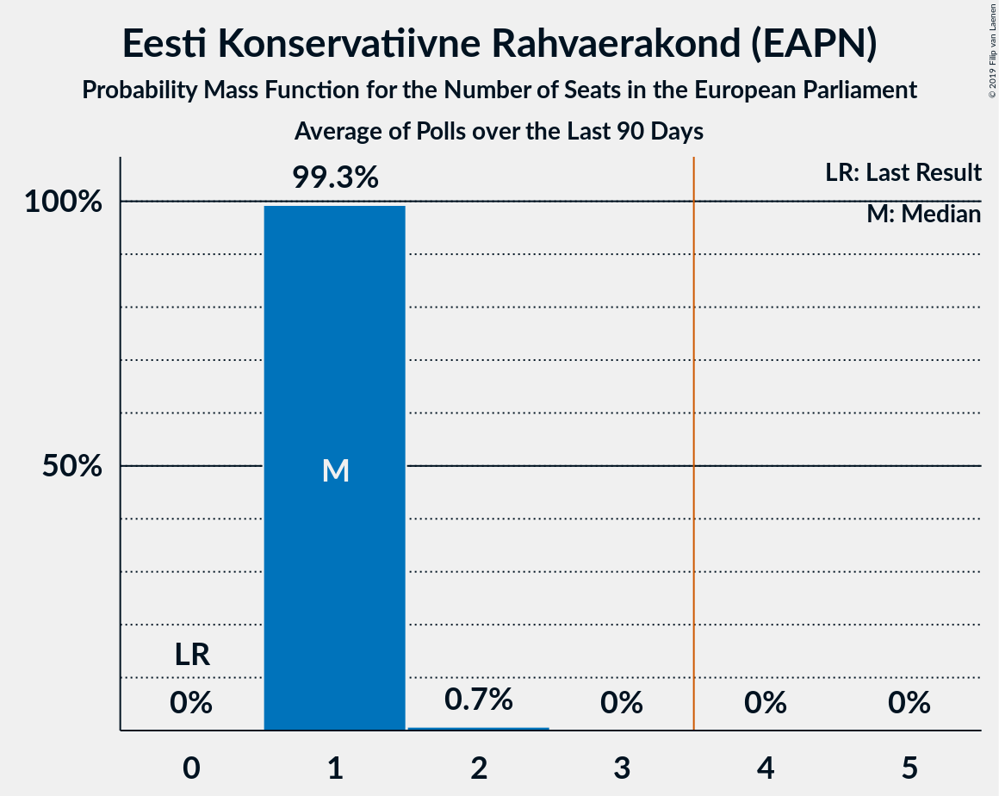

# Eesti Konservatiivne Rahvaerakond (EAPN)

<a href="#voting-intentions">Voting Intentions</a> | <a href="#seats">Seats</a>

## Voting Intentions

Last result: **4.0%** (General Election of 25 May 2014)

### Confidence Intervals

| Period     | Polling firm/Commissioner(s) | Median | 80% Confidence Interval | 90% Confidence Interval | 95% Confidence Interval | 99% Confidence Interval |
|:----------:|:----------------:|:-----------:|:-----------------------:|:-----------------------:|:-----------------------:|:-----------------------:|
| N/A | [Poll Average](average.html) | 18.2% | 16.8–19.7% | 16.4–20.1% | 16.0–20.5% | 15.4–21.2% |
| [15–22 April 2019](2019-04-22-Norstat.html) | Norstat   MTÜ Ühiskonnauuringute Instituut | 20.2% | 18.6–21.9% | 18.2–22.4% | 17.8–22.8% | 17.1–23.6% |
| [12–17 April 2019](2019-04-17-Norstat.html) | Norstat   MTÜ Ühiskonnauuringute Instituut | 14.0% | 12.7–15.5% | 12.3–15.9% | 12.0–16.3% | 11.4–17.0% |
| [2–15 April 2019](2019-04-15-Turu-uuringuteAS.html) | Turu-uuringute AS   ERR | 16.2% | N/A | N/A | N/A | N/A |
| [8–15 April 2019](2019-04-15-Norstat.html) | Norstat   MTÜ Ühiskonnauuringute Instituut | 18.1% | N/A | N/A | N/A | N/A |
| [10–15 April 2019](2019-04-15-KantarEmor.html) | Kantar Emor   BNS and Postimees | 15.4% | N/A | N/A | N/A | N/A |
| [1–8 April 2019](2019-04-08-Norstat.html) | Norstat   MTÜ Ühiskonnauuringute Instituut | 14.8% | 13.4–16.3% | 13.1–16.8% | 12.7–17.1% | 12.1–17.9% |
| [25–29 March 2019](2019-03-29-Norstat.html) | Norstat   MTÜ Ühiskonnauuringute Instituut | 19.1% | N/A | N/A | N/A | N/A |
| [18–24 March 2019](2019-03-24-Norstat.html) | Norstat   MTÜ Ühiskonnauuringute Instituut | 18.8% | N/A | N/A | N/A | N/A |
| [14–21 March 2019](2019-03-21-KantarEmor.html) | Kantar Emor   BNS and Postimees | 18.0% | 16.7–19.5% | 16.3–19.9% | 16.0–20.3% | 15.3–21.0% |
| [5–18 March 2019](2019-03-18-Turu-uuringuteAS.html) | Turu-uuringute AS   ERR | 18.0% | 16.6–19.7% | 16.1–20.1% | 15.8–20.5% | 15.1–21.3% |
| [11–15 March 2019](2019-03-15-Norstat.html) | Norstat   MTÜ Ühiskonnauuringute Instituut | 12.6% | N/A | N/A | N/A | N/A |
| [12–13 March 2019](2019-03-13-KantarEmor.html) | Kantar Emor   BNS and Postimees | 18.1% | N/A | N/A | N/A | N/A |
| [5–11 March 2019](2019-03-11-Norstat.html) | Norstat   MTÜ Ühiskonnauuringute Instituut | 18.1% | N/A | N/A | N/A | N/A |
| [24 February–1 March 2019](2019-03-01-Norstat.html) | Norstat   MTÜ Ühiskonnauuringute Instituut | 17.7% | N/A | N/A | N/A | N/A |
| [26–28 February 2019](2019-02-28-KantarEmor.html) | Kantar Emor   BNS and Postimees | 17.3% | N/A | N/A | N/A | N/A |
| [18–24 February 2019](2019-02-24-Norstat.html) | Norstat   MTÜ Ühiskonnauuringute Instituut | 18.8% | N/A | N/A | N/A | N/A |
| [7–20 February 2019](2019-02-20-Turu-uuringuteAS.html) | Turu-uuringute AS   ERR | 15.0% | N/A | N/A | N/A | N/A |
| [14–20 February 2019](2019-02-20-KantarEmor.html) | Kantar Emor   BNS and Postimees | 21.3% | N/A | N/A | N/A | N/A |
| [12–18 February 2019](2019-02-18-OÜFaktumAriko.html) | OÜ Faktum & Ariko | 18.1% | 16.8–19.7% | 16.4–20.1% | 16.0–20.5% | 15.4–21.2% |
| [11–17 February 2019](2019-02-17-Norstat.html) | Norstat   MTÜ Ühiskonnauuringute Instituut | 15.2% | N/A | N/A | N/A | N/A |
| [4–11 February 2019](2019-02-11-Norstat.html) | Norstat   MTÜ Ühiskonnauuringute Instituut | 17.6% | N/A | N/A | N/A | N/A |
| [4–7 February 2019](2019-02-07-KantarEmor.html) | Kantar Emor   BNS and Postimees | 18.9% | N/A | N/A | N/A | N/A |
| [28 January–4 February 2019](2019-02-04-Norstat.html) | Norstat   MTÜ Ühiskonnauuringute Instituut | 13.3% | N/A | N/A | N/A | N/A |
| [24–29 January 2019](2019-01-29-KantarEmor.html) | Kantar Emor   BNS and Postimees | 18.2% | N/A | N/A | N/A | N/A |
| [15–28 January 2019](2019-01-28-Turu-uuringuteAS.html) | Turu-uuringute AS   ERR | 12.6% | N/A | N/A | N/A | N/A |
| [21–27 January 2019](2019-01-27-Norstat.html) | Norstat   MTÜ Ühiskonnauuringute Instituut | 19.2% | N/A | N/A | N/A | N/A |
| [14–21 January 2019](2019-01-21-Norstat.html) | Norstat   MTÜ Ühiskonnauuringute Instituut | 18.2% | N/A | N/A | N/A | N/A |
| [7–13 January 2019](2019-01-13-Norstat.html) | Norstat   MTÜ Ühiskonnauuringute Instituut | 20.5% | N/A | N/A | N/A | N/A |
| [3–9 January 2019](2019-01-09-Turu-uuringuteAS.html) | Turu-uuringute AS   ERR | 20.0% | 18.5–21.7% | 18.0–22.2% | 17.7–22.6% | 16.9–23.4% |
| [4–8 January 2019](2019-01-08-KantarEmor.html) | Kantar Emor   BNS and Postimees | 20.2% | 18.9–21.7% | 18.5–22.1% | 18.2–22.5% | 17.5–23.2% |
| [13–19 December 2018](2018-12-19-Turu-uuringuteAS.html) | Turu-uuringute AS   ERR | 21.0% | 19.4–22.7% | 19.0–23.2% | 18.6–23.6% | 17.8–24.5% |
| [5–12 December 2018](2018-12-12-KantarEmor.html) | Kantar Emor   BNS and Postimees | 20.3% | N/A | N/A | N/A | N/A |
| [27 November–10 December 2018](2018-12-10-Turu-uuringuteAS.html) | Turu-uuringute AS   ERR | 18.0% | N/A | N/A | N/A | N/A |
| [31 October–13 November 2018](2018-11-13-Turu-uuringuteAS.html) | Turu-uuringute AS   ERR | 15.0% | N/A | N/A | N/A | N/A |
| [8–13 November 2018](2018-11-13-KantarEmor.html) | Kantar Emor   BNS and Postimees | 17.0% | N/A | N/A | N/A | N/A |
| [11–18 October 2018](2018-10-18-KantarEmor.html) | Kantar Emor   BNS and Postimees | 15.8% | N/A | N/A | N/A | N/A |
| [2–15 October 2018](2018-10-15-Turu-uuringuteAS.html) | Turu-uuringute AS   ERR | 17.0% | N/A | N/A | N/A | N/A |
| [12–20 September 2018](2018-09-20-KantarEmor.html) | Kantar Emor   BNS and Postimees | 19.9% | N/A | N/A | N/A | N/A |
| [4–17 September 2018](2018-09-17-Turu-uuringuteAS.html) | Turu-uuringute AS   ERR | 17.0% | N/A | N/A | N/A | N/A |
| [8–26 August 2018](2018-08-26-Turu-uuringuteAS.html) | Turu-uuringute AS   ERR | 19.0% | N/A | N/A | N/A | N/A |
| [15–22 August 2018](2018-08-22-KantarEmor.html) | Kantar Emor   BNS and Postimees | 21.2% | N/A | N/A | N/A | N/A |
| [24–30 July 2018](2018-07-30-KantarEmor.html) | Kantar Emor   BNS and Postimees | 21.8% | N/A | N/A | N/A | N/A |
| [1–17 June 2018](2018-06-17-KantarEmor.html) | Kantar Emor   BNS and Postimees | 17.0% | N/A | N/A | N/A | N/A |
| [29 May–11 June 2018](2018-06-11-Turu-uuringuteAS.html) | Turu-uuringute AS   ERR | 18.0% | N/A | N/A | N/A | N/A |
| [21 May 2018](2018-05-21-Turu-uuringuteAS.html) | Turu-uuringute AS   ERR | 15.0% | N/A | N/A | N/A | N/A |
| [21 May 2018](2018-05-21-KantarEmor.html) | Kantar Emor   BNS and Postimees | 16.7% | N/A | N/A | N/A | N/A |
| [19 April 2018](2018-04-19-Turu-uuringuteAS.html) | Turu-uuringute AS   ERR | 14.3% | N/A | N/A | N/A | N/A |
| [12–18 April 2018](2018-04-18-KantarEmor.html) | Kantar Emor   BNS and Postimees | 19.1% | N/A | N/A | N/A | N/A |
| [8–21 March 2018](2018-03-21-Turu-uuringuteAS.html) | Turu-uuringute AS   ERR | 13.0% | N/A | N/A | N/A | N/A |
| [8–14 March 2018](2018-03-14-KantarEmor.html) | Kantar Emor   BNS and Postimees | 18.4% | N/A | N/A | N/A | N/A |
| [1–25 February 2018](2018-02-25-KantarEmor.html) | Kantar Emor   BNS and Postimees | 16.9% | N/A | N/A | N/A | N/A |
| [7–20 February 2018](2018-02-20-Turu-uuringuteAS.html) | Turu-uuringute AS   ERR | 14.0% | N/A | N/A | N/A | N/A |
| [15–29 January 2018](2018-01-29-Turu-uuringuteAS.html) | Turu-uuringute AS   ERR | 12.0% | N/A | N/A | N/A | N/A |
| [18–25 January 2018](2018-01-25-KantarEmor.html) | Kantar Emor   BNS and Postimees | 18.4% | N/A | N/A | N/A | N/A |

### Probability Mass Function

The following table shows the probability mass function per percentage block of voting intentions for the [poll average](average.html) for Eesti Konservatiivne Rahvaerakond (EAPN).

| Voting Intentions | Probability | Accumulated | Special Marks |
|:-----------------:|:-----------:|:-----------:|:-------------:|
| 3.5–4.5% | 0% | 100% | Last Result |
| 4.5–5.5% | 0% | 100% |  |
| 5.5–6.5% | 0% | 100% |  |
| 6.5–7.5% | 0% | 100% |  |
| 7.5–8.5% | 0% | 100% |  |
| 8.5–9.5% | 0% | 100% |  |
| 9.5–10.5% | 0% | 100% |  |
| 10.5–11.5% | 0% | 100% |  |
| 11.5–12.5% | 0% | 100% |  |
| 12.5–13.5% | 0% | 100% |  |
| 13.5–14.5% | 0% | 100% |  |
| 14.5–15.5% | 0.7% | 100% |  |
| 15.5–16.5% | 6% | 99.2% |  |
| 16.5–17.5% | 21% | 93% |  |
| 17.5–18.5% | 34% | 72% | Median |
| 18.5–19.5% | 26% | 37% |  |
| 19.5–20.5% | 9% | 12% |  |
| 20.5–21.5% | 2% | 2% |  |
| 21.5–22.5% | 0.2% | 0.2% |  |
| 22.5–23.5% | 0% | 0% |  |

## Seats

Last result: **0** seats (General Election of 25 May 2014)

### Confidence Intervals

| Period     | Polling firm/Commissioner(s) | Median | 80% Confidence Interval | 90% Confidence Interval | 95% Confidence Interval | 99% Confidence Interval |
|:----------:|:----------------:|:------:|:-----------------------:|:-----------------------:|:-----------------------:|:-----------------------:|
| N/A | [Poll Average](average.html) | 1 | 1 | 1 | 1 | 1–2 |
| [15–22 April 2019](2019-04-22-Norstat.html) | Norstat   MTÜ Ühiskonnauuringute Instituut | 1 | 1–2 | 1–2 | 1–2 | 1–2 |
| [12–17 April 2019](2019-04-17-Norstat.html) | Norstat   MTÜ Ühiskonnauuringute Instituut | 1 | 1 | 1 | 1 | 1 |
| [2–15 April 2019](2019-04-15-Turu-uuringuteAS.html) | Turu-uuringute AS   ERR |  |  |  |  |  |
| [8–15 April 2019](2019-04-15-Norstat.html) | Norstat   MTÜ Ühiskonnauuringute Instituut |  |  |  |  |  |
| [10–15 April 2019](2019-04-15-KantarEmor.html) | Kantar Emor   BNS and Postimees |  |  |  |  |  |
| [1–8 April 2019](2019-04-08-Norstat.html) | Norstat   MTÜ Ühiskonnauuringute Instituut | 1 | 1 | 1 | 1 | 1 |
| [25–29 March 2019](2019-03-29-Norstat.html) | Norstat   MTÜ Ühiskonnauuringute Instituut |  |  |  |  |  |
| [18–24 March 2019](2019-03-24-Norstat.html) | Norstat   MTÜ Ühiskonnauuringute Instituut |  |  |  |  |  |
| [14–21 March 2019](2019-03-21-KantarEmor.html) | Kantar Emor   BNS and Postimees | 1 | 1 | 1 | 1 | 1–2 |
| [5–18 March 2019](2019-03-18-Turu-uuringuteAS.html) | Turu-uuringute AS   ERR | 1 | 1 | 1 | 1–2 | 1–2 |
| [11–15 March 2019](2019-03-15-Norstat.html) | Norstat   MTÜ Ühiskonnauuringute Instituut |  |  |  |  |  |
| [12–13 March 2019](2019-03-13-KantarEmor.html) | Kantar Emor   BNS and Postimees |  |  |  |  |  |
| [5–11 March 2019](2019-03-11-Norstat.html) | Norstat   MTÜ Ühiskonnauuringute Instituut |  |  |  |  |  |
| [24 February–1 March 2019](2019-03-01-Norstat.html) | Norstat   MTÜ Ühiskonnauuringute Instituut |  |  |  |  |  |
| [26–28 February 2019](2019-02-28-KantarEmor.html) | Kantar Emor   BNS and Postimees |  |  |  |  |  |
| [18–24 February 2019](2019-02-24-Norstat.html) | Norstat   MTÜ Ühiskonnauuringute Instituut |  |  |  |  |  |
| [7–20 February 2019](2019-02-20-Turu-uuringuteAS.html) | Turu-uuringute AS   ERR |  |  |  |  |  |
| [14–20 February 2019](2019-02-20-KantarEmor.html) | Kantar Emor   BNS and Postimees |  |  |  |  |  |
| [12–18 February 2019](2019-02-18-OÜFaktumAriko.html) | OÜ Faktum & Ariko | 1 | 1 | 1 | 1 | 1–2 |
| [11–17 February 2019](2019-02-17-Norstat.html) | Norstat   MTÜ Ühiskonnauuringute Instituut |  |  |  |  |  |
| [4–11 February 2019](2019-02-11-Norstat.html) | Norstat   MTÜ Ühiskonnauuringute Instituut |  |  |  |  |  |
| [4–7 February 2019](2019-02-07-KantarEmor.html) | Kantar Emor   BNS and Postimees |  |  |  |  |  |
| [28 January–4 February 2019](2019-02-04-Norstat.html) | Norstat   MTÜ Ühiskonnauuringute Instituut |  |  |  |  |  |
| [24–29 January 2019](2019-01-29-KantarEmor.html) | Kantar Emor   BNS and Postimees |  |  |  |  |  |
| [15–28 January 2019](2019-01-28-Turu-uuringuteAS.html) | Turu-uuringute AS   ERR |  |  |  |  |  |
| [21–27 January 2019](2019-01-27-Norstat.html) | Norstat   MTÜ Ühiskonnauuringute Instituut |  |  |  |  |  |
| [14–21 January 2019](2019-01-21-Norstat.html) | Norstat   MTÜ Ühiskonnauuringute Instituut |  |  |  |  |  |
| [7–13 January 2019](2019-01-13-Norstat.html) | Norstat   MTÜ Ühiskonnauuringute Instituut |  |  |  |  |  |
| [3–9 January 2019](2019-01-09-Turu-uuringuteAS.html) | Turu-uuringute AS   ERR | 1 | 1–2 | 1–2 | 1–2 | 1–2 |
| [4–8 January 2019](2019-01-08-KantarEmor.html) | Kantar Emor   BNS and Postimees | 1 | 1–2 | 1–2 | 1–2 | 1–2 |
| [13–19 December 2018](2018-12-19-Turu-uuringuteAS.html) | Turu-uuringute AS   ERR | 1 | 1 | 1 | 1 | 1–2 |
| [5–12 December 2018](2018-12-12-KantarEmor.html) | Kantar Emor   BNS and Postimees |  |  |  |  |  |
| [27 November–10 December 2018](2018-12-10-Turu-uuringuteAS.html) | Turu-uuringute AS   ERR |  |  |  |  |  |
| [31 October–13 November 2018](2018-11-13-Turu-uuringuteAS.html) | Turu-uuringute AS   ERR |  |  |  |  |  |
| [8–13 November 2018](2018-11-13-KantarEmor.html) | Kantar Emor   BNS and Postimees |  |  |  |  |  |
| [11–18 October 2018](2018-10-18-KantarEmor.html) | Kantar Emor   BNS and Postimees |  |  |  |  |  |
| [2–15 October 2018](2018-10-15-Turu-uuringuteAS.html) | Turu-uuringute AS   ERR |  |  |  |  |  |
| [12–20 September 2018](2018-09-20-KantarEmor.html) | Kantar Emor   BNS and Postimees |  |  |  |  |  |
| [4–17 September 2018](2018-09-17-Turu-uuringuteAS.html) | Turu-uuringute AS   ERR |  |  |  |  |  |
| [8–26 August 2018](2018-08-26-Turu-uuringuteAS.html) | Turu-uuringute AS   ERR |  |  |  |  |  |
| [15–22 August 2018](2018-08-22-KantarEmor.html) | Kantar Emor   BNS and Postimees |  |  |  |  |  |
| [24–30 July 2018](2018-07-30-KantarEmor.html) | Kantar Emor   BNS and Postimees |  |  |  |  |  |
| [1–17 June 2018](2018-06-17-KantarEmor.html) | Kantar Emor   BNS and Postimees |  |  |  |  |  |
| [29 May–11 June 2018](2018-06-11-Turu-uuringuteAS.html) | Turu-uuringute AS   ERR |  |  |  |  |  |
| [21 May 2018](2018-05-21-Turu-uuringuteAS.html) | Turu-uuringute AS   ERR |  |  |  |  |  |
| [21 May 2018](2018-05-21-KantarEmor.html) | Kantar Emor   BNS and Postimees |  |  |  |  |  |
| [19 April 2018](2018-04-19-Turu-uuringuteAS.html) | Turu-uuringute AS   ERR |  |  |  |  |  |
| [12–18 April 2018](2018-04-18-KantarEmor.html) | Kantar Emor   BNS and Postimees |  |  |  |  |  |
| [8–21 March 2018](2018-03-21-Turu-uuringuteAS.html) | Turu-uuringute AS   ERR |  |  |  |  |  |
| [8–14 March 2018](2018-03-14-KantarEmor.html) | Kantar Emor   BNS and Postimees |  |  |  |  |  |
| [1–25 February 2018](2018-02-25-KantarEmor.html) | Kantar Emor   BNS and Postimees |  |  |  |  |  |
| [7–20 February 2018](2018-02-20-Turu-uuringuteAS.html) | Turu-uuringute AS   ERR |  |  |  |  |  |
| [15–29 January 2018](2018-01-29-Turu-uuringuteAS.html) | Turu-uuringute AS   ERR |  |  |  |  |  |
| [18–25 January 2018](2018-01-25-KantarEmor.html) | Kantar Emor   BNS and Postimees |  |  |  |  |  |

### Probability Mass Function

The following table shows the probability mass function per seat for the [poll average](average.html) for Eesti Konservatiivne Rahvaerakond (EAPN).

| Number of Seats | Probability | Accumulated | Special Marks |
|:---------------:|:-----------:|:-----------:|:-------------:|
| 0 | 0% | 100% | Last Result |
| 1 | 99.3% | 100% | Median |
| 2 | 0.7% | 0.7% |  |
| 3 | 0% | 0% |  |

