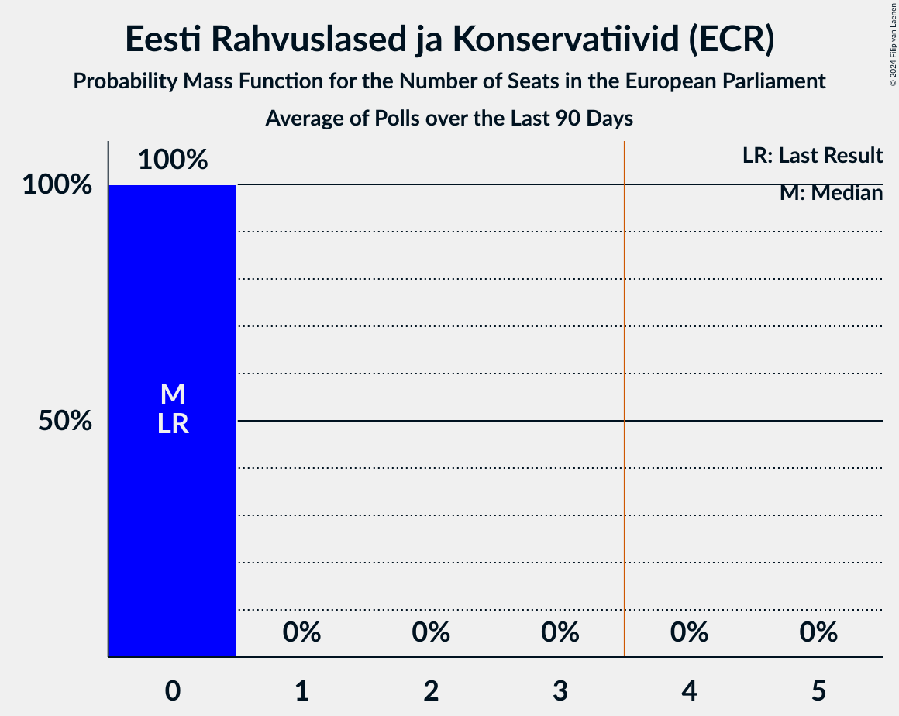

# Eesti Rahvuslased ja Konservatiivid (ECR)

<a href="#voting-intentions">Voting Intentions</a> | <a href="#seats">Seats</a>

## Voting Intentions

Last result: **0.0%** (General Election of 9 June 2024)

### Confidence Intervals

| Period     | Polling firm/Commissioner(s) | Median | 80% Confidence Interval | 90% Confidence Interval | 95% Confidence Interval | 99% Confidence Interval |
|:----------:|:----------------:|:-----------:|:-----------------------:|:-----------------------:|:-----------------------:|:-----------------------:|
| N/A | [Poll Average](average.html) | 2.9% | 1.7–4.0% | 1.5–4.2% | 1.4–4.4% | 1.2–4.8% |
| [12–18 September 2024](2024-09-18-KantarEmor.html) | Kantar Emor   ERR | 3.6% | 3.1–4.3% | 2.9–4.5% | 2.8–4.7% | 2.5–5.0% |
| [9–14 September 2024](2024-09-14-Norstat.html) | Norstat   MTÜ Ühiskonnauuringute Instituut | 1.9% | 1.4–2.6% | 1.3–2.8% | 1.2–3.0% | 1.0–3.3% |
| [29 August–12 September 2024](2024-09-12-Turu-uuringuteAS.html) | Turu-uuringute AS | 2.9% | 2.3–3.8% | 2.1–4.1% | 2.0–4.3% | 1.8–4.7% |
| [2–8 September 2024](2024-09-08-Norstat.html) | Norstat   MTÜ Ühiskonnauuringute Instituut | 1.7% | 1.3–2.4% | 1.2–2.5% | 1.1–2.7% | 0.9–3.1% |
| [26 August–1 September 2024](2024-09-01-Norstat.html) | Norstat   MTÜ Ühiskonnauuringute Instituut | 0.0% | N/A | N/A | N/A | N/A |
| [19–25 August 2024](2024-08-25-Norstat.html) | Norstat   MTÜ Ühiskonnauuringute Instituut | 0.0% | N/A | N/A | N/A | N/A |
| [15–21 August 2024](2024-08-21-KantarEmor.html) | Kantar Emor   ERR | 3.6% | 3.0–4.3% | 2.9–4.5% | 2.8–4.7% | 2.5–5.0% |
| [12–19 August 2024](2024-08-19-Norstat.html) | Norstat   MTÜ Ühiskonnauuringute Instituut | 0.0% | N/A | N/A | N/A | N/A |
| [5–11 August 2024](2024-08-11-Norstat.html) | Norstat   MTÜ Ühiskonnauuringute Instituut | 0.0% | N/A | N/A | N/A | N/A |
| [1–9 August 2024](2024-08-09-Turu-uuringuteAS.html) | Turu-uuringute AS | 2.9% | 2.3–3.8% | 2.1–4.0% | 2.0–4.2% | 1.7–4.7% |
| [23 July–4 August 2024](2024-08-04-Norstat.html) | Norstat   MTÜ Ühiskonnauuringute Instituut | 0.0% | N/A | N/A | N/A | N/A |
| [22–29 July 2024](2024-07-29-Norstat.html) | Norstat   MTÜ Ühiskonnauuringute Instituut | 0.0% | N/A | N/A | N/A | N/A |
| [15–22 July 2024](2024-07-22-Norstat.html) | Norstat   MTÜ Ühiskonnauuringute Instituut | 0.0% | N/A | N/A | N/A | N/A |
| [11–17 July 2024](2024-07-17-KantarEmor.html) | Kantar Emor   ERR | 0.0% | N/A | N/A | N/A | N/A |
| [8–12 July 2024](2024-07-12-Norstat.html) | Norstat   MTÜ Ühiskonnauuringute Instituut | 0.0% | N/A | N/A | N/A | N/A |
| [1–5 July 2024](2024-07-05-Norstat.html) | Norstat   MTÜ Ühiskonnauuringute Instituut | 0.0% | N/A | N/A | N/A | N/A |
| [17–24 June 2024](2024-06-24-Norstat.html) | Norstat   MTÜ Ühiskonnauuringute Instituut | 0.0% | N/A | N/A | N/A | N/A |
| [10–17 June 2024](2024-06-17-Norstat.html) | Norstat   MTÜ Ühiskonnauuringute Instituut | 0.0% | N/A | N/A | N/A | N/A |
| [10–17 June 2024](2024-06-17-KantarEmor.html) | Kantar Emor   ERR | 0.0% | N/A | N/A | N/A | N/A |
| [1–11 June 2024](2024-06-11-Turu-uuringuteAS.html) | Turu-uuringute AS | 0.0% | N/A | N/A | N/A | N/A |
| [3–10 June 2024](2024-06-10-Norstat.html) | Norstat   MTÜ Ühiskonnauuringute Instituut | 0.0% | N/A | N/A | N/A | N/A |

### Probability Mass Function

The following table shows the probability mass function per percentage block of voting intentions for the [poll average](average.html) for Eesti Rahvuslased ja Konservatiivid (ECR).

| Voting Intentions | Probability | Accumulated | Special Marks |
|:-----------------:|:-----------:|:-----------:|:-------------:|
| 0.0–0.5% | 0% | 100% | Last Result |
| 0.5–1.5% | 5% | 100% |  |
| 1.5–2.5% | 31% | 95% |  |
| 2.5–3.5% | 38% | 64% | Median |
| 3.5–4.5% | 24% | 26% |  |
| 4.5–5.5% | 2% | 2% |  |
| 5.5–6.5% | 0% | 0% |  |

## Seats

Last result: **0** seats (General Election of 9 June 2024)

### Confidence Intervals

| Period     | Polling firm/Commissioner(s) | Median | 80% Confidence Interval | 90% Confidence Interval | 95% Confidence Interval | 99% Confidence Interval |
|:----------:|:----------------:|:------:|:-----------------------:|:-----------------------:|:-----------------------:|:-----------------------:|
| N/A | [Poll Average](average.html) | 0 | 0 | 0 | 0 | 0 |
| [12–18 September 2024](2024-09-18-KantarEmor.html) | Kantar Emor   ERR | 0 | 0 | 0 | 0 | 0 |
| [9–14 September 2024](2024-09-14-Norstat.html) | Norstat   MTÜ Ühiskonnauuringute Instituut | 0 | 0 | 0 | 0 | 0 |
| [29 August–12 September 2024](2024-09-12-Turu-uuringuteAS.html) | Turu-uuringute AS | 0 | 0 | 0 | 0 | 0 |
| [2–8 September 2024](2024-09-08-Norstat.html) | Norstat   MTÜ Ühiskonnauuringute Instituut | 0 | 0 | 0 | 0 | 0 |
| [26 August–1 September 2024](2024-09-01-Norstat.html) | Norstat   MTÜ Ühiskonnauuringute Instituut |  |  |  |  |  |
| [19–25 August 2024](2024-08-25-Norstat.html) | Norstat   MTÜ Ühiskonnauuringute Instituut |  |  |  |  |  |
| [15–21 August 2024](2024-08-21-KantarEmor.html) | Kantar Emor   ERR | 0 | 0 | 0 | 0 | 0 |
| [12–19 August 2024](2024-08-19-Norstat.html) | Norstat   MTÜ Ühiskonnauuringute Instituut |  |  |  |  |  |
| [5–11 August 2024](2024-08-11-Norstat.html) | Norstat   MTÜ Ühiskonnauuringute Instituut |  |  |  |  |  |
| [1–9 August 2024](2024-08-09-Turu-uuringuteAS.html) | Turu-uuringute AS | 0 | 0 | 0 | 0 | 0 |
| [23 July–4 August 2024](2024-08-04-Norstat.html) | Norstat   MTÜ Ühiskonnauuringute Instituut |  |  |  |  |  |
| [22–29 July 2024](2024-07-29-Norstat.html) | Norstat   MTÜ Ühiskonnauuringute Instituut |  |  |  |  |  |
| [15–22 July 2024](2024-07-22-Norstat.html) | Norstat   MTÜ Ühiskonnauuringute Instituut |  |  |  |  |  |
| [11–17 July 2024](2024-07-17-KantarEmor.html) | Kantar Emor   ERR |  |  |  |  |  |
| [8–12 July 2024](2024-07-12-Norstat.html) | Norstat   MTÜ Ühiskonnauuringute Instituut |  |  |  |  |  |
| [1–5 July 2024](2024-07-05-Norstat.html) | Norstat   MTÜ Ühiskonnauuringute Instituut |  |  |  |  |  |
| [17–24 June 2024](2024-06-24-Norstat.html) | Norstat   MTÜ Ühiskonnauuringute Instituut |  |  |  |  |  |
| [10–17 June 2024](2024-06-17-Norstat.html) | Norstat   MTÜ Ühiskonnauuringute Instituut |  |  |  |  |  |
| [10–17 June 2024](2024-06-17-KantarEmor.html) | Kantar Emor   ERR |  |  |  |  |  |
| [1–11 June 2024](2024-06-11-Turu-uuringuteAS.html) | Turu-uuringute AS |  |  |  |  |  |
| [3–10 June 2024](2024-06-10-Norstat.html) | Norstat   MTÜ Ühiskonnauuringute Instituut |  |  |  |  |  |

### Probability Mass Function

The following table shows the probability mass function per seat for the [poll average](average.html) for Eesti Rahvuslased ja Konservatiivid (ECR).

| Number of Seats | Probability | Accumulated | Special Marks |
|:---------------:|:-----------:|:-----------:|:-------------:|
| 0 | 100% | 100% | Last Result, Median |

